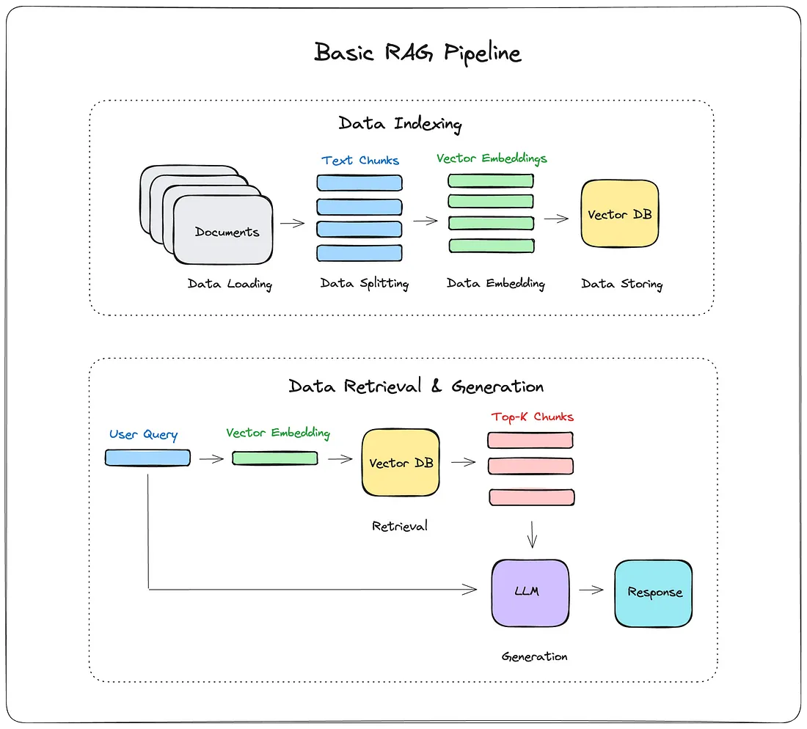
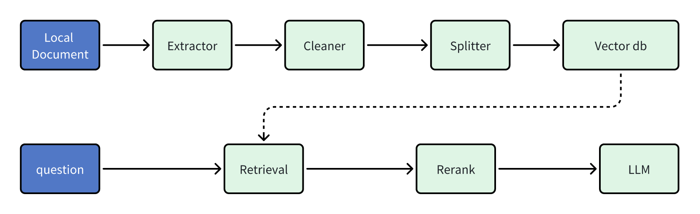

# [AI开发]1 RAG

> RAG (Retrieval Augmented Generation，检索增强技术)，相当于给LLM外挂一个词典，从闭卷考试变成开卷考试。

- 时至今日，RAG的工程实践已经非常成熟了，基本流程如下图所示，用人话说就是：把数据存到向量数据库中(建立索引)，然后在用户提问时，先检索相关数据，再将这些数据和用户提问一起输入到LLM中，让LLM基于这些信息来生成回答。


> 图源：*How I built a Simple Retrieval-Augmented Generation (RAG) Pipeline*<sup>[[1]](#references)</sup>

## Dify的RAG实现

> 参考了*深入 Dify 源码，洞察 Dify RAG 默认机制*<sup>[[2]](#references)</sup>这篇文章
>
> Dify的RAG实现的代码在`dify/api/core/rag`路径下


> 图源：*深入 Dify 源码，洞察 Dify RAG 默认机制*<sup>[[2]](#references)</sup>

- 从图中可以看出来，Dify的RAG将数据存储步骤拆分得更细，和传统的数据清洗比较类似，并且可能是考虑到Dify支持非嵌入方式存储，所以图中忽略掉了Embedding的过程。

### Extractor

> 从数据源中提取文本内容

- 其他调用外部工具的方式(如Jina.ai)就不赘述了，Dify自己实现的Extractor大多数都用的比较基础的解析器，比如读取HTML的，就简单地用`BeautifulSoup`来读取。

```python
class HtmlExtractor(BaseExtractor):
    """
    Load html files.


    Args:
        file_path: Path to the file to load.
    """

    def __init__(self, file_path: str):
        """Initialize with file path."""
        self._file_path = file_path

    def extract(self) -> list[Document]:
        return [Document(page_content=self._load_as_text())]

    def _load_as_text(self) -> str:
        text: str = ""
        with open(self._file_path, "rb") as fp:
            soup = BeautifulSoup(fp, "html.parser")
            text = soup.get_text()
            text = text.strip() if text else ""

        return text
```

- 其实也还好，从定位上extractor的作用就是从数据源中提取文本内容，数据清洗什么的交给后面的`Cleaner`来做。
- 如果有其他类型的数据源需要提取文本内容，可以自行继承`BaseExtractor`类来实现，子类的定义也很简单：

```python
class BaseExtractor(ABC):
    """Interface for extract files."""

    @abstractmethod
    def extract(self):
        raise NotImplementedError
```

### Cleaner

> Dify的Cleaner实现其实很简单，就是针对特定字符的替换和清理。

- 默认是清理连续的空格、换行符和制表符，同时也可以清除URL和邮箱，在大多数情况下这就够用了，因为导入的文件通常来说都是正式文件，没有太多杂乱的内容。

### Splitter

> 选择合适的分段策略和分隔符其实挺关键的。

- 分段标识符：默认采用的是`\n\n`，能够匹配到一个空行。但是如果数据原始分段之间不留空，那其实也可以使用`\n`作为代替，此外对于一些特殊的文本格式可能要单独考虑。比如我有一个Markdown，里面存在很多一二三级标题，如果按照二级标题分段最合适，可以将同一主题的东西分到一起，那这个时候就不应使用`\n`而是`#`，同时为了避免匹配到一级或三级，这个规格应当写得尽量严格，因此我最后使用了`^## `。
- 分段最大长度：只要能保证你的正常文段不会因为超长导致被截断即可，因此这个数值可以设置的大一些，比如2048？
- 分段重叠长度：这个值应当视你的分段长度大小而定，如果分段长度都普遍比较长，该值也可以适当大一些，但总体来说对召回效果影响不大。


> 这篇文章有待于进一步的研究以提升深度。

## References

1. [How I built a Simple Retrieval-Augmented Generation (RAG) Pipeline | by Dr Julija | Medium](https://medium.com/@drjulija/what-is-retrieval-augmented-generation-rag-938e4f6e03d1)
2. [深入 Dify 源码，洞察 Dify RAG 默认机制 - 易迟的博客 | Bryan Blog](https://hustyichi.github.io/2024/07/17/dify-default-rag/)
