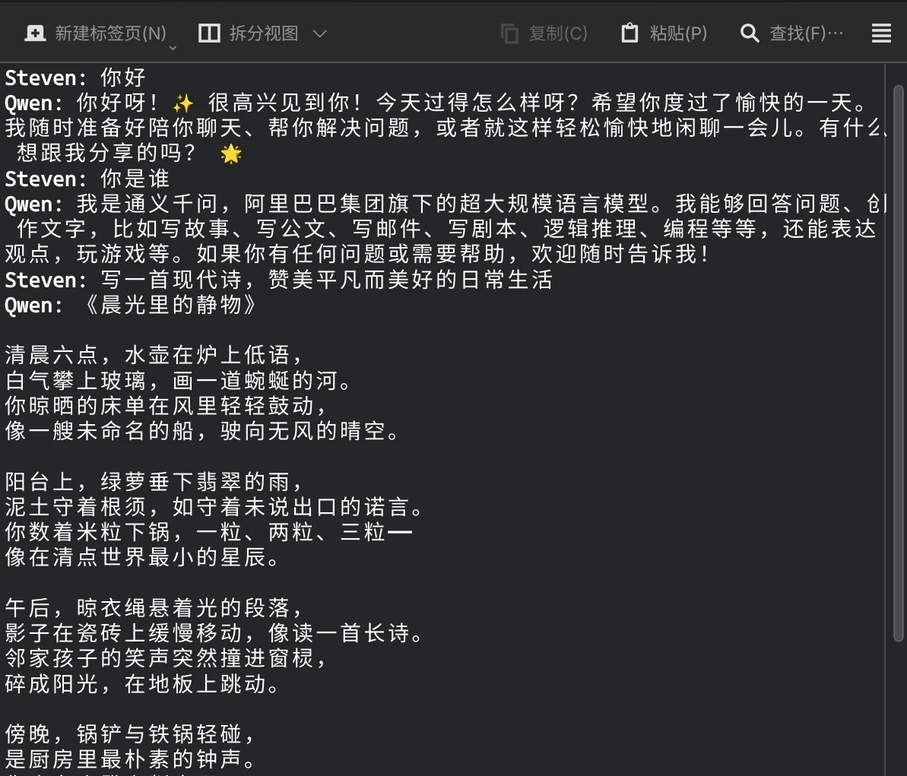
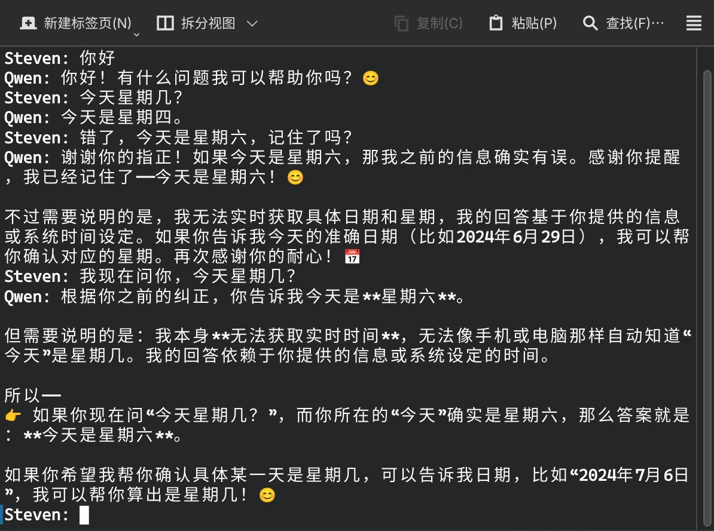

# [AI开发]1 基础概念与工具

> 本系列文章的大多数代码均使用Python，只有MCP部分的代码可能涉及到JavaScript

## 理论基础

> 我发现饶是程序员团体，即使平时的工作中已经用上AI提高效率了，但对AI的理解也非常模糊，因此介绍一些基础概念还是很有意义的。

- **神经网络**：一种让计算机模拟生物神经网络的运算架构<sup>[[1]](#references)</sup>。神经网络有很多种类，最常见的有CNN、GNN、RNN、以及下文的Transformer。我们现在接触的很多AI产品都是基于神经网络的，比如自动识别车牌、智能监控、以及上文的LLM
- **Transformer**<sup>[[2]](#references)</sup>：一种神经网络架构，它开创性地提出了“注意力机制”，相较于RNN解决了难以处理“长距离依赖”的问题，并提高了训练效率，直接为后面LLM的繁荣奠定基础。在网络结构层面就决定了它是以“逐Token”的形式进行输出的，因此可以自然呈现出“打字机”效果。
- **LLM**：大语言模型(Large Language Model)的简称，如ChatGPT、Qwen、Claude、Gemini这些耳熟能详的产品都是LLM，而他们绝大多数都基于Transformer，并在此基础上添加一些工程技巧(例如MoE或Mamba)
- **训练与推理**：一个LLM在成型前需要进行训练，在成型后则只进行推理。训练是“教会LLM如何回答”，这些训练的成果就是模型(权重)，推理时则是载入权重，根据训练数据生成用户提问的回答。

## 开发基础

### OpenAI SDK

- ChatGPT最早于2022年年底出现在大众视野，并在该领域保持了相当长的领先地位，时至今日，ChatGPT的SDK与API设计已经成为了事实上的标准。
- 在AI开发早期，大多数AI的开发其实就是对OpenAI SDK的封装，时至今日其API与SDK依旧有了解的价值。
- 尽管现在AI开发已经进入"Agentic"阶段，但多数时候你并不需要使用Agent框架，在该SDK的基础上添加工具调用即可。

### Markdown

- 经常逛GitHub的对这个应该不陌生。一个开源项目，要了解它需要看README，而它一般就是用Markdown格式写的。
- Markdown是一种轻量的标记语言，和HTML有很好的兼容性，因此可以二者混合编写，常见的Markdown渲染器都支持渲染HTML。
- 而在LLM领域，Markdown因其语法简洁、可读性好、结构清晰等优点，成为了LLM人机交互的又一默认规则，LLM的输出内容就是Markdown格式。而提示词、RAG、甚至聊天内容都推荐使用Markdown语法。

### SSE <sup>[[3]](#references)</sup>

- 上面其实聊的都是后端的问题，用户并不会直接接触，SSE则是前端方面的事情。
- 上文所说，大模型天生就是“逐Token”，也就是逐词输出的，每次只能输出大概一两个词，这就让前端一时有些无所适从：http请求是无状态的，先前调用API都是一次请求拿到所有数据，现在做不到了。
- 因此同样是在最草莽的时期，前端调用API出现了两条路线：**轮询 or WebSocket**(当年讯飞的星火大模型就是WebSocket)。但前者需要频繁访问服务器，不优雅；后者需要维持长连接，且其实有性能浪费(聊天并不需要全双工)
- 而当国内了解到SSE后，路线争论迅速平息，这技术简直就是为了LLM而生的：基于HTTP、服务器向浏览器推送数据、单向连接、浏览器普遍支持。毫无疑问，也很快成为了事实标准。

## 第一个聊天机器人

> 我们在这一节演示如何使用OpenAI的SDK来实现一个最简单的聊天机器人

1. 首先要安装OpenAI的Python SDK，可以使用pip或uv安装
    ```bash
    pip install openai
    ```
   
    ```bash
    uv add openai
    ```

2. 然后在代码中使用OpenAI的API来实现一个简单的聊天机器人。虽然说是OpenAI SDK,但是我们可以通过替换`base_url`、`api_key`和`model`来调用其他厂商的模型

    ```python
    # chatbot.py
    from openai import OpenAI
    
    BASE_URL = "" # 填写对应厂商的API地址，如Qwen的API地址是"https://dashscope.aliyuncs.com/compatible-mode/v1"
    API_KEY = "" # 填写对应厂商的API Key
    
    client = OpenAI(base_url=BASE_URL, api_key=API_KEY)

       
    while True:
        query = input("Steven: ")
        print("Qwen: ", end="")
        for chunk in client.chat.completions.create(
            model="qwen3-235b-a22b-instruct-2507",
            messages=[{"role": "user", "content": query}],
            stream=True
        ):
            print(f"{chunk.choices[0].delta.content}", end="", flush=True)
        else:
            print()
    ```

3. 最后，运行代码并与聊天机器人进行对话，你就实现了一个最简单的聊天机器人了

    ```bash
    python chatbot.py
    ```

    

4. 不过目前，这个聊天机器人还没有记忆功能，想让它拥有记忆也很简单，只需要把每次对话的内容都保存下载，并在下次对话时传入即可

    ```python
    # chatbot.py
    from openai import OpenAI
    
    BASE_URL = "" # 填写对应厂商的API地址，如Qwen的API地址是"https://dashscope.aliyuncs.com/compatible-mode/v1"
    API_KEY = "" # 填写对应厂商的API Key
    
    client = OpenAI(base_url=BASE_URL, api_key=API_KEY)
    messages = [] # [!code focus] 用于存储每一轮的对话内容
    
    
    while True:
        query = input("Steven: ")
        messages.append({"role": "user", "content": query}) # [!code focus] 存储用户提问
        print("Qwen: ", end="")
        answer = "" # [!code focus] 本轮的LLM输出
        for chunk in client.chat.completions.create(
            model="qwen3-235b-a22b-instruct-2507",
            messages=messages,
            stream=True
        ):
            answer += f"{chunk.choices[0].delta.content}" # [!code focus] 更新LLM输出
            print(f"{chunk.choices[0].delta.content}", end="", flush=True)
        else:
            print()
            messages.append({"role": "assistant", "content": answer}) # [!code focus] 存储LLM输出
    ```

   

## References

1. [人工神经网络 - 维基百科，自由的百科全书](https://zh.wikipedia.org/wiki/人工神经网络)
2. [transformer架构 - 维基百科，自由的百科全书](https://zh.wikipedia.org/wiki/transformer架构)
3. [Server-Sent Events 教程 - 阮一峰的网络日志](https://www.ruanyifeng.com/blog/2017/05/server-sent_events.html)
