# [AI开发]2 Dify

[](https://dify.ai)

## Docker Compose 部署

> 部署环境还是我最喜欢的EndeavourOS，使用`systemctl`管理服务，使用`docker compose`部署Dify。
>
> 部署的是社区版，但是感觉功能已经够了，官方文档<sup>[[1]](#references)</sup>也写的很不错，这一节仅作为补充。

### 安装 Docker (docker engine) 和Docker Compose

1. Ubuntu/Debian：用包管理器简单方便：

```bash
sudo apt install docker docker-compose
```

2. Arch Linux/Manjaro/EndeavourOS：同样是包管理器安装：

```bash
sudo pacman -S docker docker-compose
```

3. CentOS 7（毕竟还有不少老服务器在用CentOS 7）：

```bash
sudo yum install -y yum-utils && sudo yum-config-manager --add-repo http://mirrors.aliyun.com/docker-ce/linux/centos/docker-ce.repo # 添加阿里云的源
sudo yum install docker-ce docker-ce-cli containerd.io docker-buildx-plugin docker-compose-plugin # 用包管理器安装
```

4. 下载官方二进制文件离线安装（见二进制安装<sup>[[2]](#references)</sup>）

- 在安装完成后，可以配置是否允许非root用户启动（见安装后步骤<sup>[[3]](#references)</sup>），或是否开机启动。docker的关联服务主要是`docker.service`和`containerd.service`，但有的时候`docker.socket`可能无法正常启动。因此如果要开机启动，可以执行以下命令：

```bash
sudo systemctl enable docker.socket
sudo systemctl enable docker.service
sudo systemctl enable containerd.service
```

- 如果只是手动启动，将上述命令的`enable`改为`start`或`stop`即可，即：

```bash
sudo systemctl start docker.socket
sudo systemctl start docker.service
sudo systemctl start containerd.service
```

- 这时候docker就应该跑起来了

### 部署 Dify

- 部署Dify主要看官方文档<sup>[[1]](#references)</sup>就行，官方写的很全了，只有一点需要注意：使用`docker compose up -d`可能有些服务会无法启动(尤其是数据库服务`docker-db-1`)，原因在于数据库的默认路径（`/var/lib/postgresql/data/pgdata`）可能权限不足导致无法启动。这个问题可以按照以下的顺序尝试解决：
  - 对于启动失败的服务，使用`docker logs <服务名称>`查看对应服务的日志，确定问题（直接把日志甩给AI最快）。
  - 尝试直接用`sudo docker compose up -d`启动，如果权限问题解决了，所有服务都`Started`/`Running`或`Healthy`，那就万事大吉。
  - 不行则可以尝试按照这篇文章<sup>[[4]](#references)</sup>的步骤来试一试，需要修改`docker-compose.yaml`中的内容，最好在修改之前备份一下。
- 此外，Dify的nginx默认监听了`0.0.0.0:80`和`0.0.0.0:443`，在浏览器中直接访问`http://localhost`或者`https://localhost`就能看到界面了。但如果这两个端口需要另作他用的话，可以在`<project-path>/docker/docker-compose.yaml`中找到`nginx.ports`修改即可。默认内容如下：

```yaml
nginx:
  ...
  ports:
    - '${EXPOSE_NGINX_PORT:-80}:${NGINX_PORT:-80}'
    - '${EXPOSE_NGINX_SSL_PORT:-443}:${NGINX_SSL_PORT:-443}'
```

## Dify的AI应用

> 目前没有关于AI应用的统一定义，Dify提供了5类模板，但我倾向于将其分为2大类：
>
> - 一类是文本能力驱动的，主要利用的是LLM的文本生成能力。
> - 另一类是推理能力驱动的，利用的是LLM的理解和推理能力。

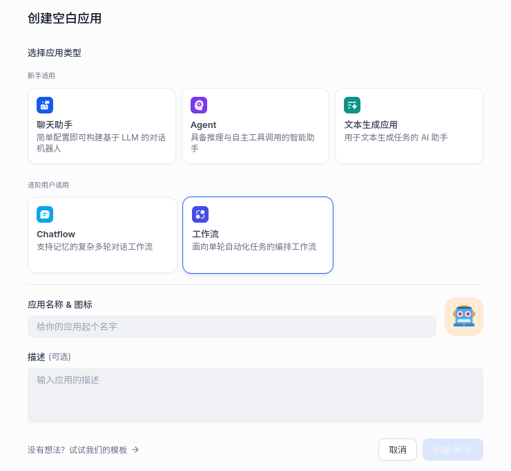

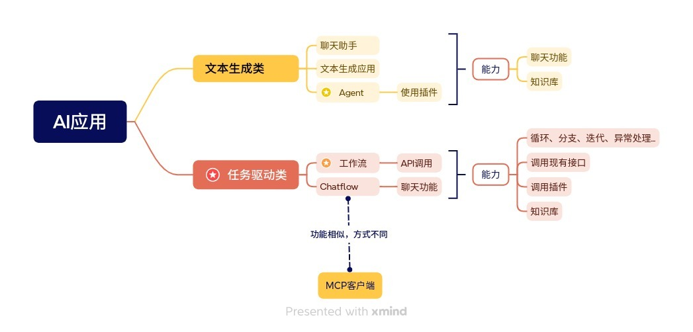

> 注意，上图仅适应于Dify语境下的AI应用，尤其是Agent与一般意义上的Agent有较大区别。在当下，一般理解的Agent并不局限于对话框，而是一种可以自主规划、调度、执行的对象，实际能力已经等同于工作流了，甚至在某些比较强的LLM加持下，能发挥出比工作流更高的灵活度和准确性，同时响应速度也保持在较快的水平。
>
> 我目前认为Agent和工作流还不存在高低之分，各有优劣。Agent更灵活，无需预先编排流程，更加符合对“智能”的想象，但是这依赖于更强大的基础模型，以及总有可能遇到错误理解或处理的情况。工作流更稳定，更方便调试和可视化，但是需要预先编排流程，仍然需要一定的工作量，但Dify显著降低了这部分的开发成本。

### 文本生成类

- **聊天助手**、**Agent**和**文本生成应用**，都支持知识库和变量，这也是目前最基础的用法
- **聊天助手**和**文本生成应用**基本上一样，就是接入一个LLM，一来一回地对话，不太需要推理能力。即使接入了知识库，本质上也就是给LLM了一个很长的上文，让LLM从上文中归纳出用户问题的结果，还是文本方面的能力。
- **Agent**在上面的基础上，拥有了调用插件的能力。Dify内置了一些基础插件，如联网搜索，获取当前时间等，同时市场中也有不少第三方插件可以下载使用，甚至可以通过第三方插件支持MCP服务，这大大扩展了Agent的功能，似乎它可以通过安装插件变得“无所不能”了，但....为什么Agent仍然被归到“文本生成类”呢？
  - 其实远没有达到“无所不能”，因为Agent同样被限制在了对话框中。比如它可以根据你的需求自动联网搜索事件、汇总数据、收集评论、根据知识库的原有文章写稿、配图、润色....但凡是超出对话框的，比如提交平台审核、发布文章、评论互动等等，尽管凭AI的能力完全做得到，但也没办法实现。
  - Cursor、Trae的Agent和这个差不多，只是插件是遵循MCP格式的，并且优化了Agent策略，多轮调用效果更好一些。
- 这类AI应用的形式将LLM的能力局限在了对话框内，无法更深入地融入其他工作中，比如实现程序的逻辑、PPT制作、邮件收发等。

### 任务驱动类

- **Chatflow**和**工作流**属于这一类型。Chatflow相当于给工作流接入了一个聊天框的壳，所以下面主要聊工作流。
- 正如业务流程可以用流程图来描述，工作流就是反过来，根据流程图执行业务流程。工作流内置了基本的编程语法，可以在任意流程结点嵌入LLM执行问答、判断等操作，同时支持插件和调用API。基于这些特性，工作流能够基本模仿原本用代码实现的业务逻辑，并且由于方便嵌入AI的特点，一些用代码实现起来很麻烦的功能，在工作流中用LLM实现可能就比较简单快速。
- 目前看来，工作流适合的业务场景有以下几个：
  - 数据抓取和清洗：其实就是爬虫，只不过传统爬虫需要针对每个页面写规则，繁琐且不灵活，规则可能不能完全适配，需要大量的`try-catch`。AI结合后，只需要获取原始HTML，根据实际情况看是否需要转换为Markdown或yaml（如果转换成Markdown后不会丢失信息，那就推荐转换，可以减少等待时间，减少token用量），然后将所需的数据结构告诉LLM，LLM就可以从中提取有用信息，以结构化的格式（通常是JSON）返回，稳定性比较高
  - 与自然语言对接：就像先前云服里根据用户输入，携带参数跳转到对应页面，不仅可以生成查询参数，判断跳转路由的功能也可以交给LLM。即在Dify中预置路由表和对应的查询参数，交由LLM分析自然语言，查询知识库，生成对应路径的跳转指令，（格式如`{"route": "", "condition": {}}`），并执行跳转。
- Chatflow和MCP客户端比较相似，可以作为MCP的替代品。Chatflow和MCP都是“对话框开始，对话框结束”，尽管对话过程中会调用插件/MCP，但都以“输出到”对话框中作为结束。

## 工作流

> 主要是对各节点的总结

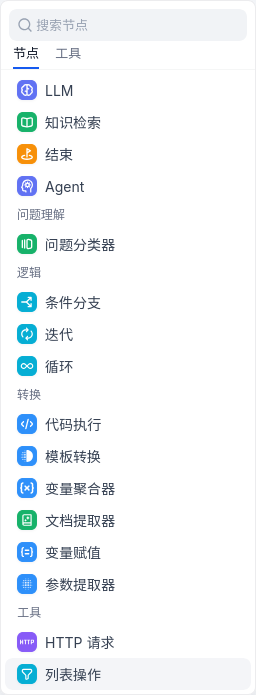

### LLM

- 以问答的形式调用LLM。通常将流程中的变量和固定的输入组合起来，作为单次聊天的输入。
- **参数介绍**
  - **上下文**：一般是对问题背景的预设。按照官方说法，这里通常填入知识检索的输出变量，换句话说如果没有进行知识检索，这里空着就行。
  - **会话预设**：用于模拟和LLM的已有会话，让LLM“快速进入角色”。会话预设中有3个身份：**SYSTEM**，**USER**和**ASSISTANT**。SYSTEM通常填写“你是一个XXXX专家”这种话，限定LLM的身份和输入输出的范围；USER表示用户输入，ASSISTANT表示LLM输出。
  - **视觉**：只有需要用到图像识别/分类时才打开
  - **结构化输出**：需要的话就打开，不用管模型支不支持。打开后能提高LLM生成JSON的准确率
  - **失败重试/异常处理**：略

以“从网页内容中提取JSON”为例，一个LLM模块可以这么配置：

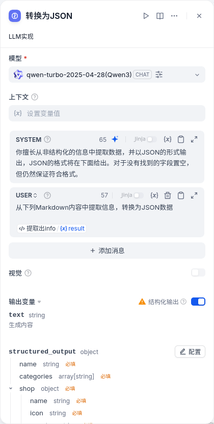

### Agent

- 以多步自主决策的形式调用LLM。一个Agent节点中允许LLM执行多次操作，并且每次操作执行什么由LLM根据任务完成情况和已有工具列表自主决定。在设计上这就和Cursor、Windsurf等AI IDE的Agent模式差不多了。
- **参数介绍**
  - **Agent策略**：默认Agent策略有**FunctionCalling**和**ReAct**，二者倾向不同。FunctionCalling是“识别用户意图，对应到工具并直接调用”，是一个比较简单直接的策略。而ReAct是“交替进行思考和行动，行动产生的结果会影响下一轮思考”，是一种类似于贪心算法的思想。相对来说ReAct的效果应该会更好，但迭代次数也会更高，时间长。
  - **模型**：略
  - **工具列表**：Agent可以使用的工具（不包含API调用）
  - **指令**：告诉LLM任务是什么，类似于LLM节点的SYSTEM
  - **查询**：告诉LLM用户的输入，类似于LLM节点的USER
  - **最大迭代次数**：由于Agent是多步执行的，这个值用于限制最大步数
- 例如，我想收集2025年新模型，以及汇总模型更新频率，考虑到这是一个较为复杂的需求，就给定的工具来说应该单次搜索满足不了条件，因此策略就选ReAct，指令和查询就随便写写，一个Agent节点就配置如下图所示。

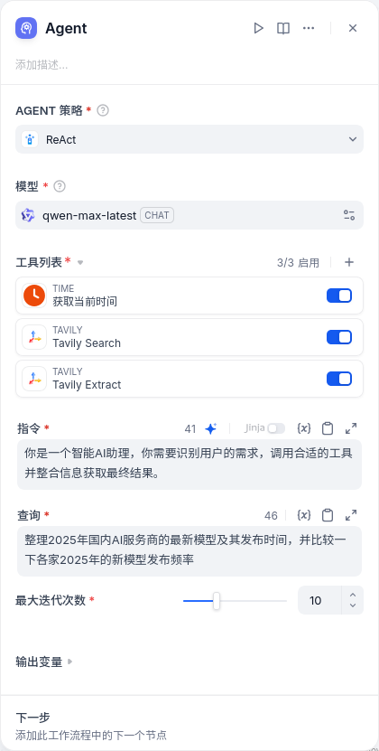

- 结果如下所示，可以看到效果并不是很好，部分结果并没有搜到（例如Qwen3），也没有汇总更新频率，称不上好。

```md
### 2025年国内AI服务商的最新模型及其发布时间

1. **DeepSeek**
   - 发布时间：2025年1月
   - 模型名称：DeepSeek-R1（推理模型）

2. **字节跳动**
   - 发布时间：未明确提及具体时间，但提到其在2025年前后持续迭代。
   - 模型名称：豆包实时语音大模型

3. **华为云**
   - 发布时间：2025年2月1日
   - 模型名称：基于云服务的模型（具体名称未提及）

4. **智谱AI**
   - 发布时间：2025年5月12日
   - 模型名称：开源模型

5. **快手**
   - 发布时间：2025年5月12日
   - 模型名称：可灵2.0

6. **生数科技**
   - 发布时间：2025年5月12日
   - 模型名称：Vidu Q1

7. **阿里通用**
   - 发布时间：未明确提及具体时间，但提到与字节、DeepSeek等共荣发展。
   - 模型名称：未具体提及

8. **通义千问**
   - 发布时间：2024年9月
   - 模型名称：Qwen2.5及后续版本（如Qwen2.5-Turbo、QwQ-32B-preview、QvQ-72B-preview）

### 各家2025年的新模型发布频率比较

- **DeepSeek**：1次（截至2025年1月）
- **字节跳动**：未明确具体次数，但显示持续迭代
- **华为云**：1次（截至2025年2月）
- **智谱AI**：1次（截至2025年5月）
- **快手**：1次（截至2025年5月）
- **生数科技**：1次（截至2025年5月）
- **阿里通用**：未明确提及具体次数
- **通义千问**：多次（2024年9月以来多次更新）

总体来看，2025年国内AI服务商的模型发布频率相对较低，多数公司集中在年初和年中发布了新模型。其中，字节跳动和通义千问显示出较为频繁的迭代节奏，而其他公司的发布频率则相对较低。
```

- 后来在VS Code中，使用的用同类工具(Jina.ai的MCP服务器)，但是将LLM换成了GPT4.1后，效果明显更好，不仅能够在数据不足时继续调用，还能以Markdown表格的形式汇总数据并展示，明显更优。这当然可能有Copilot特调的原因，但基础模型的能力差异也不可忽视。


### 代码执行

> 可以把这个节点抽象为，在流程中嵌入一个这样的函数：`def main(*args: Any) -> dict[str, Any]`（Python），或`function main(...args: any[]): Record<string, any>`（TypeScript）

- 允许添加一个同步函数，函数名必须为main，参数任意指定，返回值必须为`dict[str, Any]`（Python）或`Record<string, any>`（TypeScript）
- 如果需要递归的话也可以多创建一个递归函数，但是主函数必须是`main`
- 由于大多数节点的输入输出格式都是string类型的JSON，这个节点常用来解析JSON，从中提取所需字段的数据
- 例如我通过LLM识别Markdown的内容，得到了JSON，但由于LLM的输出格式是string，为了提取出所需的字段，比较简单的函数就是用Python或JS自带的JSON函数处理。

### 模板转换

> Jinja2模板引擎，主要目的是按照格式生成字符串。不光可以在文本中嵌入变量，还支持循环、条件等逻辑，不恰当地说，这是个简单版本的Vue（都是根据数据渲染文本）。

- 但是还是感觉用不着
- 一来循环和条件逻辑应当在节点内部完成，不应当在模板中完成；
- 二来不同节点之间一般用JSON传输数据，手动拼接的字符串要么传输给LLM，要么作为最终输出，但这两种节点内就可以实现了，没必要单独抽象出来一个节点。

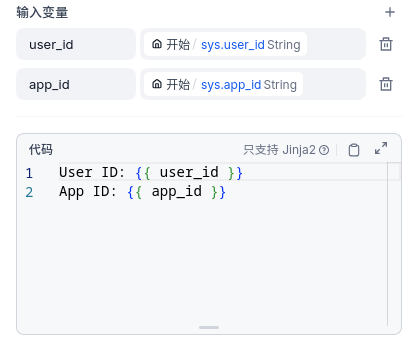

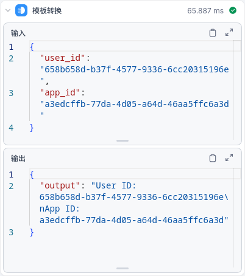

### 变量聚合器

> 详见变量聚合<sup>[[5]](#references)</sup>

- 这个名字取得有点歧义，会让人以为是将多个变量合并成一个变量（`concat`），但实际上它的作用是迭代所有输入直到找到不为空的作为输出，相当于JS中的`??`运算符，所有输入的变量的数据类型必须要一致。
- 它的使用场景是前面产生了分支，但后面不同分支的处理逻辑相同的情况。比如要搜索数据，前面可能会根据情况选择不同的搜索引擎，比如英文用Google，中文用百度，但得到搜索结果后处理过程是一样的。
- 如下图，**代码执行1**输出`{"result": "1"}`，**代码执行2**输出`{"result": "2"}`，变量聚合器输出`{"result": "1"}`。

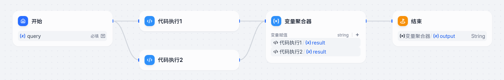

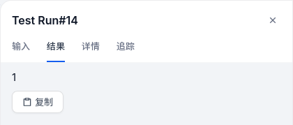

### 文档提取器

> 在工作流中上传文件的方法较少，只有在流程开始时上传或通过接口返回，因此功能也不是特别大

- 文档提取器将docx、ppt、pdf等文档转换为纯文本，但目前存在较为明显的缺陷，对于一个24页，3.9MB的PPT，解析时间需要将近3分钟。相比之下流行的转Markdown工具(如`Markitdown`)只需要几秒，同时效果更优，因此如果需要解析文档内容，建议使用第三方工具。

### 参数提取器

- 让LLM从自然语言中提取出下一步所需的参数，通常用于对接用户输入和插件/MCP
- 用的也不是很多，一来这个功能用LLM节点+结构化输出基本就能解决，二来除了流程开始和流程结束，大多数节点间传输数据用JSON，直接用代码执行节点解析JSON就行了。

## 知识库 (RAG in Dify)

> 详见知识库功能简介<sup>[[6]](#references)</sup>，简单来说就是Dify的RAG<sup>[[7]](#references)</sup>方案
>
> 这里比较硬核，涉及到一些自然语言处理和向量数据库的概念

- 简单来说知识库就是背景知识，尽管LLM本身在训练时就有了很多知识了，但一些非公开资料LLM是不知道的，需要提前说明，聊天时由SYSTEM授予的信息（prompt，提示词）就属于这种。
- 对于较短的背景知识，我们大可以直接粘贴到聊天的SYSTEM中。
- 但如果是几篇文章，若干文件、报表、pdf等，首先一般问题是不会全都用到的，可能相关内容只有一两段；其次上下文肯定是不够长的，以及对于图表类数据怎么处理也是问题。知识库就是解决这类问题的，通过内置的数据提取工具，以及词嵌入等工程技巧，实现了快速存取大量非结构化数据。在LLM回答之前，通过**检索和召回**获取到相关知识提供给LLM，以实现更好的生成。

### 选择数据源

- 在知识库页面点击“创建知识库”，即可创建并初始化一个知识库。一般来说背景知识多来源于本地文件，Dify支持的文件类型还是挺多的，这里就随便传一个试试。

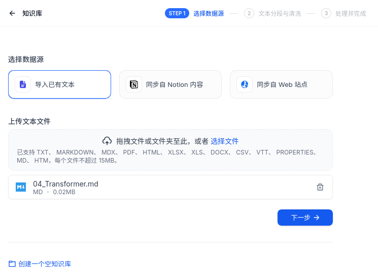

### 分段设置

#### 通用分段

> 详见指定分段模式<sup>[[8]](#references)</sup>
>
> 分段就是字面意思，单个文件可能文本量太大了，AI不好理解，一般来说段落的体量就正好。

- 分段标识符默认是`\n\n`，也就是匹配到**每个段落后的一个空行**；分段最大长度不必多说；分段重叠数量就是给每一段前后额外多留一些文字，这样有利于保留段落之间的语义关系。
- 文本预处理规则的前两个略，Q&A分段功能是将段落转换为问答的形式，段落原文是A，Q由LLM生成。这样有利于问答类（智能客服）的AI应用，但对于其他类型来说没有必要。
- 经过上面的设置，分段规则就已经配置好了，点击预览块就可以看到划分好的段落。

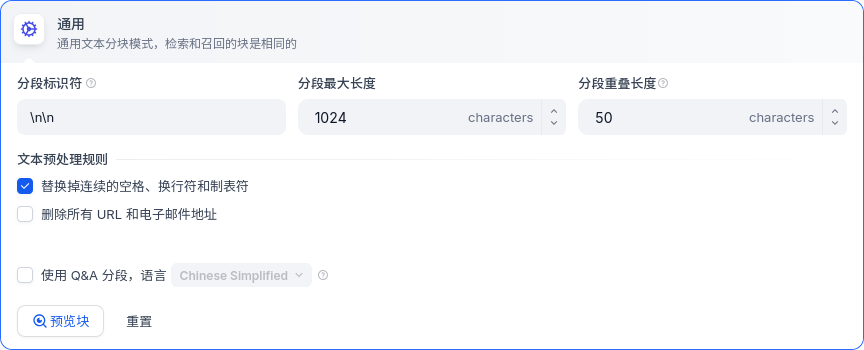

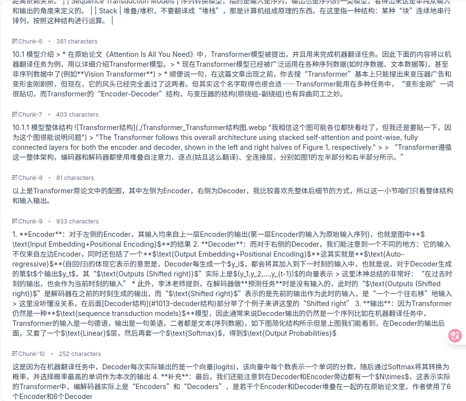

#### 父子分段

> 在通用分段规则下，所有段落都是一样的，一视同仁，不管只有十几个字还是接近分段最大长度，都平等地参与检索和召回。但这样够好吗？其实不然，检索时用检索效率高的结构，召回时用召回效果好的结构才是更好的。

- 父子分段规则将段落划分为2个级别，父级仍然是段落，子级基本上就是句子，所以一个父级中包含了几个子级段落。
- 在父子分段的模式下，子级用于检索，父级用于召回。按照Dify官方的意思，更细粒度的检索有利于更精确地匹配输入的问题，同时也能够更快提供结果。

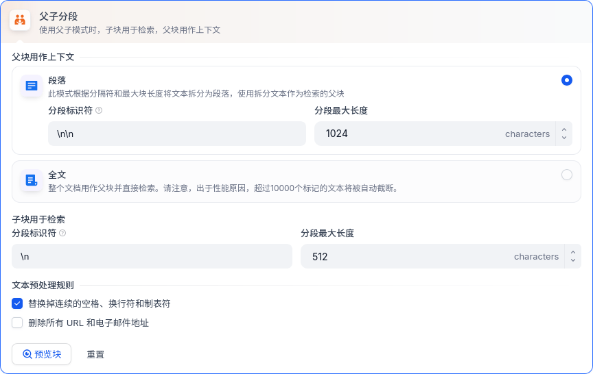

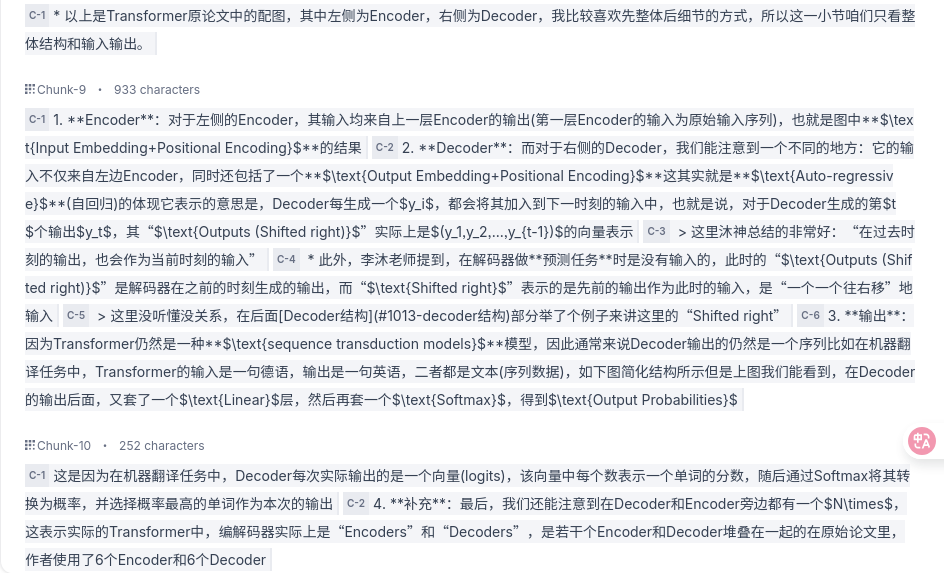

### 索引方式与检索设置

> 这里涉及到一个关键的技术——词嵌入(Embedding)

#### 索引方式

- 强烈建议选择**高质量**，也就是使用嵌入(Embedding)的形式，这将会把文本转换为向量，并且在语义上的相似性同样体现在向量的距离中（例如“系统”和“System”在语义上相似，那么二者对应的向量的距离也会比较近）。

- 嵌入的本质就是一个映射 $f(w_i) =\text{v}_i \in \mathbb{R}^d$ ，高质量模式下存储的不是文本 $w_i$ ，而是向量 $\text{v}_i$ ，这种模式下是能够搜出**文本不同但语义近似**的结果的。
  > 和LLM一样，这种映射关系本身也是可训练的，学术界常用如**Word2Vec**的模型在自己的语料库上训练得到这个映射，同时如阿里百炼也提供了预训练的Embedding模型直接提供这个映射。
- 但如果使用**经济**模式，则是关键词+倒排索引，类似于一个`HashMap`，从每个分段中提取10个关键词，用关键词当key，用“该关键词出现过的分段的序号”当value，这样检索速度很快，但无法得到**语义相似**的结果，整体效果不佳。

#### 检索设置

> 由于经济模式下只支持倒排索引，已经聊过了，下面只聊高质量模式。这里涉及到向量数据库的一些东西了

- 向量检索：利用词嵌入可计算的特性，将输入转换为向量，在知识库中查找相似的词向量，返回相邻的分段内容。就是最常见的词向量检索用法。
- 全文检索：大概也是使用关键词+倒排索引进行检索，当然了，同类词的结果是搜不出来的。全文检索具体实现还是靠底层的向量数据库，数据库不支持的话这个模式返回的就是空，不过默认的向量数据库`weaviate`是支持的。
- 混合模式：两种方法都用，把最后结果合并起来。
- Rerank：对于搜出来的结果重新排序，让最相关的结果在最前面。关于如何衡量“最相关的结果”，有专门的Rerank模型实现这个。所以勾选Rerank之后会在查询出结果后再调一次LLM，时间会更长一些。

## References

1. [Docker Compose 部署 - Dify Docs](https://docs.dify.ai/zh-hans/getting-started/install-self-hosted/docker-compose)
2. [Biniaries | Docker Docs](https://docs.docker.com/engine/install/binaries/)
3. [Post installation steps | Docker Docs](https://docs.docker.com/engine/install/linux-postinstall/#manage-docker-as-a-non-root-user)
4. [dify用 docker compose 部署后Docker Desktop中 postgres:15-alpine 报错； 以及每次重启Docker后Dify都被初始化问题_docker按照dify 每次重启后 都需要重新注册用户-CSDN博客](https://blog.csdn.net/LiHaoHang6/article/details/147076116)
5. [变量聚合 - Dify Docs](https://docs.dify.ai/zh-hans/guides/workflow/node/variable-aggregator)
6. [功能简介 - Dify Docs](https://docs.dify.ai/zh-hans/guides/knowledge-base/readme)
7. [RAG 概念简介 - Dify Docs](https://docs.dify.ai/zh-hans/learn-more/extended-reading/retrieval-augment/README)
8. [2. 指定分段模式 - Dify Docs](https://docs.dify.ai/zh-hans/guides/knowledge-base/create-knowledge-and-upload-documents/chunking-and-cleaning-text)
