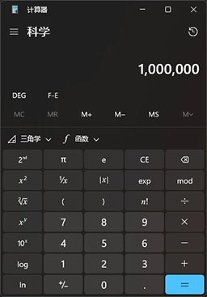

# [Python基础]1 基本语法

> 这篇文章不太适合入门吧，内容侧重比较主观，而且喜欢介绍Python的语法糖，但这并不适合新手或者用惯了Java等语言的其他人。如果你是完全的新手，我更建议你去找本教程或者直接看[**菜鸟教程**](https://www.runoob.com/python3)去。
>
> 此外，我这人的学习习惯是，相比于啃完整套教程再上手，我更喜欢一边学一边做demo，因此这篇文章里面有很多小代码段作为演示。

## 1. 从Hello, world开始

> `Hello, world!`，就好像什么新生事物在向这个世界致意一样。
>
> 这么说有点中二，但我挺喜欢。

```python
print("Hello, world!") # 没有什么调库，没有什么入口函数，直接这一行就OK
```

* 其实从这么简单的一句代码就能看出不少端倪：
  * 与C/C++、Java等比较“规范”的语言不同，Python可以脚本式运行，而不需要`int main()`或者`public static void main(String[] args)`。当然也可以有入口函数，但如果只是单文件则没必要了。这个咱们之后再说。
  * Python代码的单行注释使用`#`
  * Python的每条语句结尾不要求`;`，但如果希望在一行内塞多条语句，那么需要用`;`分隔(这并不是官方的推荐做法，会有个Warning但不影响运行。不过忽略Warning是一个纯纯的坏习惯，不要这么做哦)

## 2. 躲不开的数据类型

> 大家似乎总是在意数据类型，但在Python里，这不是一个非常重要的问题。Guido van Rossum大神似乎在创立这个语言之初就希望它对数学友好，因此Python几乎杜绝了C语言中常见的舍入误差，Python帮你完成了高精表示和数据类型转换。
>
> 但我们还是可以稍微聊聊数据类型。下面我们使用`type()`函数来查看类型。

* Python中常用的数据类型有以下几种：

```python
## 数值型
print(type(1)) # <class 'int'>
print(1_000_000) # 1000000
print(type(1.5))  # <class 'float'>
print(type(1.3e5))  # <class 'float'>

## 字符串型
print(type("A"))  # <class 'str'>
print(type("你好"))  # <class 'str'>

## 布尔型
print(type(True))  # <class 'bool'>

## 空类型
print(type(None))  # <class 'NoneType'>

## 高级数据类型:列表、元组、字典、集合
print(type([1, 2, 3]))  # <class 'list'>
print(type((1, 2, 3)))  # <class 'tuple'>
print(type({1: "one", 2: "two", 3: "three"})) # <class 'dict'>
print(type({1, 2, 3}))  # <class 'set'>

## 函数
def testFunc():
    pass

print(type(testFunc))  # <class 'function'>
print(type(testFunc()))  # <class 'NoneType'>

## 类
class TestClass:
    pass

print(type(TestClass))  # <class 'type'>
print(type(TestClass()))  # <class '__main__.TestClass'>
```

> 是不是觉得前面还好，后面就怪起来了？咱们等后面讲“类”的时候再详细说，现在先针对基础的数据类型聊聊。

### 2.1 数值型-总结

> 其实也没有什么好说的....

1. Python为数值精度问题做了大量优化，比如`1.0 == 1`是`True`、`5 / 2`结果是`2.5`等等，并且没有`double`，只有一个精度很高的`float`。
2. 但尽管如此，Python也没有完全解决精度问题，比如`0.1 + 0.2 == 0.3`是`False`，这实际上是因为根据IEEE 754<sup>[\[1\]](#参考资料)</sup>规定的浮点数表示法，浮点数只能近似表示`0.1`或`0.2`，并非精确的，二者之和也不等于近似表示的`0.3`，所以才会出现这个问题。通常我们用`0.3 - (0.1 + 0.2) < 1e-6`或类似形式判断两个数值是否相等。
3. 在Python中，对于比较大的整数，是可以使用下划线充当分隔符的(相当于下图所示的逗号)。这种做法在部分外国和数学领域比较常见，目的是增加可读性，当然，要是感觉不习惯，不用也完全可以。



### 2.2 字符串型-总结

1. Python中没有“字符”，所有的字符都是字符串，所以`"A"`和`'A'`是等价的。
2. Python想要表达字符串的话，方式有很多，具体来讲是**一对或三对单/双引号**均可，比如以下的写法都是合法的，且实际内容一致：

  ```python
  "Hello, world!"
  'Hello, world!'
  """Hello, world!"""
  '''Hello, world!'''
  ```
  
  > 至于为什么要搞这么多种写法呢，老实讲一开始我也不理解，直到后来我通过Python执行SQL的时候，才发现这个特性的好处。

## 3 运算符

### 3.1 数学运算符

* 加减乘除就不说了
* `%`：求余(求模)，比如`5 % 2`结果是`1`，实际就是$5 \div 2 = 2 \cdots 1$
* `//`：整除，比如`5 // 2`结果是`2`，实际就是$5 \div 2 = 2.5$，然后直接抹去小数

### 3.2 逻辑运算符

> 这里的逻辑运算符，基本上只用在`if`语句中，有时间可以瞟一眼真值表

* `and`：与，两者均为`True`时结果为`True`，否则为`False`
* `or`：或，两者均为`False`时结果为`False`，否则为`True`
* `not`：非，`not True`就是`False`，`not False`就是`True`
* 但是注意，在Python的`if`中，不是只有`bool`值才能参与判断的，很多其他类型的变量也可以参与逻辑运算，比如：
  * 数值：`0`（或`0.0`）为`False`，其他为`True`
  * 字符串：空字符串`""`为`False`，其他为`True`
  * 列表、元组、字典、集合：空为`False`，其他为`True`
  * 上述这些操作，其实就相当于`bool(<var>)`，对于其他未提到的情况，你也可以`print(bool(var))`查看这个变量转换为布尔值后的结果

### 3.3 布尔运算符

### 3.4 位运算符

### 3.5 字符串运算符

## 4. 非常实用的字符串处理

### 4.1 字符串的方法

### 4.2 难学但好用的正则表达式

> 我个人是非常喜欢正则表达式的，虽然目前的趋势是大家在尽量用库函数取代正则(因为上手比较难)，但是用熟之后仍然是个十分强大的工具。
>
> 此外，对于第一次接触的同学来说，正则表达式的复杂程度较高，而作用场景并不是那么大(主要是在数据清洗、爬虫等方面)，因此初学者可以先跳过这一部分。

* 正则表达式的知识点大概可分为两部分：正则表达式的**规则**和`re`**库函数**。其中正则的规则是比较难记的，在网上讲解的也比较少，而库函数则好记且简单得多。

#### 4.2.1 表达式规则

* 所谓正则表达式，就是一组“用符号来表达某一类字符”的约束规则，我大概分了分类，列了下面这几张表：

* **直接表示字符**

  > 根据使用经验来说，最常使用的就是`.`、`\d`、`\w`、`\s`这几个，其他的相对来说没那么重要。

| 符号 | 含义 | 示例 |
|:---:|:---:|:---:|
| `.` | 通配符，匹配除换行符外的任意字符 | `a.b`可以匹配`a1b`、`a2b`、`a*b`等 |
| `\d` | 匹配数字 | `\d`可以匹配`0`、`1`、`2`、`3`、`4`、`5`、`6`、`7`、`8`、`9` |
| `\D` | 匹配非数字 | `\D`可以匹配`a`、`b`、`c`、`A`、`B`、`C`等 |
| `\w` | 匹配字母、数字、下划线 | `\w`可以匹配`a`、`b`、`c`、`A`、`B`、`C`、`0`、`1`、`2`、`_`等 |
| `\W` | 匹配非字母、数字、下划线 | `\W`可以匹配`*`、`#`、`@`等 |
| `\s` | 匹配空白字符 | `\s`可以匹配空格(Space键)、制表符(Tab键)、换行符(Enter键)等 |
| `\S` | 匹配非空白字符 | `\S`可以匹配`a`、`b`、`c`、`A`、`B`、`C`等 |

* `[]`**：指定字符范围**

  > 这个使用方法能取代部分上面的符号约束，并且显而易见的可读性更好、更加灵活，因此在实际使用中，我更倾向于使用`[]`来表示字符集。

| 符号 | 含义 | 示例 |
|:---:|:---:|:---:|
| `[]` | 匹配中括号内的任意一个字符 | `[abc]`可以匹配`a`、`b`、`c` |
| `[^]` | 不匹配中括号内的任意一个字符 | `[^abc]`可以匹配除了`a`、`b`、`c`之外的任意字符，注意,`^`仅在`[]`内表示反选(逻辑非)，在其他地方表示字符串的开头 |
| `[a-z]`、`[A-Z]`、`[a-z]` | 匹配括号内的任意一个字符 | `[a-z]`可以匹配26个小写字母中的任意一个，`[A-Z]`可以匹配26个大写字母中的任意一个，`[0-9]`可以匹配0-9中的任意一个数字 |
| `[^a-z]` | 不匹配任意一个小写字母 | `[^a-z]`可以匹配除了26个小写字母之外的任意字符 |
| `[0-9a-z]` | 匹配任意一个数字或小写字母 | 在中括号中的“范围”是可以组合使用的 |

* **位置约束**

  > 位置约束是指正则表达式中的`^`和`$`，分别表示字符串的开头和结尾。

| 符号 | 含义 | 示例 |
|:---:|:---:|:---:|
| `^` | 匹配字符串的开头 | `^abc`可以匹配以`abc`开头的字符串 |
| `$` | 匹配字符串的结尾 | `abc$`可以匹配以`abc`结尾的字符串 |

* **重复约束**

  > 重复约束是指正则表达式中的`*`、`+`、`?`、`{}`，分别表示重复0+次、重复1+次、重复0或1次、重复指定次数。

| 符号 | 含义 | 示例 |
|:---:|:---:|:---:|
| `*` | 该符号前面的符号重复0次或多次 | `a*`可以匹配`""`、`a`、`aa`、`aaa`等 |
| `+` | 该符号前面的符号重复1次或多次 | `a+`可以匹配`a`、`aa`、`aaa`等 |
| `?` | 该符号前面的符号重复0次或1次，因为约束了最大重复次数，因此也叫做“非贪婪模式” | `a?`可以匹配`""`、`a` |
| `{1:5}` | 该符号前面的符号重复1次到5次 | `a{1:5}`可以匹配`a`、`aa`、`aaa`、`aaaa`、`aaaaa`。当然，如果只想匹配重复3次的情况，除了直接写`aaa`外，还可以用`a{3}` |

* **其他**

  > 就是似乎不方便归类的一些符号，比如`\`、`|`、`()`等。

| 符号 | 含义 | 示例 |
|:---:|:---:|:---:|
| `\` | 转义符，用于转义特殊字符，符合C语言习惯 | `\.`可以匹配`.`，`\*`可以匹配`*`，比如我们想匹配文件名，那么通常就用`\.`来匹配文件名中分割文件名和后缀的`.` |
| `()` | 不参与匹配，只是让正则表达式认为括号内的部分为整个元素 | 比如`(ab)+`匹配的是`ab`、`abab`、`ababab`等，而`ab+`匹配的则是`ab`、`abb`、`abbb`等 |
| `|` | 或，匹配符号左边或者右边的内容 | `a|b`可以匹配`a`或者`b`，此时和`[ab]`等价 |

* 这里有篇文章写的不错<sup>[[2]](#参考资料)</sup>，附加了很多示例，可以练一练。

#### 4.2.2 `re`库函数

## 5. `if`、`for`和`while`

## 参考资料

1. [IEEE 754_百度百科](https://baike.baidu.com/item/ieee%20754/3869922)
2. [详解Python正则表达式（含丰富案例） - 知乎](https://zhuanlan.zhihu.com/p/479731754)
