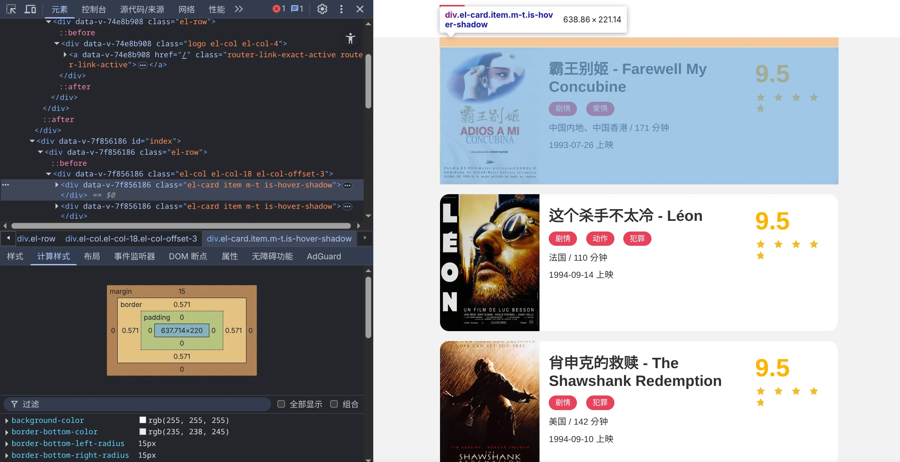

# [Python]专题01 爬虫

> 随着今年AI开发的流行，数据源越来越受到重视，我可以下一个暴论：数据的数量与质量直接影响到AI产品的好坏。即使抛开AI不谈，传统软件开发和系统开发往往也对外部数据有着很高的需求，所以爬虫的开发将会持续存在。
>
> 但目前(或者说以前)，Python爬虫存在一个比较麻烦的问题：前端三大框架大行其道，网页的渲染多是在浏览器进行的(CSR)，相较于服务端渲染(SSR)的网站，这意味着传统爬虫拿不到HTML了，需要执行页面JS才能拿到数据。
>
> Python中有没有能执行JS的爬虫框架呢？有，Selenium，但它很不好用：不支持异步、自动补全做得不好、不同版本语法兼容性差、依赖特定浏览器版本的WebDriver、性能低下等问题使得使用体验非常糟糕，长期以来Python只能用非官方实现puppeteer FFI的[pyppeteer](https://github.com/pyppeteer/pyppeteer)来实现较为高效的爬虫。
>
> 但现在，你多了一个选择，那就是由巨硬开源的，原生支持Python的[playwright-python](https://github.com/microsoft/playwright-python)，不仅实现了高效的加载网站，还跨提供了跨浏览器支持，不喜欢Chromium可以直接用Firefox！
>
> 这篇文章中，我尝试通过几种从简单到复杂的情景，由浅入深地提供几种爬虫思路，并进行比较和分享。

## 写在前面

### 1. 法律风险与免责声明

- 本篇文章仅供技术交流与分享之用途，在进行数据爬取时务必提前评估法律风险与合规性，务必遵循当地法律法规。
- 以下列举一些可能与爬虫技术有关的法律法规，供参考

1. [《中华人民共和国网络安全法》](https://www.gov.cn/xinwen/2016-11/07/content_5129723.htm)

    > - 第二十一条　国家实行网络安全等级保护制度。网络运营者应当按照网络安全等级保护制度的要求，履行下列安全保护义务，保障网络免受干扰、破坏或者未经授权的访问，防止网络数据泄露或者被窃取、篡改：
    >   - （一）制定内部安全管理制度和操作规程，确定网络安全负责人，落实网络安全保护责任；
    >   - （二）采取防范计算机病毒和网络攻击、网络侵入等危害网络安全行为的技术措施；
    >   - （三）采取监测、记录网络运行状态、网络安全事件的技术措施，并按照规定留存相关的网络日志不少于六个月；
    >   - （四）采取数据分类、重要数据备份和加密等措施；
    >   - （五）法律、行政法规规定的其他义务。
    > - 第四十四条　任何个人和组织不得窃取或者以其他非法方式获取个人信息，不得非法出售或者非法向他人提供个人信息。

2. [《中华人民共和国个人信息保护法》](https://www.gov.cn/xinwen/2021-08/20/content_5632486.htm)

    > - 第十条　任何组织、个人不得非法收集、使用、加工、传输他人个人信息，不得非法买卖、提供或者公开他人个人信息；不得从事危害国家安全、公共利益的个人信息处理活动。
    > - 第二十八条　敏感个人信息是一旦泄露或者非法使用，容易导致自然人的人格尊严受到侵害或者人身、财产安全受到危害的个人信息，包括生物识别、宗教信仰、特定身份、医疗健康、金融账户、行踪轨迹等信息，以及不满十四周岁未成年人的个人信息。只有在具有特定的目的和充分的必要性，并采取严格保护措施的情形下，个人信息处理者方可处理敏感个人信息。

3. [《中华人民共和国数据安全法》](https://www.gov.cn/xinwen/2021-06/11/content_5616919.htm)

    > - 第三十二条　任何组织、个人收集数据，应当采取合法、正当的方式，不得窃取或者以其他非法方式获取数据。法律、行政法规对收集、使用数据的目的、范围有规定的，应当在法律、行政法规规定的目的和范围内收集、使用数据。

4. [《中华人民共和国刑法》](https://law.pkulaw.com/chinalaw/3b70bb09d2971662bdfb.html?type=text)

    > - 第二百八十五条
    >   - 【非法侵入计算机信息系统罪】违反国家规定，侵入国家事务、国防建设、尖端科学技术领域的计算机信息系统的，处三年以下有期徒刑或者拘役。
    >   - 【非法获取计算机信息系统数据、非法控制计算机信息系统罪】违反国家规定，侵入前款规定以外的计算机信息系统或者采用其他技术手段，获取该计算机信息系统中存储、处理或者传输的数据，或者对该计算机信息系统实施非法控制，情节严重的，处三年以下有期徒刑或者拘役，并处或者单处罚金；情节特别严重的，处三年以上七年以下有期徒刑，并处罚金。
    >   - 【提供侵入、非法控制计算机信息系统程序、工具罪】提供专门用于侵入、非法控制计算机信息系统的程序、工具，或者明知他人实施侵入、非法控制计算机信息系统的违法犯罪行为而为其提供程序、工具，情节严重的，依照前款的规定处罚。
    >   - 单位犯前三款罪的，对单位判处罚金，并对其直接负责的主管人员和其他直接责任人员，依照各该款的规定处罚。
    > - 第二百八十六条
    >   - 【破坏计算机信息系统罪】违反国家规定，对计算机信息系统功能进行删除、修改、增加、干扰，造成计算机信息系统不能正常运行，后果严重的，处五年以下有期徒刑或者拘役；后果特别严重的，处五年以上有期徒刑。 违反国家规定，对计算机信息系统中存储、处理或者传输的数据和应用程序进行删除、修改、增加的操作，后果严重的，依照前款的规定处罚。 故意制作、传播计算机病毒等破坏性程序，影响计算机系统正常运行，后果严重的，依照第一款的规定处罚。 单位犯前三款罪的，对单位判处罚金，并对其直接负责的主管人员和其他直接责任人员，依照第一款的规定处罚。
    > - 第二百八十六条之一　【拒不履行信息网络安全管理义务罪】网络服务提供者不履行法律、行政法规规定的信息网络安全管理义务，经监管部门责令采取改正措施而拒不改正，有下列情形之一的，处三年以下有期徒刑、拘役或者管制，并处或者单处罚金：
    >   （一）致使违法信息大量传播的；
    >   （二）致使用户信息泄露，造成严重后果的；
    >   （三）致使刑事案件证据灭失，情节严重的；
    >   （四）有其他严重情节的。
    >   单位犯前款罪的，对单位判处罚金，并对其直接负责的主管人员和其他直接责任人员，依照前款的规定处罚。有前两款行为，同时构成其他犯罪的，依照处罚较重的规定定罪处罚。

### 2. 技术基础

- 爬虫是一种自动化程序，用于从互联网上提取信息。这一技术主要建立在网络协议和计算机技术之上。
- 在开始爬虫之前，你应当具备以下的基本知识：
  - Python编程基础
  - 了解HTTP协议
  - 一定的HTML/CSS基础
  - 一点点的正则表达式基础
  - 当然，最重要的是能沉下心去研究问题

## 最基础的爬虫

### 1. 发起请求

- 大多数的网络请求都是基于HTTP协议，所以第一步，我们需要了解如何在Python中发起一个HTTP请求。
- Python中有很多请求库，对于初学者，我推荐使用`requests`，它的API非常简单易用，又不失灵活。在熟悉之后，再探索其他更强大的库(如`httpx`、`aiohttp`)也不迟。
- 接下来我们以[Scrape Center](https://scrape.center/)的SSR1 demo为例，尝试发起一个请求。

  ```python
  import requests
  response = requests.get("https://ssr1.scrape.center/")
  print(response.text)
  ```

- 如果你的网络环境正常的话，应该在命令行即可看到这个URL的返回内容：该网页的HTML，这样你就完成了一次最简单的网络请求。以下内容只是响应中的一小部分。

  ```html
  <html lang="en">
  <head>
    
    <meta charset="utf-8">
    <meta http-equiv="X-UA-Compatible" content="IE=edge">
    <meta name="viewport" content="width=device-width,initial-scale=1">
    <link rel="icon" href="/static/img/favicon.ico">
    <title>Scrape | Movie</title>
    

    <link href="/static/css/app.css" type="text/css" rel="stylesheet">
    
  <link href="/static/css/index.css" type="text/css" rel="stylesheet">

  </head>
  <body>
  <div id="app">
    <!-- .... -->
  </div>
  ```

### 2. 解析数据

- 对于爬虫来说，发起请求获取响应只是第一步，解析数据是必要的，也是更有技术含量的一步。
- HTTP请求的响应通常有两种，**HTML**和**JSON**。
  - HTML是给浏览器看的，用于描述网站内容。但由于HTML数据结构复杂，直接在文本层面进行处理的难度很大，好在Python中有一个`BeautifulSoup`库可以方便地进行解析。
  - 该库的API有两套风格，一套比较符合Python的习惯，另一套和原生JS的查询选择器(`document.querySelector`)高度类似，使用起来非常方便。
  - JSON在设计上就是为了便于与代码集成的，而代码是给人看的，因此它的语法简洁的多，在各类编程语言中也都得到了广泛支持，使用内置的`json`库即可进行解析。
- 以上述内容为例，我们使用`BeautifulSoup`库来解析HTML，我个人认为写解析规则的过程很有趣，因为这个过程需要观察、尝试，但又不算太难，能够很快得到正反馈，很有成就感。

1. 审视网页结构
   - 我们可以直接在浏览器中访问该页面，然后使用浏览器的F12查看这份HTML。这是一个找规律的过程。
    
   - 可以发现，每一部电影的“卡片”都对应一个`div`标签，更重要的是，这些标签的`class`都是相同的：`el-card item m-t is-hover-shadow`，进一步来说，这个页面中只有电影卡片包含`el-card`这个类名，这便是我们要的规则。
2. 写解析规则
   - 接下来要回到Python中了，虽然你可能没用过也不熟悉`BeautifulSoup`，但不用担心，它的用法很直观。
  
    ```python
    import requests
    from bs4 import BeautifulSoup # [!code focus] 引入BeautifulSoup

    response = requests.get("https://ssr1.scrape.center/")

    html = response.text

    soup = BeautifulSoup(html, "html.parser") # [!code focus] 实例化BeautifulSoup对象
    res = soup.find_all("div", attrs={"class": "el-card"}) # [!code focus] 查找规则：寻找所有包含el-card类的div
    for card in res:
        print(card.text) # [!code focus] 简单输出一下看看效果
        print("-"*100) # [!code focus] 画一道分隔符
    ```

    - 可以稍微解释一下：
      - 在你安装时使用的是`pip install beautifulsoup4`或`uv add beautifulsoup4`，但在实际代码中，库的名称被简化为了`bs4`。其中的`BeautifulSoup`类是核心，负责解析HTML和XML文档。
      - 实例化时的第二个参数用于指定解析器，不同的解析器得到的结果可能会有所不同，通常使用`html.parser`即可。
      - `find_all`方法用于查找所有符合条件的标签，第一个参数是标签名，第二个参数是属性字典，返回一个列表(`list[Tag]`)。
      - 每个`card`都是一个`Tag`对象，可以通过`.text`属性获取标签中的文本内容，等同于JS里的`Element.textContent`
    - 输出结果如下，说明我们的解析规则是正确的，虽然数据都混在一起。

      <details>
        <summary>输出结果</summary>

        ```text
        霸王别姬 - Farewell My Concubine

        剧情

        爱情

        中国内地、中国香港
        /
        171 分钟

        1993-07-26 上映

                        9.5

        ----------------------------------------------------------------------------------------------------

        这个杀手不太冷 - Léon

        剧情

        动作

        犯罪

        法国
        /
        110 分钟

        1994-09-14 上映

                        9.5

        ----------------------------------------------------------------------------------------------------

        肖申克的救赎 - The Shawshank Redemption

        剧情

        犯罪

        美国
        /
        142 分钟

        1994-09-10 上映

                        9.5

        ----------------------------------------------------------------------------------------------------

        泰坦尼克号 - Titanic

        剧情

        爱情

        灾难

        美国
        /
        194 分钟

        1998-04-03 上映

                        9.5

        ----------------------------------------------------------------------------------------------------

        罗马假日 - Roman Holiday

        剧情

        喜剧

        爱情

        美国
        /
        118 分钟

        1953-08-20 上映

                        9.5

        ----------------------------------------------------------------------------------------------------

        唐伯虎点秋香 - Flirting Scholar

        喜剧

        爱情

        古装

        中国香港
        /
        102 分钟

        1993-07-01 上映

                        9.5

        ----------------------------------------------------------------------------------------------------

        乱世佳人 - Gone with the Wind

        剧情

        爱情

        历史

        战争

        美国
        /
        238 分钟

        1939-12-15 上映

                        9.5

        ----------------------------------------------------------------------------------------------------

        喜剧之王 - The King of Comedy

        剧情

        喜剧

        爱情

        中国香港
        /
        85 分钟

        1999-02-13 上映

                        9.5

        ----------------------------------------------------------------------------------------------------

        楚门的世界 - The Truman Show

        剧情

        科幻

        美国
        /
        103 分钟

                        9.0

        ----------------------------------------------------------------------------------------------------

        狮子王 - The Lion King

        动画

        歌舞

        冒险

        美国
        /
        89 分钟

        1995-07-15 上映

                        9.0

        ----------------------------------------------------------------------------------------------------
        ```

      </details>

3. 细化解析规则
   - 还记得刚刚我们提到`card`的类型都是`Tag`吗？事实上如果你~~确实比较闲~~去看一下源代码便会发现，`BeautifulSoup`赫然就是`Tag`的子类。因此，我们可以在`card`上继续执行`find_all`、`find`等方法来精确筛选信息。
   - 再回到HTML中，继续寻找内部信息的规则。我把一个电影卡片的HTML放到下面：

      <details>
        <summary>HTML</summary>

        ```html
        <div data-v-7f856186="" class="el-card item m-t is-hover-shadow">
          <div class="el-card__body">
            <div data-v-7f856186="" class="el-row">
              <div data-v-7f856186="" class="el-col el-col-24 el-col-xs-8 el-col-sm-6 el-col-md-4">
                <a data-v-7f856186="" href="/detail/1" class="">
                  
                </a>
              </div>
              <div data-v-7f856186="" class="p-h el-col el-col-24 el-col-xs-9 el-col-sm-13 el-col-md-16">
                <a data-v-7f856186="" href="/detail/1" class="name">
                  <h2 data-v-7f856186="" class="m-b-sm">霸王别姬 - Farewell My Concubine</h2>
                </a>
                <div data-v-7f856186="" class="categories">

                  <button data-v-7f856186="" type="button" class="el-button category el-button--primary el-button--mini">
                    <span>剧情</span>
                  </button>

                  <button data-v-7f856186="" type="button" class="el-button category el-button--primary el-button--mini">
                    <span>爱情</span>
                  </button>

                </div>
                <div data-v-7f856186="" class="m-v-sm info">
                  <span data-v-7f856186="">中国内地、中国香港</span>
                  <span data-v-7f856186=""> / </span>
                  <span data-v-7f856186="">171 分钟</span>
                </div>
                <div data-v-7f856186="" class="m-v-sm info">

                  <span data-v-7f856186="">1993-07-26 上映</span>

                </div>
              </div>
              <div data-v-7f856186="" class="el-col el-col-24 el-col-xs-5 el-col-sm-5 el-col-md-4">
                <p data-v-7f856186="" class="score m-t-md m-b-n-sm">
                  9.5</p>
                <p data-v-7f856186="">
                </p>
                <div data-v-7f856186="" role="slider" aria-valuenow="4.75" aria-valuetext="" aria-valuemin="0" aria-valuemax="5"
                  tabindex="0" class="el-rate">

                  <span class="el-rate__item" style="cursor: auto;"><i class="el-rate__icon el-icon-star-on"
                      style="color: rgb(247, 186, 42);"></i>
                  </span>

                  <span class="el-rate__item" style="cursor: auto;"><i class="el-rate__icon el-icon-star-on"
                      style="color: rgb(247, 186, 42);"></i>
                  </span>

                  <span class="el-rate__item" style="cursor: auto;"><i class="el-rate__icon el-icon-star-on"
                      style="color: rgb(247, 186, 42);"></i>
                  </span>

                  <span class="el-rate__item" style="cursor: auto;"><i class="el-rate__icon el-icon-star-on"
                      style="color: rgb(247, 186, 42);"></i>
                  </span>

                  <span class="el-rate__item" style="cursor: auto;"><i class="el-rate__icon el-icon-star-on"
                      style="color: rgb(239, 242, 247);"><i class="el-rate__decimal el-icon-star-on"
                        style="color: rgb(247, 186, 42); width: 75.0%;"></i></i>
                  </span>
                </div>
                <p></p>
              </div>
            </div>
          </div>
        </div>
        ```

      </details>

    - 把发现的规则描述一下：
      - 电影封面是``
      - 电影标题直接就是`<h2>`中包裹的文本
      - 电影的标签是`<button class="category">`中包裹的文本，且有多个
      - 其他信息在`<div class="info">`中，也有多个，分别是地区+时长、上映时间
      - 评分信息在`<p class="score">`中
    - 将上述观察到的规则用代码实现出来，大概就像下面这样了：

      ```python
      import requests
      from bs4 import BeautifulSoup

      response = requests.get("<https://ssr1.scrape.center/>")

      html = response.text

      soup = BeautifulSoup(html, "html.parser")
      res = soup.find_all("div", attrs={"class": "el-card"})
      for card in res:
          cover = card.find["img"]("src")  # [!code focus] 获取封面图片链接
          title = card.find("h2").text  # [!code focus] 获取标题文本
          tag_elems = card.find_all("button", attrs={"class": "category"}) # [!code focus] 获取所有标签元素
          tags = [tag.text for tag in tag_elems]  # [!code focus] 获取所有标签文本
          info_elems = card.find_all("div", attrs={"class": "info"}) # [!code focus] 获取所有信息元素
          infos = [info.text for info in info_elems]  # [!code focus] 获取所有信息文本
          score = card.find("p", attrs={"class": "score"}).text
          print(f"封面: {cover}")
          print(f"标题: {title}")
          print(f"标签: {tags}")
          print(f"信息: {infos}")
          print(f"评分: {score}")
          print("-" * 100)
      ```

    - 恭喜，你完成了一个简单的爬虫。

      <details>
        <summary>输出结果</summary>

        ```text
        封面: https://p0.meituan.net/movie/ce4da3e03e655b5b88ed31b5cd7896cf62472.jpg@464w_644h_1e_1c
        标题: 霸王别姬 - Farewell My Concubine
        标签: ['\n剧情\n', '\n爱情\n']
        信息: ['\n中国内地、中国香港\n / \n171 分钟\n', '\n1993-07-26 上映\n']
        评分: 
                        9.5
        ----------------------------------------------------------------------------------------------------
        封面: https://p1.meituan.net/movie/6bea9af4524dfbd0b668eaa7e187c3df767253.jpg@464w_644h_1e_1c
        标题: 这个杀手不太冷 - Léon
        标签: ['\n剧情\n', '\n动作\n', '\n犯罪\n']
        信息: ['\n法国\n / \n110 分钟\n', '\n1994-09-14 上映\n']
        评分: 
                        9.5
        ----------------------------------------------------------------------------------------------------
        封面: https://p0.meituan.net/movie/283292171619cdfd5b240c8fd093f1eb255670.jpg@464w_644h_1e_1c
        标题: 肖申克的救赎 - The Shawshank Redemption
        标签: ['\n剧情\n', '\n犯罪\n']
        信息: ['\n美国\n / \n142 分钟\n', '\n1994-09-10 上映\n']
        评分: 
                        9.5
        ----------------------------------------------------------------------------------------------------
        封面: https://p1.meituan.net/movie/b607fba7513e7f15eab170aac1e1400d878112.jpg@464w_644h_1e_1c
        标题: 泰坦尼克号 - Titanic
        标签: ['\n剧情\n', '\n爱情\n', '\n灾难\n']
        信息: ['\n美国\n / \n194 分钟\n', '\n1998-04-03 上映\n']
        评分: 
                        9.5
        ----------------------------------------------------------------------------------------------------
        封面: https://p0.meituan.net/movie/289f98ceaa8a0ae737d3dc01cd05ab052213631.jpg@464w_644h_1e_1c
        标题: 罗马假日 - Roman Holiday
        标签: ['\n剧情\n', '\n喜剧\n', '\n爱情\n']
        信息: ['\n美国\n / \n118 分钟\n', '\n1953-08-20 上映\n']
        评分: 
                        9.5
        ----------------------------------------------------------------------------------------------------
        封面: https://p0.meituan.net/movie/da64660f82b98cdc1b8a3804e69609e041108.jpg@464w_644h_1e_1c
        标题: 唐伯虎点秋香 - Flirting Scholar
        标签: ['\n喜剧\n', '\n爱情\n', '\n古装\n']
        信息: ['\n中国香港\n / \n102 分钟\n', '\n1993-07-01 上映\n']
        评分: 
                        9.5
        ----------------------------------------------------------------------------------------------------
        封面: https://p0.meituan.net/movie/223c3e186db3ab4ea3bb14508c709400427933.jpg@464w_644h_1e_1c
        标题: 乱世佳人 - Gone with the Wind
        标签: ['\n剧情\n', '\n爱情\n', '\n历史\n', '\n战争\n']
        信息: ['\n美国\n / \n238 分钟\n', '\n1939-12-15 上映\n']
        评分: 
                        9.5
        ----------------------------------------------------------------------------------------------------
        封面: https://p0.meituan.net/movie/1f0d671f6a37f9d7b015e4682b8b113e174332.jpg@464w_644h_1e_1c
        标题: 喜剧之王 - The King of Comedy
        标签: ['\n剧情\n', '\n喜剧\n', '\n爱情\n']
        信息: ['\n中国香港\n / \n85 分钟\n', '\n1999-02-13 上映\n']
        评分: 
                        9.5
        ----------------------------------------------------------------------------------------------------
        封面: https://p0.meituan.net/movie/8959888ee0c399b0fe53a714bc8a5a17460048.jpg@464w_644h_1e_1c
        标题: 楚门的世界 - The Truman Show
        标签: ['\n剧情\n', '\n科幻\n']
        信息: ['\n美国\n / \n103 分钟\n', '\n']
        评分: 
                        9.0
        ----------------------------------------------------------------------------------------------------
        封面: https://p0.meituan.net/movie/27b76fe6cf3903f3d74963f70786001e1438406.jpg@464w_644h_1e_1c
        标题: 狮子王 - The Lion King
        标签: ['\n动画\n', '\n歌舞\n', '\n冒险\n']
        信息: ['\n美国\n / \n89 分钟\n', '\n1995-07-15 上映\n']
        评分: 
                        9.0
        ----------------------------------------------------------------------------------------------------
        ```

      </details>

## References

1. [requests · PyPI](https://pypi.org/project/requests/)
