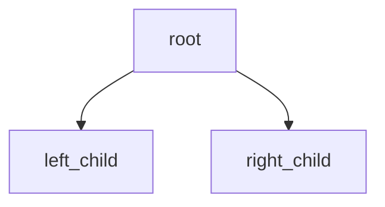

## Markdown支持

### 基本Markdown语法

正文

> 引用

* 无序列表1
* 无序列表2
* 无序列表3

1. 有序列表1
2. 有序列表2
3. 有序列表3

* [ ] CheckBox1
* [x] CheckBox2

```python
__doc__ = """代码段及高亮"""

from world import me

class Me:
  def __init__(self, name):
    self.name = name

  @staticmethod
  def hello():
    print("Hello World!")

  def hello(self):
    print("I'm" + me.name)
```

[外部链接](https://www.bilibili.com)


### 扩展Markdown语法

> Mermaid图表支持



> LaTeX公式支持

$\text{单行公式}:f(x)=\frac{1}{\sqrt{2\pi}\sigma}e^{-\frac{1}{2}\left(\frac{x-\mu}{\sigma}\right)}$

$$\text{多行公式}:
y=\begin{cases}
  x & x \geq 0 \\
  -x & x < 0
\end{cases}
$$

> 时间线

::: timeline 2024-10-01
* **最主要的任务**: 回家
* 支线任务: 没抢上高铁或者火车票,坐大巴堵在高速上了,闲着没事搞搞博客
:::
::: timeline 2024-10-02
* 睡觉
:::

> 代码组合

:::code-group
```c [1 C语言版]
int fibonacci(int n) {
    if (n <= 1) return n;
    return fibonacci(n - 1) + fibonacci(n - 2);
}
```
```java [2 Java版]
public static int fibonacci(int n) {
    if (n <= 1) return n;
    return fibonacci(n - 1) + fibonacci(n - 2);
}
```
```python [3 Python版]
def fibonacci(n):
    return n if n <= 1 else fibonacci(n - 1) + fibonacci(n - 2)
```
```javascript [4 JavaScript版]
function fibonacci(n) {
  if (n <= 1) return n;
  return fibonacci(n - 1) + fibonacci(n - 2);
}
```
:::

## Vue组件支持

<script setup>
  import { ref } from 'vue';
  import { ElMessage } from 'element-plus';
  import MultiLevelMenu from '/public/vue-demos/MultiLevelMenu.vue';

  const clickTime = ref(0);
  const onButtonClick = () => {
    clickTime.value++;
  }

  const onElButtonClick = () => {
    ElMessage.success('这是一条消息');
  }

  const demoApiData = ref([{
    menuName: "item1",
    hasChild: false,
    icon: "Setting",
    children: []
  }, {
    menuName: "item2",
    hasChild: true,
    icon: "Document",
    children: [{
      menuName: "item2-1",
      hasChild: false,
      icon: "Check",
      children: []
    }, {
      menuName: "item2-2",
      hasChild: true,
      icon: "Switch",
      children: [{
        menuName: "item2-2-1",
        hasChild: false,
        icon: "Open",
        children: []
      }]
    }]
  }])
</script>

### 原生组件

<button @click="onButtonClick" style="padding: 6px; border: 1px solid #ABABAB; border-radius: 6px;">
  You clicked {{clickTime}} times
</button>

### 第三方库(Element Plus)组件

<el-button @click="onElButtonClick">显示一条消息</el-button>

### 自定义组件

<MultiLevelMenu :router-list="demoApiData" />
