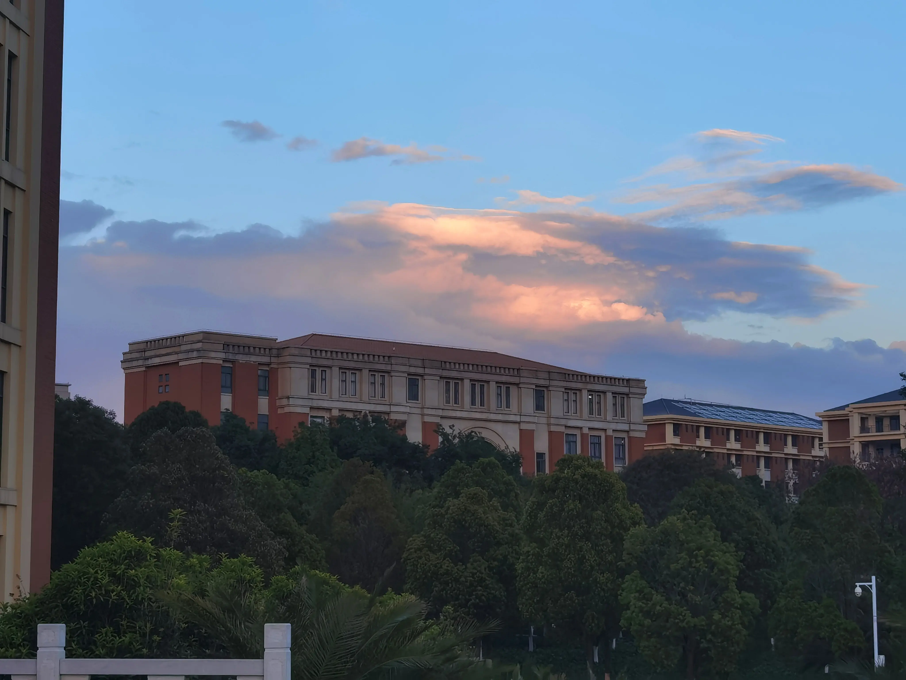

# [一蓑烟雨任平生]02 春天

> 江南无所有，聊赠一枝春。

* 4月3日，星期三，昆明多云转晴，普普通通的一天。
* 今天天气不错，我在图书馆赶一个DDL，当手头上的工作完成的差不多的时候，伸个懒腰，顺便扭头看向窗外风景。春天真是好啊，尤其是在图书馆比外面更暗的情况下，更是让人感到温暖。我忍不住想出门转一转。

* “江南无所有，聊赠一枝春。”，不知怎么突然想起这句诗，再一品却又感觉非常合适。虽然这里是西南地区，但春天之景却是绝对不输各种诗词中盛赞的江南的。除此之外，云南其实还更符合这首诗的字面含义，毕竟大家都知道，江南自古就是富庶之地，怎么会“无所有”呢？而云南，确实好像没什么拿得出手的东西，唯一拿得出手的，恐怕也就是春天了。
* 一方水土养一方人，仔细想想，其实这里的一切现象都有据可循。比如云南纬度低但是海拔高，因此云层就比较稀薄。这就造成了晴天时阳光强烈，温度高、但是一旦日落或下雨，却又颇为阴冷。学过地理的同学应该能反应过来：昼夜温差大，应该适合种植啊！但是嘛，这里的土地不够肥沃，加上山地丘陵居多，缺少平原，因此不适合发展农业。不过种不了庄稼，种鲜花却是合适，而且这里得天独厚的气候使得鲜花几乎能够四时不败，美丽的鲜花吸引来了游客，云南靠着春天，成为了著名的旅游城市。
* 这又让我想起了《文化苦旅》的那个基本观点，我大概总结为：**文化是基于自然生态的**，太妙了。

* 但随着一片云彩遮住阳光，我的心态也随之一变。唉，为什么好不容易跟这片大地有了一丝共鸣，却再过不了几个月就要说再见了。大概以后工作了就很难有时间再来这里了吧。春天啊，万物复苏，朝气蓬勃，似乎对未来的希望也更强了。但是又能怎么办呢？我此刻坐在长椅上，突然意识到自己好像本就是个过客，我会在春天离开，新的人会在下一个春天前来，不变的只有这片土地，这片土地上的春天。

* “天气真会影响心态啊”，当我意识到这句话的时候，天气又放晴了。我站起身，收拾好东西，准备回去继续工作。不过，我想我会记得这个春天的，既然春天留不住，那就让我记住这个春天吧。

## 附：《赠范晔》

<h3 style="font-size: 20px; font-family: LXGW WenKai Screen; text-align: center;">赠范晔[1]</h3>

〔南朝宋〕陆凯

折花逢驿使[2]，寄与陇头人[3]。

江南无所有，聊赠一枝春[4]。

> 1. 范晔(yè)：南朝宋顺阳（现在湖北省光化县）人，史学家，著有《后汉书》。
> 2. 逢：遇到。驿使：古时传递公文的人。
> 3. 陇头人：指范晔。陇头：即陇山，在今陕西陇县西北。
> 4. 聊：姑且。一枝春：此处借代一枝花。
