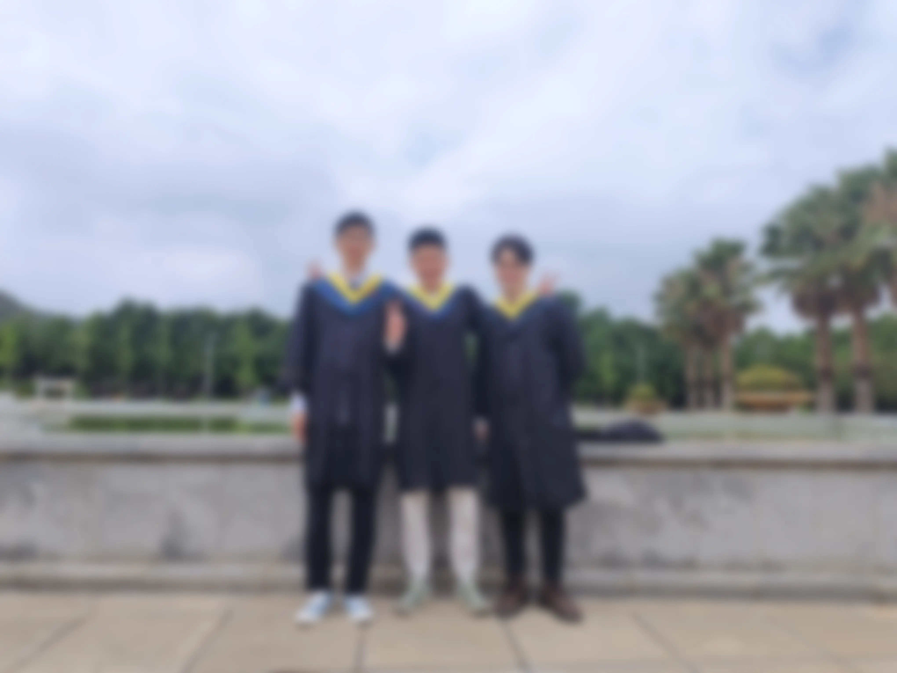
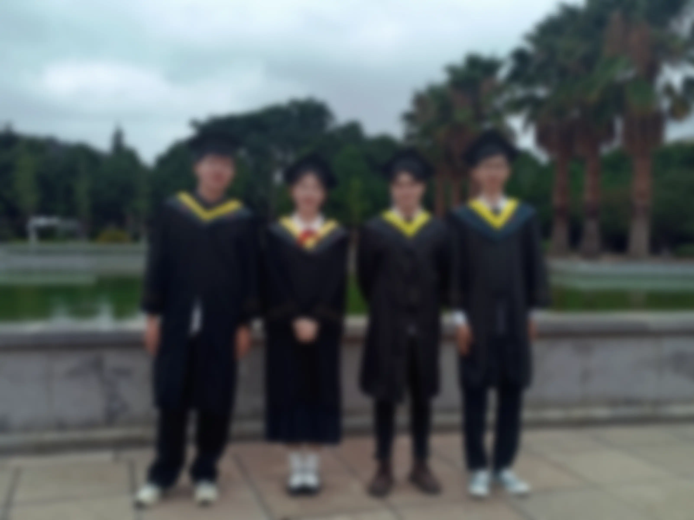
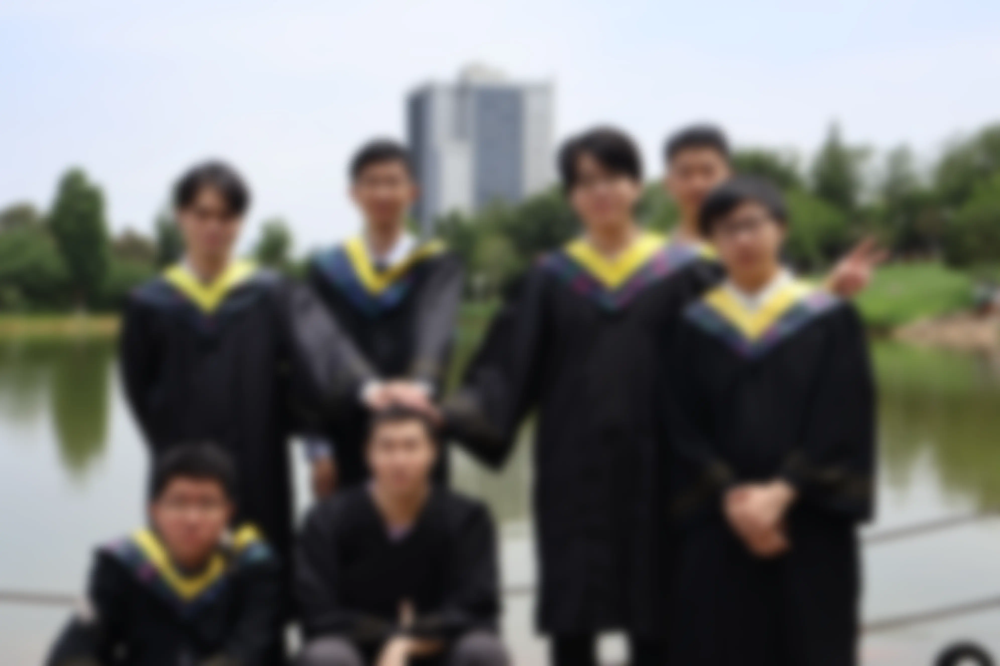

# [一蓑烟雨任平生]04 接棒

> 对我来说，这正是两个人生阶段的交界点：学生时代即将结束，工作生活即将开始，这就好似接力赛中的接棒，在拿下下一棒之后也要继续向前奔跑，故这一篇题为“接棒”。

* 今天是2024年7月2日，说起来距离上一次写博客已经过去2个多月了，这段时间发生了许多难忘和出乎意料的事情。也许多年之后回头看，这会是我的人生中一个重要的转折点吧。

## Part.1 学校生涯

* 首先呢，这是最后一段大学时光了，5、6月份的时间比较轻松——论文已经大致完成，各项学分也都顺利拿到了，因此有大把的时间可以一起打游戏、聊数码产品、吃饭、闲聊，确实过的非常开心。很幸运能够遇到如此多的志趣相投的朋友，幸甚至哉。

> 上述照片均拍摄于2024年5月30日，分别位于图书馆前和泽湖边。

* 但是，快乐的时光总是短暂的，转眼间这一个月就过去了大半，其中一个舍友也因为工作原因，总是在家和学校之间奔波，聚少离多，算是一点遗憾吧。不过这样也好，为了自己的明天而努力，这是值得尊敬的。
* 赵雷的歌中写“分别总是在九月”，说的大概是小学和中学生，但对我来说，分别来的更早一些，就在这个六月。想来想去也没有太契合的诗句，倒是一首歌挺适合送别的：

### 附：《江山行歌》

......

轻舟泊苍茫 船头捞月亮 千年亦如一瞬长

浩浩去流江 人生路远 山河坦荡 好景在前方

......

> 希望诸位同仁前程似锦，一帆风顺。愿友谊长存，江山永固。

## Part.2 工作生活

### 2024/07/14记

* 其实在写文章的时候已经是入职第2天了，嗯，7月1日当天入职的。我学校发毕业证比较晚，一直到6月28日才拿到，随即离开学校，就在家待了一晚上，第二天就直接去了南京，公司所在地。

* 现在是7月14日，距离入职已经过去了2星期，每天都还是挺充实的，我也渐渐习惯了这里的生活。比较令我安心的是，我所在的部门氛围非常好，人不多所以都坐在一起，虽然分工不同，但没有什么隔阂，大家都自觉完成自己的工作，有问题一起讨论，闲暇时一起聊天，轻松而充实。
* 其实我是一个偏内向的人，而且由于我是临上班前才被分到前端的，所以底子非常浅，目前写的代码还不够可靠，所以实际上我现在还是“学习中”，而不是“工作中”。虽然大家都很友好，让我好好学就是，但对我来说果然还是有一份拿得出手的本领才让人安心，现在参与不到工作中去，总会让我有一种“不安全感”。但这也没什么好办法，唯有多花时间学习、练手，尽快步入正轨了。

### 2024/10/20记

* 现在可以说我的工作已经进入正轨了，现在在做第三个项目，差不多从第二个项目开始，我就能够独自完成了，虽然会由于经验不足、工具不熟练等原因导致一些问题，但总体来说都在可控范围之内，还是能够完成任务的。现在的工作也比较忙，每天都有很多事情要做，但我还是很喜欢这种状态，充实的工作带来的提升是显而易见的，我的内心因此感到非常踏实。
* 由于我有一些机器学习和后端的背景，因此在做前端开发时，我的思考内容与纯前端开发者有所不同，考虑解决方案时视角更加综合一些。比如最近要优化网站加载速度，主要是图片、视频等媒体资源拖累加载速度。除了采用异步加载和缓存之外，我提出了采用webp和HEVC等新格式压缩的方法，并且写了相关的Shell脚本以方便批量转换。
* 但这也不意味着我万事大吉了，古话说“人无远虑，必有近忧”。现在我逐渐熟悉原本不了解的前端开发，但也要提防沉迷于舒适区——尽管这个舒适区从Python变成了Vue。海阔凭鱼跃，天高任鸟飞，需要我继续学习的东西还多着呢。套用一句名言：

务必使同志们继续地保持谦虚、谨慎、不骄、不躁的作风，务必使同志们继续地保持艰苦奋斗的作风。

