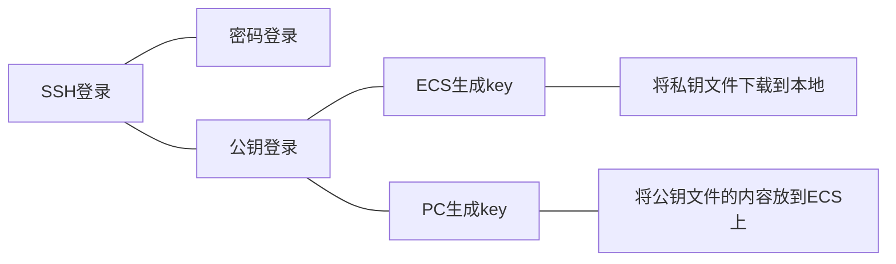
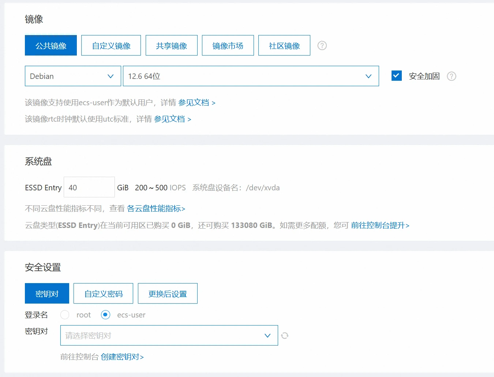
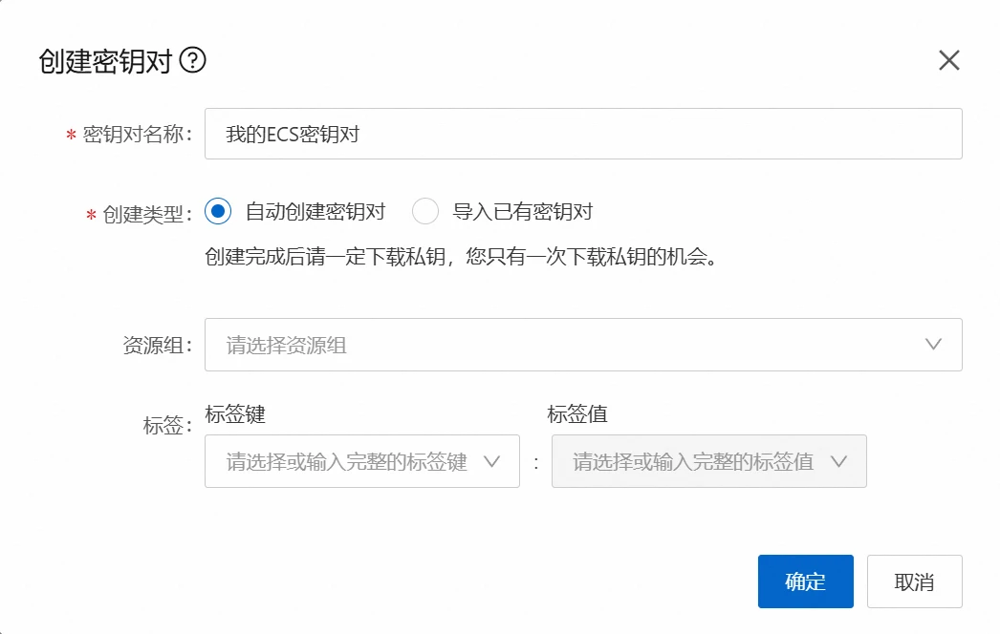
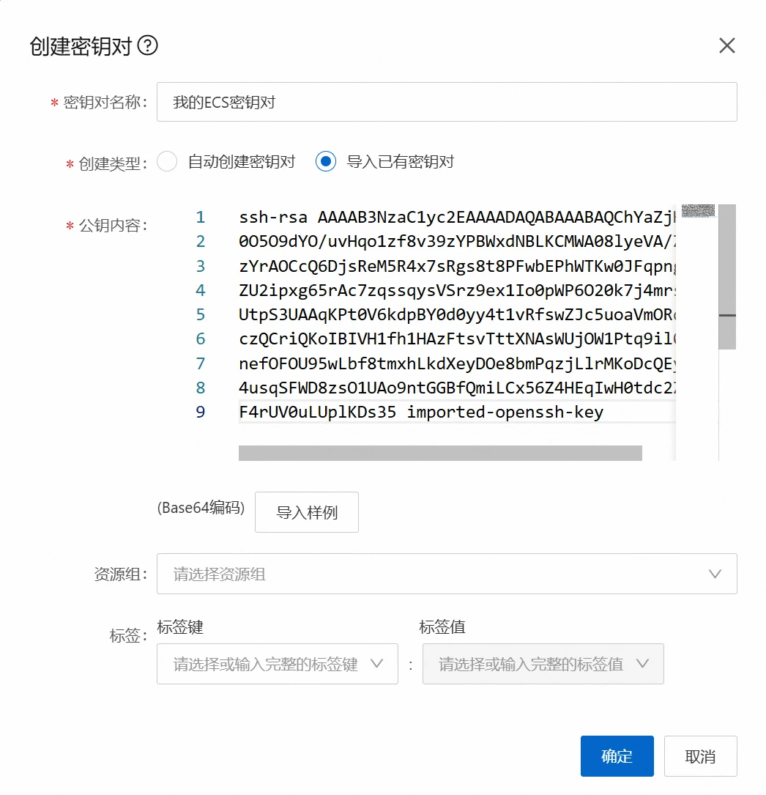
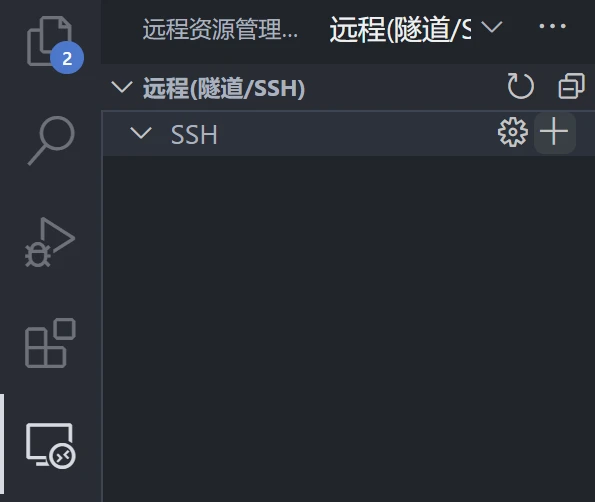
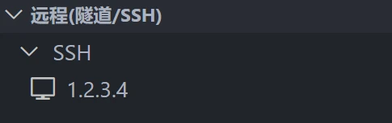
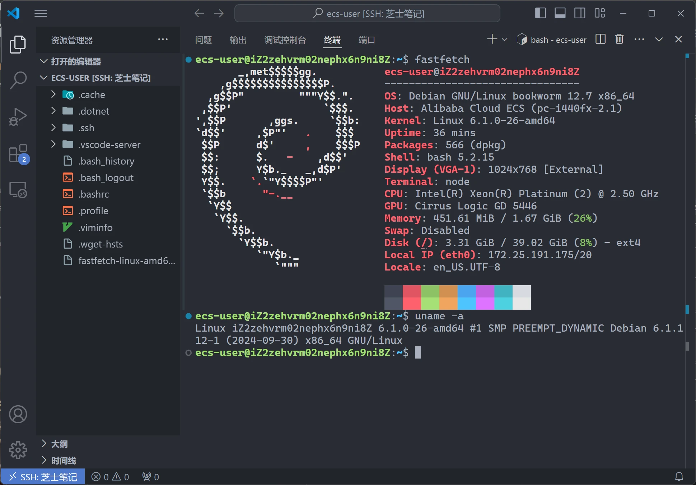
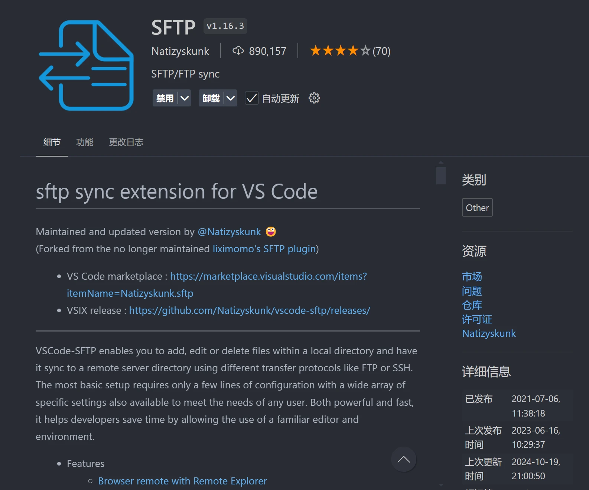
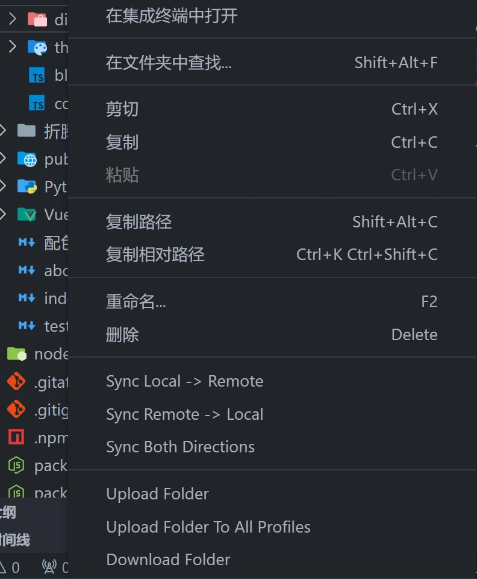

# [折腾]ECS折腾记

> 其实我接触这类东西比较早，大三那会软件工程的课设要搭个网站，那时候就白嫖了微软的Azure，愣是靠着一套现在看来非常low的技术栈(把一个H5的demo改造成Jinja2模板+Flask+MySQL)完成了一个网站，不过后来白嫖到期了便作罢。后来那年寒假，我出去实习的时候看到阿里云有个99包年的活动，就入坑了一个ECS，把自己的博客搬了上去，直到现在。

## 配置VS Code+SSH

> 假设此时你已经有了一个ECS，并且想方便地管理你的远程项目，那我相信你会喜欢这一节的。

- 首先要知道，我们租的ECS实际上在某个机房中，我们不能像在PC上拷文件一样直接插U盘，因此需要一种东西来远程控制ECS，而SSH正是我们需要的东西。SSH是一种安全的远程连接协议，而OpenSSH是实现这种协议的软件，几乎已经成为SSH的代名词。作个有些不恰当的比喻，这就好像Magnet协议和qBittorrent的关系一样。

### 1. 本地安装SSH客户端

- 第一步，你需要确保本地有一个SSH客户端，我们以OpenSSH客户端为例：
- Windows下，你可以在命令行或PowerShell中输入`ssh -V`查看OpenSSH的版本，默认情况下Windows 10及之后的版本已经内置了OpenSSH，但也不能完全保证(也许某些精简版会把这个阉割掉也说不定)。想要安装的话，可以以管理员身份启动PowerShell，执行以下命令即可。在Windows 11中，你也可以在*设置-系统-可选功能-添加可选功能*中找到OpenSSH客户端，在有GUI的情况下安装。

  ```powershell
  Add-WindowsCapability -Online -Name OpenSSH.Client~~~~ 0.0.1.0
  ```

- Linux下，一般比较开箱即用的Linux发行版都自带了SSH客户端，没有的话请使用对应的包管理器安装吧(什么`apt`、`pacman`，自行安装即可)

### 2. 创建ECS实例时选择登录方式

- 之后我们转换视角到ECS上，一般ECS会在创建实例时自动安装好OpenSSH服务器，并且让你选择远程连接的方式(密码或公钥)，我更推荐使用公钥，因为通常来说它更方便，也更安全。登录方式通常有以下几种选择：



- 以阿里云为例，在创建ECS实例时，会需要在**安全设置**一栏中选择登录方式，“密钥对”就是使用公钥登录。以下截图是换系统时的界面，不是创建实例的界面，所以仅供参考。
  
- 如果选择密码登录的话，就只要记好密码，尽量不要被别人试出来即可了，不再多说。
- 如果选择“密钥对”的话，通常需要创建一个新的密钥对，在创建密钥对时可以选择**自动创建**(ECS生成)和**导入已有**(PC生成)。如果你有多台PC登录这个ECS的需求，最好选择自动创建；如果反过来，一台PC登录多个ECS，导入已有更合理一些。
  
  
  > 这将会下载一个`pem`文件，你可以通过足够安全的方式把这个文件放在多个PC中，这样多个PC都可以登录这个ECS
  
  
  
  > 你只需要在多个ECS创建时使用这一串公钥内容，即可使用同一台PC登录多个ECS
  >
  > 才不会说本地生成公钥的方法是在终端输入`ssh-keygen`，并且一路回车即可。也不会说`~/.ssh/`(Windows中是`C:/Users/<username>/.ssh/`)中的`.pub`结尾的文件就是公钥文件了，用VS Code打开即可看到公钥内容。

### 3. VS Code与SSH客户端配置

- 接下来只要配置PC即可了，也更简单一些，我接下来使用VS Code演示。
- 首先打开你的VS Code，在扩展中找到[Remote - SSH](#关联阅读)扩展并安装，就是下面这个：


- 安装好之后你会发现左侧多了一个小按钮，它应该叫做“远程资源管理器”，点开它，并且点击“SSH”一栏旁边的小加号

- 之后会弹出一个小的对话框，在此处输入ssh登录的命令即可直接完成配置，很方便。下面给出几种登录命令的参考，其中`<user>`是用户名、`<host>`是服务器的公网IP或域名、`-p`参数指定端口为22，也是SSH服务的默认端口：

```shell
# ssh不允许明文显示密码，所以没有密码对应的参数，是在执行命令后交互式输入的
ssh <user>@<host> -p 22

# 下载pem之后，在登录时需要指定pem文件的路径
ssh <user>@<host> -i key.pem -p 22

# 如果是本地生成的pub，无需额外配置，ssh会自动使用的，所以其实和使用密码时的命令一样，只不过没有输密码的环节
ssh <user>@<host> -p 22
```

- 例如我下载了`pem`文件，用户名是`ecs-user`，IP假定为`1.2.3.4`，那么我的命令就是`ssh ecs-user@1.2.3.4 -i "key.pem" -p 22`，随后就会产生一个选项：


- 在这个选项右侧有2个图标：“在当前窗口中连接”和“在新窗口中连接”，任选一个，选择目标平台(一般是Linux)，输入完密码(有需要的话)，等待远端下载完成VS Code服务器即可愉快玩耍了。



## 部署一个静态网站

> 这一节使用nginx部署我的个人网站(基于VitePress)

- 经过上一节的内容，现在你应该可以使用SSH登录到你的远程服务器了。现在假设你已经有了一个静态网站的项目，那么接下来只有2步了

### 1. 将静态网站上传到ECS上

- 如果你稍微了解过一点运维流程的话，你可能知道我要说SFTP或者XShell了，但作为一个非专业运维，这部分的需求应当是一切从简，我再次推荐一个VS Code插件：[SFTP](#关联阅读)。它的功能很强大，配置完之后使用也是很方便的。


- 安装完成后，进入静态网站所在的项目，使用`Ctrl+Shift+P`组合键呼出快捷搜索，输入`SFTP`，找到`SFTP: Config`，它会自动创建一个`sftp.json`，并存储在当前项目的`.vscode`路径下。

:::tip
如果你的项目使用git同步，那么为了保护隐私，可以把`.vscode`路径添加到`.gitignore`文件中。
:::

- 随后就是配置这个json文件，默认的模板可能长以下这个样子，但是其实这个模板很多东西是用不到的，只需要以下的这些即可：

```json
{
    "name": "My Server",
    "host": "localhost",
    "protocol": "sftp",
    "username": "username",
    "remotePath": "/"
}
```

- 其中，`name`为标识ECS的名字；`host`为ECS的IP或域名；`username`为登录ECS的用户名；`remotePath`为要同步的文件或文件夹在ECS上的路径
- 以我的VitePress为例，我的用户名为`ecs-user`，想把我的文件放在ECS的用户目录下的`Blog`路径中，那么`username`就是`ecs-user`，`remotePath`就是`/home/ecs-user/Blog/`
- 但是上述模板还不够，还需要再额外配置一些东西，比如登录方式。如果使用密码登录，需要添加一项`password`，而如果是使用密钥登录，需要添加一项`privateKeyPath`。
- 还有一点，由于我只需要同步静态文件而非整个项目，它的路径为`<项目路径>/docs/.vitepress/dist`，那么还可以添加一项`context`，填写要同步的子路径。
- 所以我的配置文件如下所示：

```json
{
    "name": "Blog",
    "host": "1.2.3.4",
    "protocol": "sftp",
    "username": "ecs-user",
    "privateKeyPath": "key.pem",
    "context": "C:/Users/Steven/My Blog/docs/.vitepress/dist/",
    "remotePath": "/home/ecs-user/Blog/"
}
```

- 这就算配置完成了，那么我们怎么使用呢？只需要在VS Code的资源管理器选项中，在要同步的文件夹上右键，即可看到一些选项，点击"Sync Local -> Remote"即可将本地路径同步到远端。
- 使用这种同步有很多好处，比如只会同步有修改的文件，不需要SSH连接到ECS，不需要重启任何服务，nginx能够自动应用修改后的网站。



### 2. 配置nginx

> nginx是一个轻量的Web服务器，开源，功能强大，配置相对简单，对于一个小型的个人博客来说它是很合适的选择。

- 现在假设ECS服务器上已经有你的静态网站了。首先，对你的网站内容设置一次权限，以免nginx无法访问：

```shell
chmod -R 755 /home/ecs-user/Blog/ # 递归地将Blog文件夹及其子文件夹的权限设置为755
```

- 然后，安装nginx，以Debian/Ubuntu为例，执行如下命令，nginx就会自动安装并启动相关服务

```shell
sudo apt install nginx
```

- 随后，我们需要配置nginx，它的配置文件是`/etc/nginx/nginx.conf`，但我不太建议直接修改根配置文件，更好的方式是在`/etc/nginx/sites-available/`下创建一个新的配置文件，然后在`/etc/nginx/sites-enabled/`下创建一个软链接，这样可以更好地管理多个app的配置。
- VitePress官网给出了一个[nginx配置示例](https://vitepress.dev/zh/guide/deploy#nginx)，我就直接拿来，修改一下`root`即可使用了。你也可以参考一下`/etc/nginx/sites-enabled/default`的配置，它是nginx的默认配置文件。
- 以我的VitePress为例，我的配置文件如下：

```nginx
server {
    gzip on;
    gzip_types text/plain text/css application/json application/javascript text/xml application/xml application/xml+rss text/javascript;

    listen 80;
    server_name _;
    index index.html;

    location / {
        # content location
        root /home/ecs-user/Blog/;

        # exact matches -> reverse clean urls -> folders -> not found
        try_files $uri $uri.html $uri/ =404;

        # non existent pages
        error_page 404 /404.html;

        # a folder without index.html raises 403 in this setup
        error_page 403 /404.html;

        # adjust caching headers
        # files in the assets folder have hashes filenames
        location ~* ^/assets/ {
            expires 1y;
            add_header Cache-Control "public, immutable";
        }
    }
}
```

- 将该文件放在`/etc/nginx/sites-available/`下，然后在`/etc/nginx/sites-enabled/`下创建一个软链接即可。你可以在终端通过`nginx -t`命令检查是否有语法错误或者冲突，如果没有的话，就可以重启nginx服务了。

:::tip
`/etc/nginx/sites-enabled/default`已经是一个服务了，并且`server_name`是`_`，而很多网上给出的示例中`server_name`也是`_`，这可能会导致一些问题。所以在你的配置文件中，最好手动将`server_name`改一个不会冲突的名字，或者干脆删除掉`default`。
:::

```shell
sudo systemctl restart nginx # 重启nginx服务
```

- 此时，通过ECS的公网IP即可访问你的网站了，如果有域名的话，记得在域名解析中添加一条A记录，指向你的ECS的公网IP或CDN即可。

## 使用Cloudflare添加SSL

## 关联阅读

- [Remote - SSH](https://marketplace.visualstudio.com/items?itemName=ms-vscode-remote.remote-ssh)
- [SFTP](https://marketplace.visualstudio.com/items?itemName=Natizyskunk.sftp)
- [SFTP配置公钥至受信任列表,提供外部访问_sftp public key-CSDN博客](https://blog.csdn.net/dwyane__wade/article/details/79223135)
- [Nginx配置文件详解 - 程序员自由之路 - 博客园](https://www.cnblogs.com/54chensongxia/p/12938929.html)
- [部署 VitePress 站点 | VitePress](https://vitepress.dev/zh/guide/deploy#nginx)
