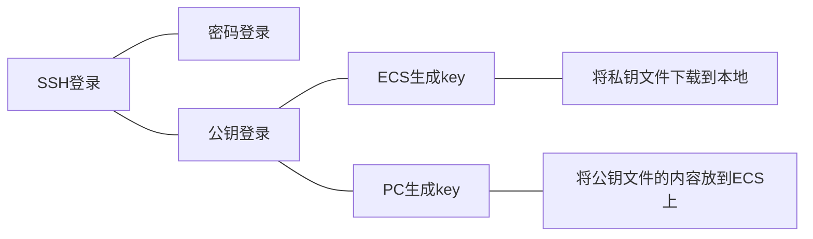

# [折腾]ECS折腾记

> 其实我接触这类东西比较早，大三那会软件工程的课设要搭个网站，那时候就白嫖了微软的Azure，愣是靠着一套现在看来非常low的技术栈(把一个H5的demo改造成Jinja2模板+Flask+MySQL)完成了一个网站，不过后来白嫖到期了便作罢。后来那年寒假，我出去实习的时候看到阿里云有个99包年的活动，就入坑了一个ECS，把自己的博客搬了上去，直到现在。

## 配置VS Code+SSH

> 假设此时你已经有了一个ECS，并且想方便地管理你的远程项目，那我相信你会喜欢这一节的。

- 首先要知道，我们租的ECS实际上在某个机房中，我们不能像在PC上拷文件一样直接插U盘，因此需要一种东西来远程控制ECS，而SSH正是我们需要的东西。SSH是一种安全的远程连接协议，而OpenSSH是实现这种协议的软件，几乎已经成为SSH的代名词。作个有些不恰当的比喻，这就好像Magnet协议和qBittorrent的关系一样。

### 1. 本地安装SSH客户端

- 第一步，你需要确保本地有一个SSH客户端，我们以OpenSSH客户端为例：
- Windows下，你可以在命令行或PowerShell中输入`ssh -V`查看OpenSSH的版本，默认情况下Windows 10及之后的版本已经内置了OpenSSH，但也不能完全保证(也许某些精简版会把这个阉割掉也说不定)。想要安装的话，可以以管理员身份启动PowerShell，执行以下命令即可。在Windows 11中，你也可以在*设置-系统-可选功能-添加可选功能*中找到OpenSSH客户端，在有GUI的情况下安装。

  ```powershell
  Add-WindowsCapability -Online -Name OpenSSH.Client~~~~ 0.0.1.0
  ```

- Linux下，一般比较开箱即用的Linux发行版都自带了SSH客户端，没有的话请使用对应的包管理器安装吧(什么`apt`、`pacman`，自行安装即可)

### 2. 创建ECS实例时选择登录方式

- 之后我们转换视角到ECS上，一般ECS会在创建实例时自动安装好OpenSSH服务器，并且让你选择远程连接的方式(密码或公钥)，我更推荐使用公钥，因为通常来说它更方便，也更安全。登录方式通常有以下几种选择：



- 以阿里云为例，在创建ECS实例时，会需要在**安全设置**一栏中选择登录方式，“密钥对”就是使用公钥登录。以下截图是换系统时的界面，不是创建实例的界面，所以仅供参考。
  
- 如果选择密码登录的话，就只要记好密码，尽量不要被别人试出来即可了，不再多说。
- 如果选择“密钥对”的话，通常需要创建一个新的密钥对，在创建密钥对时可以选择**自动创建**(ECS生成)和**导入已有**(PC生成)。如果你有多台PC登录这个ECS的需求，最好选择自动创建；如果反过来，一台PC登录多个ECS，导入已有更合理一些。
  
  
  > 这将会下载一个`pem`文件，你可以通过足够安全的方式把这个文件放在多个PC中，这样多个PC都可以登录这个ECS
  
  
  
  > 你只需要在多个ECS创建时使用这一串公钥内容，即可使用同一台PC登录多个ECS
  >
  > 才不会说本地生成公钥的方法是在终端输入`ssh-keygen`，并且一路回车即可。也不会说`~/.ssh/`(Windows中是`C:/Users/<username>/.ssh/`)中的`.pub`结尾的文件就是公钥文件了，用VS Code打开即可看到公钥内容。

### 3. VS Code与SSH客户端配置

- 接下来只要配置PC即可了，也更简单一些，我接下来使用VS Code演示。
- 首先打开你的VS Code，在扩展中找到[**Remote - SSH**](https://marketplace.visualstudio.com/items?itemName=ms-vscode-remote.remote-ssh)扩展并安装，就是下面这个：


- 安装好之后你会发现左侧多了一个小按钮，它应该叫做“远程资源管理器”，点开它，并且点击“SSH”一栏旁边的小加号

- 之后会弹出一个小的对话框，在此处输入ssh登录的命令即可直接完成配置，很方便。下面给出几种登录命令的参考，其中`<user>`是用户名、`<host>`是服务器的公网IP或域名、`-p`参数指定端口为22，也是SSH服务的默认端口：

```shell
# ssh不允许明文显示密码，所以没有密码对应的参数，是在执行命令后交互式输入的
ssh <user>@<host> -p 22

# 下载pem之后，在登录时需要指定pem文件的路径
ssh <user>@<host> -i key.pem -p 22

# 如果是本地生成的pub，无需额外配置，ssh会自动使用的，所以其实和使用密码时的命令一样，只不过没有输密码的环节
ssh <user>@<host> -p 22
```

- 例如我下载了`pem`文件，用户名是`ecs-user`，IP假定为`1.2.3.4`，那么我的命令就是`ssh ecs-user@1.2.3.4 -i "key.pem" -p 22`，随后就会产生一个选项：


- 在这个选项右侧有2个图标：“在当前窗口中连接”和“在新窗口中连接”，任选一个，选择目标平台(一般是Linux)，输入完密码(有需要的话)，等待远端下载完成VS Code服务器即可愉快玩耍了。


## 部署一个静态网站

## 使用Cloudflare添加SSL

## 关联阅读
