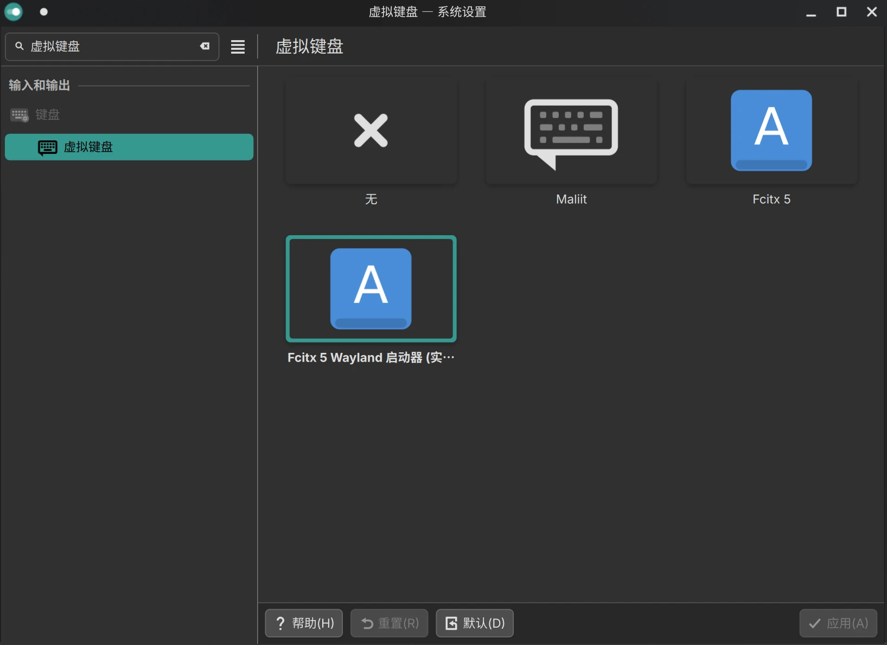

# [折腾]系统配置 Linux篇

> 这篇文章记录一下Linux的个性化配置，一切都是为了更方便、更好用。
>
> Linux系统使用的发行版是EndeavourOS，桌面环境是KDE Plasma，显示协议是Wayland，包管理器是Pacman和Paru

## 系统设置

### 修改默认应用

> 包括两部分，分别是`系统设置 / 应用和窗口 / 默认应用程序`和`/etc/environment`，对我来说前者只修改默认浏览器(chrome)，后者只修改默认编辑器(vim)

### 配置终端代理

> 很多时候一些在终端运行的软件需要连接代理才能运行，比如`docker`或`git`，配置终端代理的命令主要是以下3行

```shell
# 将<ip>和<port>替换为实际的IP和端口
export http_proxy="http:<ip>:<port>"
export https_proxy=$http_proxy
export socks5_proxy="socks5://<ip>:<port>"
```

- 最简单的方法是直接在`~/.bashrc`或`~/.zshrc`中添加这几行命令，重启终端即可生效。这样适合始终使用代理的情况，但如果你大多数时候使用代理，偶尔需要不使用，可以将取消代理的命令放在一个函数中，在需要时执行。

```shell
export http_proxy="http:<ip>:<port>"
export https_proxy=$http_proxy
export socks5_proxy="socks5://<ip>:<port>"

function noproxy() { # 取消代理
    unset http_proxy
    unset https_proxy
    unset socks5_proxy
}
```

### 终端配置

#### 解决粘贴时出现`^[[200~`的问题

> 这是由于终端的`Bracketed Paste Mode` <sup>[[1]](#references)</sup> 导致的，但实际上该特性用的不多，反而总是影响更常用的粘贴，可以通过执行以下命令关闭该模式：

```shell
echo -e "\e[?2004l"
```

## 硬件驱动

### 视频硬件加速驱动

> 本小节并非“**显示驱动**”，通常各发行版在安装时已经包含了显示驱动，因此如果只是显示界面、观看视频等基本操作，通常不需要额外安装驱动，下列操作主要针对音视频的相关开发者。

- 须知视频硬件加速存在多种实现方式，最常见的是Intel提供的**VA-API**和NVIDIA使用的**NVDEC/NVENC**。

#### Intel

- 对于Intel GPU来说，视频硬件加速主要依赖于**VA-API**。
- 从Broadwell(对应第5代酷睿)开始，包括*HD Graphics*、*UHD Graphics*、*Iris Xe Graphics*以及最新的*Arc Graphics*等众多架构GPU都只需安装[`intel-media-driver`](https://archlinux.org/packages/?name=intel-media-driver)驱动包即可，这涵盖了大部分常见的Intel GPU。

    ```bash
    sudo pacman -S intel-media-driver
    ```

- 除此之外，还推荐安装[`intel-gpu-tools`](https://archlinux.org/packages/?name=intel-gpu-tools)，这是一个Intel GPU的工具集，包含了一些调试和性能分析工具，对我来说，最常使用的命令是`sudo intel_gpu_top`，可以实时监控GPU的使用情况，和NVIDIA的`nvidia-smi`类似。

    ```bash
    sudo pacman -S intel-gpu-tools
    ```

- 在安装完成后，你便可以通过Intel GPU实现视频硬件加速了
  - 如果你只有一个GPU，那么通常它叫做`/dev/dri/renderD128`，你可以通过指定该渲染节点来进行硬件加速，例如在FFmpeg中添加`-hwaccel vaapi -hwaccel_device /dev/dri/renderD128`参数以实现硬件加速。
  - 如果你有多个GPU，则可以通过`ls -l /dev/dri/`来查看所有的DRI设备节点。

#### NVIDIA

> 以后用到了再写吧

### 罗技(Logitech)外设驱动

- 众所周知，罗技官方并没有提供Linux下的驱动软件，因此可以使用一个开源软件[`solaar`](https://github.com/pwr-Solaar/Solaar)实现相关功能

```bash
sudo pacman -S solaar
```

### 指纹驱动

- 现在越来越多的笔记本提供了指纹解锁功能，但很多供应商并不会专门提供Linux驱动程序，因此指纹识别需要自行解决。
- `libfprint`是一个开源的指纹识别驱动库，支持众多指纹传感器，是Linux下指纹识别的主要解决方案。
- 大多数指纹传感器都属于USB外设，因此可以通过`lsusb`命令查看连接的USB设备，找到对应的指纹传感器。

    ```text
    Bus 003 Device 003: ID 27c6:659a Shenzhen Goodix Technology Co.,Ltd. Goodix USB2.0 MISC
    ```

- 例如上述信息中，这一条便是指纹传感器，其中`27c6`是供应商ID，`659a`是产品ID，搜索`27c6:659a`即可找到相关信息。例如上述传感器的供应商是汇顶科技，并且该ID出现在了`libfprint`的[支持列表](https://fprint.freedesktop.org/supported-devices.html)中，因此对于我来说，只需要安装`libfprint`即可。
- 而如果没有出现在支持列表中的设备，则可能需要社区开发者提供驱动，可以继续在GitHub中逛逛，说不定就有大佬提供解决方案。

## 开发工具

### Git

#### 处理不同的行尾换行符

> Windows的行尾换行符是CRLF，Linux和MacOS使用的是LF。在Linux下为了兼容可能出现的CRLF，可以进行以下配置

```shell
git config --global core.autocrlf input
```

### zsh

> Linux自带的终端工具通常是**bash**，但我觉得不好用，一般会安装并使用**zsh**，主要参考了<sup>[[3]](#references)</sup>

1. 安装zsh
    :::code-group

    ```shell [安装zsh]
    paru zsh # 安装zsh
    chsh -s $(which zsh) # 修改默认Shell，执行之后需要重启终端
    ```

    ```shell [安装oh-my-zsh]
    # 使用原版安装脚本
    sh -c "$(curl -fsSL https://raw.githubusercontent.com/ohmyzsh/ohmyzsh/master/tools/install.sh)"
    # 使用Gitee镜像
    sh -c "$(curl -fsSL https://gitee.com/pocmon/ohmyzsh/raw/master/tools/install.sh)" 
    ```

    ```shell [安装zsh-autosuggestions]
    ## (可选)这是一个zsh自动补全插件，输入命令后会根据历史记录和上下文自动补全命令，推荐使用
    git clone https://github.com/zsh-users/zsh-autosuggestions ${ZSH_CUSTOM:-~/.oh-my-zsh/custom}/plugins/zsh-autosuggestions
    ```

    ```shell [安装zsh-syntax-highlighting]
    ## (可选)这是一个zsh语法高亮插件，推荐使用
    git clone https://github.com/zsh-users/zsh-syntax-highlighting.git ${ZSH_CUSTOM:-~/.oh-my-zsh/custom}/plugins/zsh-syntax-highlighting
    ```

    ```conf [~/.zshrc]
    ## 修改~/.zshrc中plugins一行为以下内容
    plugins=(git zsh-autosuggestions zsh-syntax-highlighting)
    ```

    ```shell [重载配置]
    source ~/.zshrc
    ```

    :::
2. 美化zsh

> 可选：使用Powerlevel10k皮肤，但我现在比较懒了，觉得整那些没必要，就先不写了

## 常用工具

### Fcitx5

> 主要参考Fcitx5 的Arch Wiki<sup>[[4]](#references)</sup>

1. 安装fcitx5基础库与中文支持

    ```shell
    sudo pacman -S fcitx5 fcitx5-configtool fcitx5-gtk fcitx5-qt fcitx5-chinese-addons
    ```

2. 安装中文词库<sup>[[5]](#references)</sup>

    ```shell
    paru fcitx5-pinyin-custom-pinyin-dictionary
    ```

3. 配置输入法

    - 请注意，不同桌面环境下配置fcitx的方法有所不同，详细可参考[Fcitx5的Arch Wiki](https://wiki.archlinux.org/title/Fcitx5)
    - 在KDE Plasma+Wayland下的配置很简单，仅需在系统设置中搜索“虚拟键盘”，然后选择Fcitx5(如果有2个选项，应该任何一个都可以)，随后编辑`/etc/environment`，添加一行配置：`XMODIFIERS=@im=fcitx`，最后重启即可
    

## References

1. [解决git bash粘贴^\[\[200~-CSDN博客](https://blog.csdn.net/okay_ing/article/details/136621547)
2. [硬件视频加速 - Arch Linux 中文维基](https://wiki.archlinuxcn.org/zh-sg/硬件视频加速)
3. [zsh 安装与配置，使用 oh-my-zsh 美化终端 | Leehow的小站](https://www.haoyep.com/posts/zsh-config-oh-my-zsh/)
4. [Fcitx5 - Arch Linux 中文维基](https://wiki.archlinuxcn.org/wiki/Fcitx5)
5. [wuhgit/CustomPinyinDictionary: 自建拼音输入法词库，百万常用词汇量，适配 Fcitx5 (Linux / Android) 及 Gboard (Android + Magisk or KernelSU) 。](https://github.com/wuhgit/CustomPinyinDictionary)
