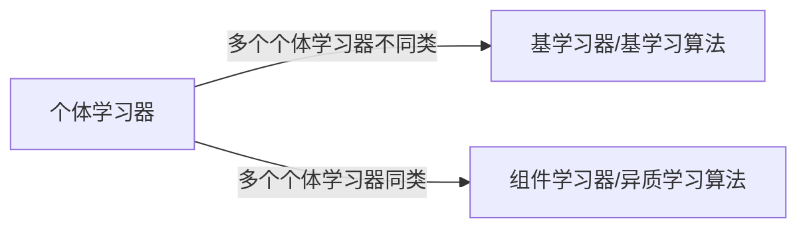
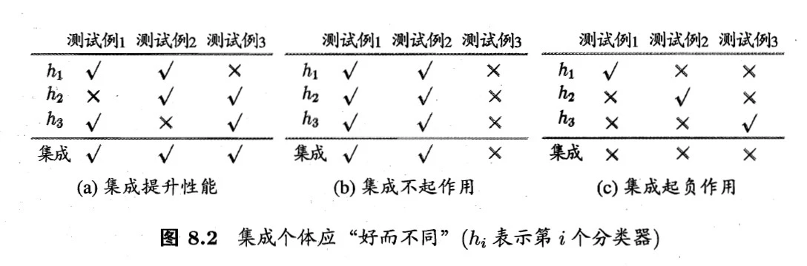
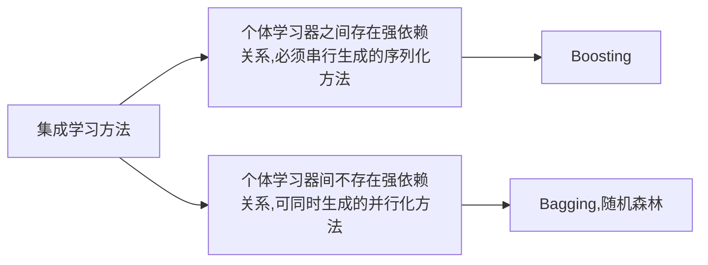
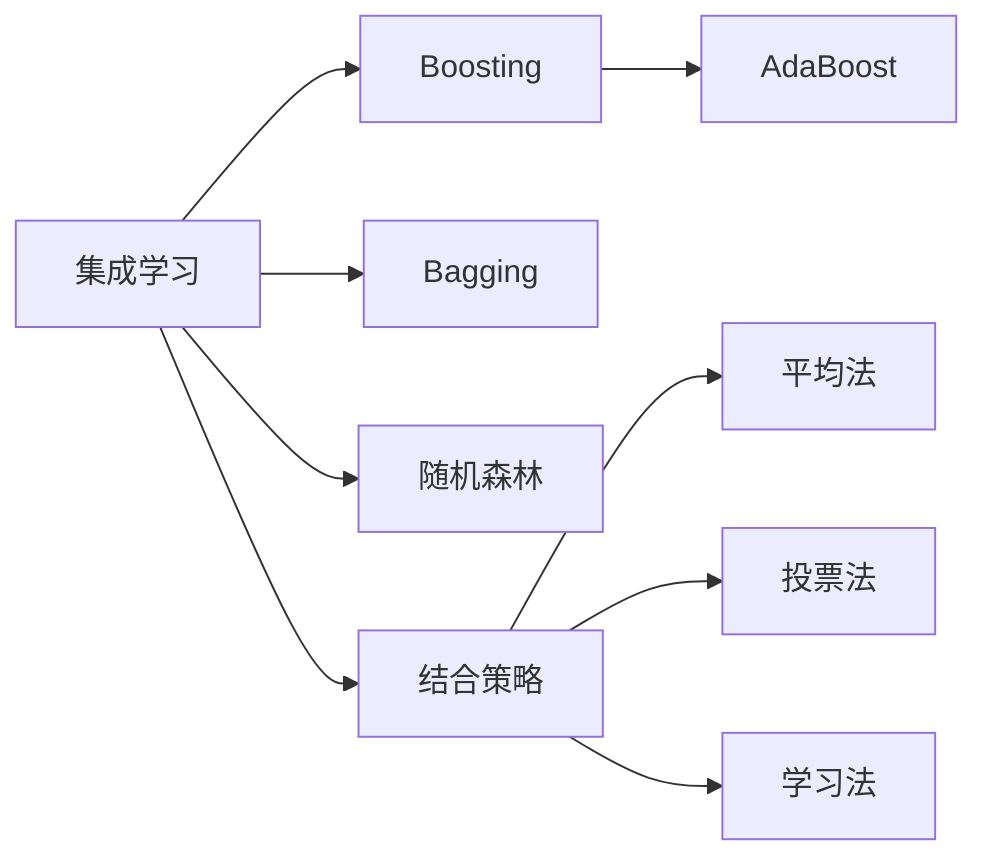

# [机器学习]05 集成学习

> 集成学习的思想是将多个模型组合起来，形成一个更强大的模型。

## 5.1 个体与集成

### 5.1.1 个体学习器的类别

### 5.1.2 个体学习器的要求

> 这里用一个例子引出。假设有3个个体学习器，3个测试用例，下表中√表示判断正确，×表示判断错误。下面3个表展示了集成学习后的3种可能的效果。

* 可见，(a)通过集成学习，集成了3个精度$\frac{2}{3}$的弱学习器，得到了精度为1的强学习器。这是理想的情况。
* (b)中，即使集合了3个弱学习器，但总体精度却没有提升，这是因为3个弱学习器的结果高度相同，也就是“它们仨”大概是从同一个角度进行分类的
* (c)更寄了，集成学习后的精度反而低于弱学习器的精度。3个弱学习器的精度都不太高:都是$\frac{1}{3}$

* 由此可知个体学习器的要求：
  * 个体学习器要有一定的**准确性**，即学习器不能太弱
  * 个体学习器之间要有**差异性**，即学习器之间不能太相似。
  * 这两句合称为“**好而不同**”

### 5.1.3 简单分析

* 对于二分类问题(类别记为+1，-1)，若基分类器的判断结果表示为$h_i(x)$，真实类别表示为$f(x)$。
  * 则错误率为$P(h_i(x)\not ={f(x)})=\epsilon$
  * 则集成后的错误率为$H(x)=\text{sign}\left(\sum\limits^T_{i=1}h_i(x)\right)$(用求和表示投票结果)
* 根据Hoeffding不等式(公式略)可知随着$T$增大，集成的错误率$H(x)$将指数级下降，最终趋于0。这说明集成学习“前途光明”
* 但这个结论建立在一个关键假设上：**基学习器的误差相互独立**....但事实上它们不可能相互独立，因为个体学习器都是针对同一个问题训练的，这又说明集成学习“道路曲折”。一般来说“准确性”和“多样性”是一对杠杆，集成学习的关键就是如何在准确性和多样性之间寻找平衡，即产生“**好而不同**”的个体学习器。

### 5.1.4 常用集成学习类别

## 5.2 Boosting

> 我们直接从AdaBoost开始吧

### 5.2.1 AdaBoost

* AdaBoost算法的最经典的表示为：$h(x)=\sum\limits^T_{t=1}a_th_t(x)$，其中$t$表示迭代次数，$a_t$表示第$t$个基学习器的权重，$h_t(x)$表示第$t$个基学习器(的输出结果)。

#### (1) 伪代码及理解

* **输入**：训练集$D=\{(x_1,y_1),(x_2,y_2),....,(x_m,y_m)\}$；基学习算法$\mathfrak{L}$；训练轮次$T$；
* **过程**：

1. $\mathcal{D}_1(x)=1/m$ (初始化训练集权重分布)
2. `for` $t=1,2,\cdots,T$ `do` (迭代训练$T$个基学习器)
3. * $h_t=\mathfrak{L}(D,\mathcal{D}_t)$ (基学习器训练)
4. * $\epsilon_t=P_{x~\mathcal{D}_t}(h_t(x)\not ={f(x)})$ (估算基学习器误差)
5. `if` $\epsilon_t>0.5$ `then` `break` (如果基学习器效率还不如瞎蒙，则提前停止)
6. $\alpha_t=\frac{1}{2}\ln\frac{1-\epsilon_t}{\epsilon_t}$ (计算基学习器权重，易知$\alpha_t$为正数，且和误差$\epsilon_t$成反比)
7. (计算下次迭代各样本的权重，若本次判对了则降低权重，否则增加，用以调整下次的注意力，书中叫“**样本分布**”)
  
  $$\mathcal{D}_{t+1}(i)=\frac{\mathcal{D}_t(i)}{Z_t}\begin{cases}e^{-\alpha_t},&h_t(x_i)=f(x_i) \\ e^{\alpha_t},&h_t(x_i)\not ={f(x_i)}\end{cases}$$

8. `end for`

* **输出**：$H(x)=\text{sign}\left(\sum\limits^T_{t=1}\alpha_t h_t(x)\right)$ (其实就是投票法)

#### (2) 重赋权法和重采样法

> 这里的2种方法是AdaBoost针对“基学习器能够对特定的数据分布进行学习”的处理方法，其实在伪码中已经体现了，不用担心。
>
> Boosting算法要求基学习器能够对特定的数据分布进行学习，这可通过“重赋权法”实现，如果基学习器算法不支持赋权，则用“重采样法”代替。

* 重赋权法：“训练过程的每一轮，根据样本分布为每个训练样本重新赋予一个权重”，其实就是上述伪码第7行，重新分配各样本的权重。
* 重采样法：“每一轮学习中，根据样本分布对训练集重新采样，用重采样而得的样本集对基学习器进行训练”
  * 此外，重采样法能避免重赋权法可能的“过早停止”的问题(伪码第5行，若性能不佳则迭代直接停止)，每次迭代都可获得“重启动”的机会，因此能保证迭代$T$轮。

#### (3) 分析

* Boosting主要关注**降低偏差**，因此它能基于泛化性能相当弱的学习器构建出很强的集成。

## 5.3 Bagging与随机森林

### 5.3.1 Bagging

* Bagging直接基于“[自助采样法](/机器学习/02_模型评估与选择.html#_2-2-3-自助法-bootstrap)”(也就是有放回采样)，单次采集$m$个样本，共采集$T$次，获得$T$个基学习器的训练集。
* 基于这些训练集训练出$T$个基学习器，最后进行投票法(分类问题)或平均法(回归问题)得到最终结果。

#### (1) 伪代码

* **输入**：训练集$D=\{(x_1,y_1),(x_2,y_2),....,(x_m,y_m)\}$；基学习算法$\mathfrak{L}$；训练轮次$T$；
* **过程**：

1. `for` $t=1,2,\cdots,T$ `do` (迭代训练$T$个基学习器)
2. * $h_t=\mathfrak{L} (D,\mathcal{D}_{bs})$
   > (基学习器训练，$\mathcal{D}_{bs}$为从$D$中有放回采样得到的训练集)
3. `end for`

* **输出**：$H(x)=\arg \max\limits_{y\in Y}\sum^T_{t=1}\text{II}(h_t(x)=y)$ (分类问题，投票法)

#### (2) 分析：Bagging的特点

* 时间复杂度低
  * Bagging实质是多个弱分类器直接组合，所以若基分类器的时间复杂度为$O(m)$，投票/平均过程的时间复杂度为$O(T)$，则Bagging的时间复杂度近似为$T(O(m)+O(s))$。
  * 而且由于$O(s)$通常很小，且$T$也不会很大，因此Bagging的时间复杂度通常与直接使用基学习器的复杂度同阶。
* 包外估计：根据自助法的特点：平均只有63.2%的样本出现在采样集中，因此可用剩余的36.8%的样本作为验证集，用以估计泛化性能。

### 5.3.2 随机森林

> 随机森林实质上是Bagging的一个扩展变体，其基学习器为决策树，但在决策树的训练过程中引入了随机属性选择。

* 首先随机森林就是一种Bagging，所以基本框架和Bagging伪码一致。每个基决策树的训练集同样是自助法产生，在训练集的构建中引入扰动(随机性)。
* 传统决策树在构建的时候，每次都从当前节点的全部属性中选择最优属性划分；而随机森林则先从当前结点的全部属性中随机选k个属性，然后再从这k个属性中选择最优属性进行划分。(通常推荐$k=\log_2d,d\text{为“全部属性”的数量}$)
  * 也就是说，它在决策树**选择属性**的过程中也引入了“扰动”
  * 除此自外，它和Bagging别无二致；但它却在很多任务中展现出强大的性能。

#### (1) 总结

* 随机森林是Bagging的一个扩展变体。
* 随机森林不仅具有**采样的随机性**(Bagging就有)，还在构建决策树的过程中引入了**属性选择的随机性**。

## 5.4 结合策略

> 学习器结合可能从**统计**、**计算**、**表示**三个方面带来好处，因此集成学习是有意义的。

### 5.4.1 平均法

> 平均法适合回归问题

* 简单平均法：$H(x)=\frac{1}{T}\sum\limits^T_{i=1}h_i(x)$
* 加权平均法：$H(x)=\sum\limits^T_{t=1}w_th_t(x)$
  * 权重通常是从训练数据中学习得到的，如AdaBoost中的$\alpha_i$

> 虽然加权平均似乎比简单平均法更好，但实际上并不一定。
>
> 一般而言，个体学习器**性能相差较大**时宜使用**加权平均法**；**性能相近**时宜使用**简单平均法**。
>
> 想想也合理，集成的目的就是“集各家之长”，哪个好就加大哪个的话语权嘛；而如果都差不多，那么话语权也应该差不多——简单平均。

### 5.4.2 投票法

> 投票法适合分类问题

* 绝对多投票法：若某个标记票数多于半数则预测为该标记，否则拒绝预测。
* 相对多投票法：预测为得票最多的标记，若得票最多的标记不唯一则随机选其中之一。
* 加权投票法：每个基分类器都有个权重$w_i$，每个基分类器对某个样本都输出$j$个{+1,-1}值：是否属于第$j$类，最后将所有基分类器的输出加权求和，得到最终的输出。

### 5.4.3 学习法

> 咕咕咕

## 5.5 多样性

## Extra05-总结

* 本章的知识脉络如下

* 其中，AdaBoost和随机森林是两个重点，需要了解算法思想、原理、伪代码(最好包括实现)
