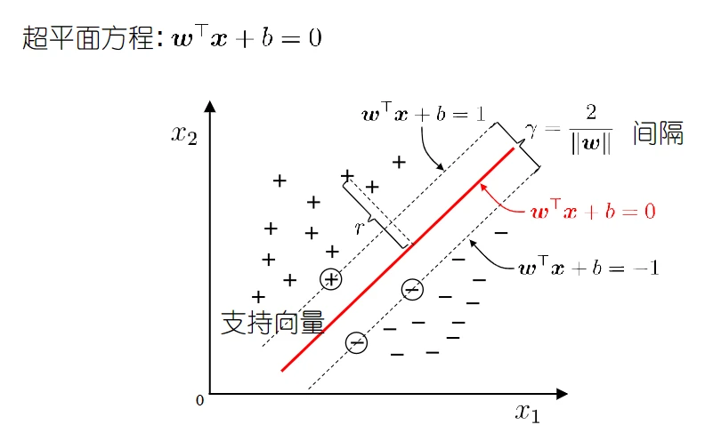
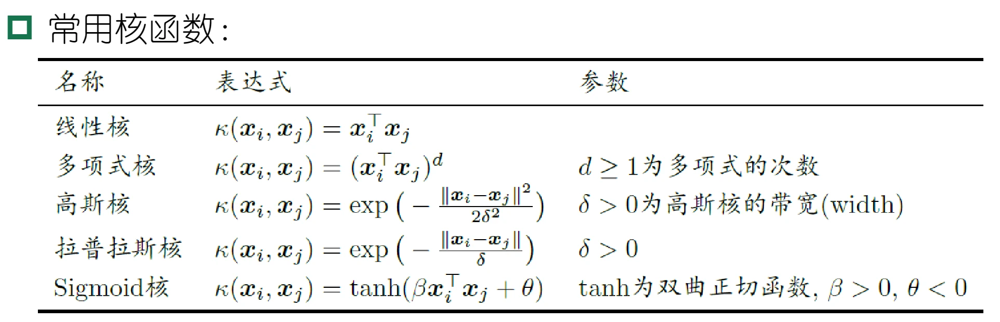

# [机器学习]06 支持向量机

> 隐隐觉得这一章与解析几何和传统高数关系紧密，同时似乎在学最优化理论时也接触过类似的思路。

## 6.1 间隔与支持向量

> 这一小节是引子，用以引出支持向量机的核心思想。

### 6.1.1 引子

* 如图是一个回归问题的样本分布，支持向量机的目标是要寻找一个超平面把两类样本分开，选哪个呢？直观上这个红色的最好，因为它离两类样本都足够远。
* 如果是分类问题，那么这个超平面最好能在一定范围内包住所有点。

### 6.1.2 总计一下SVM的目标

* 分类问题：**寻找一个超平面，能够分开正例和负例，且让超平面最近的两类点距离最大**
* 回归问题：**寻找一个超平面，能够包住全部样本点**

> 但通常来说，支持向量机更多用于分类问题，接下来的讨论也都是关于分类问题的。

### 6.1.3 支持向量机的基本型

* 设这个目标超平面的表达式为$w^Tx+b=0$，那么上述的目标用数学表示为：
  * 对于正类($y_i=+1$)的$x_i$，应当满足$w^Tx_i+b\geq1$
  * 对于负类($y_i=-1$)的$x_i$，应当满足$w^Tx_i+b\leq-1$。
  * 恰好满足这两式等号的样本被称为“支持向量”
  * 而两个异类支持向量到超平面的距离之和$\gamma=\frac{2}{\vert\vert w\vert\vert}$被称为“间隔”。

* 其实我们早就注意到这是个优化问题，简单表述为：寻找参数$w$和$b$，使得$\gamma$最大。

$$\arg \max_{w,b}\frac{2}{\vert\vert w\vert\vert}$$

$$\text{s.t. }y_i(w^Tx_i+b)\geq1,i=1,2,\cdots,m$$

* 但其实优化问题的基本型一般是$\min$，所以转换一下，得到SVM的优化问题的基本型：

$$\arg \min_{w,b}\frac{1}{2}\vert\vert w\vert\vert^2$$

$$\text{s.t. }y_i(w^Tx_i+b)\geq1,i=1,2,\cdots,m$$

## 6.2 对偶问题

> 解这个问题的方法是拉格朗日乘子法，引入拉格朗日乘子法后相当于解决原问题的对偶问题。

### 6.2.1 拉格朗日乘子法

#### (1) 公式推演

1. 引入拉格朗日乘子$\alpha_i\geq0$，得到拉格朗日函数

   * $L(w,b,\alpha)=\frac{1}{2}\vert\vert w\vert\vert^2+\sum_{i=1}^m\alpha_i\left[1-y_i(w^Tx_i+b)\right]$

2. 令$L(w,b,\alpha)$对$w$和$b$的偏导为0，得到：

   * $w=\sum\limits^m_{i=1}\alpha_iy_ix_i$(令$\frac{\partial L}{\partial w}=0$得到)
   * $0=\sum\limits^m_{i=1}\alpha_iy_i$(令$\frac{\partial L}{\partial b}=0$得到)

3. 回代到$L$中可得：

   * 首先化简一下$L$:

    $$L(w,b,\alpha)=\frac{1}{2}w^Tw+\sum_{i=1}^m\alpha_i-w^T\sum_{i=1}^m\alpha_ix_iy_i-\left(\sum\limits^m_{i=1}\alpha_iy_i\right)b$$

   * 然后将`2.`中的2个式子代入，得到：

    $$\max_\alpha \sum^m_{i=1}\alpha_i-\frac{1}{2}\sum^m_{i=1}\sum^m_{j=1}\alpha_i\alpha_jy_iy_jx_i^Tx_j$$

    $$\text{s.t. }\sum^m_{i=1}\alpha_iy_i=0,\alpha_i\geq0$$

* 此时需要验证满足[KKT条件](#2-kkt条件)

#### (2) KKT条件

> KKT条件是优化问题的一种重要条件，用于在约束条件下寻找最优解。

$$\begin{cases}
\alpha_i\geq0,(\text{拉格朗日乘子法的要求},\alpha_i\text{必须}\geq0)\\
y_if(x_i)\geq1,(\text{每个样本都要被正确地分类})\\
\alpha_i\left[y_if(x_i)-1\right]=0,(\text{必有}\alpha_i=0\text{或}y_if(x_i)=1)
\end{cases}$$

* 优化目标是凸函数的话，KKT条件就是全局极小值点存在的**充要条件**。
* 不是充分条件的话，KKT条件只能保证局部极小值点，也就是驻点，只是极小值点的**必要条件**。

#### (3) 解法

> 不会考的，所以随便看下即可

* 转换为对偶问题(拉格朗日乘子法)
* 代入约束条件
* 利用KKT条件，计算向量$w$
* 利用KKT条件，计算$b$

### 6.2.2 SMO(Sequential Minimal Optimization)算法

> 这又是个迭代算法，但并不要求掌握解法，知道就行

* 对于推导出的对偶优化问题：

$$\max_\alpha \sum^m_{i=1}\alpha_i-\frac{1}{2}\sum^m_{i=1}\sum^m_{j=1}\alpha_i\alpha_jy_iy_jx_i^Tx_j$$

$$\text{s.t. }\sum^m_{i=1}\alpha_iy_i=0,\alpha_i\geq0$$

* 如何高效求解呢？SMO算法是其中的代表。

#### (1) 基本思路

* 不断执行以下两个步骤直至收敛：
  * 选取一对需要更新的变量$\alpha_i$和$\alpha_j$
  * 固定$\alpha_i$和$\alpha_j$以外的参数，求解对偶问题更新$\alpha_i$和$\alpha_j$

#### (2) 变量选择原则

> 大概也不考，知道就行

* 第1个变量是在KKT条件不满足的中间选择。
  * 直观来看，KKT条件违背的程度越大，则变量更新后可能会使得目标函数的增幅越大
* 第2个变量应选择使得目标函数增长最快的变量，也就是两样本的间距最大。

## 6.3 核函数

> 若原问题线性不可分，根据一个什么公式，必然存在其高维映射线性可分，所以此时就将其从低维空间映射到高维空间。但映射完之后往往会导致维度灾难，所以就有了核函数。

### 6.3.1 为什么需要核函数

* 设样本$x$映射后的向量为$\varPhi(x)$，则超平面为$f(x)=w^T\varPhi(x)+b$，此时的优化问题为：
* 原始问题：

$$\arg \min_{w,b}\frac{1}{2}||w||^2$$

$$\text{s.t. }y_i(w^T\varPhi(x_i)+b)\geq1,i=1,2,\cdots,m$$

* 对偶问题：

$$\min_\alpha \frac{1}{2}\sum^m_{i=1}\sum^m_{j=1}\alpha_i\alpha_jy_iy_j\varPhi(x_i)^T\varPhi(x_j)-\sum^m_{i=1}\alpha_i$$

* 预测：

$$f(x)=w^T\varPhi(x)+b=\sum^m_{i=1}\alpha_iy_i\varPhi(x_i)^T\varPhi(x)+b$$

* 但是直接计算$\varPhi(x_i)^T\varPhi(x_j)$很难(因为维度通常很高)，所以我们才想到将其单独拉出来作为核函数$\mathcal{k}(x_i,x_j)=\varPhi(x_i)^T\varPhi(x_j)$，并且不直接设计核映射$\varPhi$，而是设计整个核函数$\mathcal{k}$。

> 所以说白了核函数就是一个函数，它的输入是两个样本，输出是两个样本映射后的内积，这样就避免了直接计算映射后的内积，从而避免了维度灾难。

### 6.3.2 常用核函数

* 明显核函数其实就是$x_i,x_j$做某种运算，其目的是为了升维映射，所以经过总结前人经验，目前存在多种常用核函数。

> 大概记个线性核和高斯核就差不多了

### 6.3.3 核函数的注意事项

* 核函数的选择成为SVM的最大变数
* 经验来讲，文本数据适合线性核，情况不明适合使用高斯核

## 6.4 软间隔与正则化

> SVM的想法太理想，但现实中往往无法实现，因此需要做一下妥协：允许一些样本不满足约束条件，即允许一些样本被误分类。

### 6.4.1 软间隔

* 引入软间隔之后，允许一些样本分类错误(即不满足约束)，但仍应当要求不满足的样本尽量少。

* 则优化目标改写为：

  $$\min_{w,b}\frac{1}{2}||w||^2+C\sum^m_{i=1}\mathcal{l}_{0/1}\left(y_i(w^T\varPhi(x_i)+b)-1\right)$$

* 其中$\mathcal{l}_{0/1}$是0/1损失函数，$C>0$是正则化常数，但是0/1损失函数不可导，因此我们使用松弛变量代替这部分：

  $$\min_{w,b,\xi_i}\frac{1}{2}||w||^2+C\sum^m_{i=1}\xi_i$$

  $$\text{s.t. }y_i(w^Tx_i+b)\geq1-\xi_i$$

  $$\xi_i\geq0$$

* 然后此时的拉格朗日乘子法表达式将变得史无前例地复杂：

  $$L(w,b,\alpha,\xi,\mu)=\frac{1}{2}||w||^2+C\sum\limits^m_{i=1}\xi_i+\sum\limits^m_{i=1}\alpha_i\left(1-\xi_i-y_i(w^Tx_i+b)\right)\sum\limits^m_{i=1}\mu_i\xi_i$$

* 但好在这个式子不要求记住，你只要知道此时的KKT条件变体

### 6.4.2 软间隔下的KKT条件

$$\begin{cases}
\alpha_i\geq0,\mu_i\geq0(\text{拉格朗日乘子法的要求},\alpha_i\text{必须}\geq0)\\
y_if(x_i)-1+\xi_i\geq0,(\text{松弛的表现，在原本≥1的地方变成}1-\xi_i)\\
\alpha_i\left[y_if(x_i)-1+\xi_i\right]=0,(\text{必有}\alpha_i=0\text{或}y_if(x_i)=1-\xi_i) \\
\xi_i\geq0,\mu\xi_i=0,(\text{松弛条件})\end{cases}$$

### 6.4.3 正则化

> 正则化通过引入模型复杂度(结构风险和经验风险)，来减小发生过拟合的几率

## 6.5 支持向量回归

## 6.6 核方法

> 本节不要求掌握

## Extra06-总结

* 本章的知识脉络如下图

graph LR

支持向量机-->间隔与支持向量
支持向量机-->优化问题求解思想-->KKT条件
支持向量机-->SMO
支持向量机-->核函数
支持向量机-->软间隔与正则化-->软间隔下的KKT条件

* 支持向量机的思想：“找一个超平面，......”是个小重点
* 支持向量机转化为优化问题后的**KKT条件**，以及加入**软间隔之后的KKT条件**是两个大重点

## Ques06-例题整理

### [思想理解·SVM是否对噪声敏感]

> 题目内容

* SVM对噪声敏感吗？为什么？

> 分析与解答

1. SVM对噪声敏感。
2. SVM的目标是找到一个超平面，使得所有样本点到超平面的距离最大，但是如果有噪声点，那么这个距离就会受到噪声点的影响，有可能使得SVM得不到最优的超平面而导致分类器性能下降，乃至出现错误。

### [思想理解·软间隔SVM惩罚参数]

> 题目内容

* 如何选择SVM的惩罚参数C?它对模型性能有什么影响？

> 分析与解答

* C是一个超参数，用于控制分类错误的惩罚强度。C过大，分类器会尽量减少在训练集上犯的错误，但这有可能导致过拟合。C值太小，则有可能会反过来——导致欠拟合。
* 因此，通常采用交叉验证等方法来确定合适的C值。
