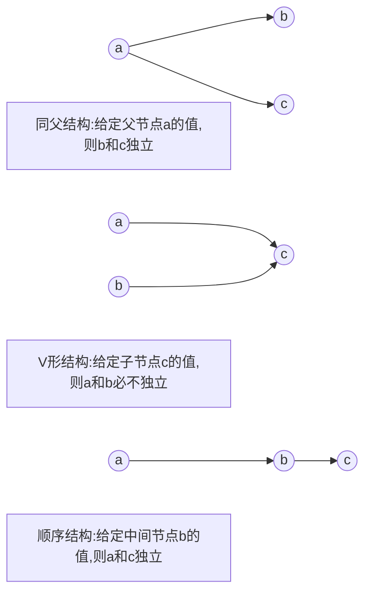

# [机器学习]11 贝叶斯分类器

> 这一章数学相关的东西比较多....

## 11.1 贝叶斯决策论

> 先介绍一些基本概念

* 类别：$y \in \{c_1, c_2, \cdots, c_N\}$
* 损失：$\lambda_{ij}$：将一个真实标记为$c_j$的样本误分类为$c_i$所产生的损失(不过感觉有点怪，怎么感觉这个表示法就好像写反了一样)
* 后验概率：$P(c_i\vert x)$：(已出现了)样本$x$，则其属于类别$c_i$的概率
* 条件风险：$R(c_i\vert x)=\sum\limits^m_{j=1}\lambda_{ij}P(c_j\vert x)$，即在样本$x$出现的条件下将其误分类为$c_i$所产生的期望损失
  * 可见这是个期望，遍历$x$可能属于的全部类别$c_j$，并且按照对应的后验概率$P(c_j\vert x)$加权
* 总体风险：$R(h)=\mathbb{E_x}[R(h(x)\vert x)]$，也就是考虑所有的条件风险，按照样本出现的概率加权。这个式子不要求搞清楚，只要明白这个量相当于一个分类器$h$对于所有样本的损失之期望即可，这个量可以衡量一个分类器的好坏
* 判定标准：若$h$能满足最小化总体风险：$h^(x)=\arg\min_{c\in C}R(c\vert x)$则这个$h$就是贝叶斯最优分类器，记作$h^*$

### 11.1.1 最小化分类错误率

> 只是要求简单的最小化分类错误率

* 那么此时$\lambda$就是个简单的0-1损失：

$$\lambda_{i,j}=\begin{cases}
  0 & i=j\\
  1 & i\neq j
\end{cases}$$

* 此时的条件风险为：$R(c\vert x)=1-P(c\vert x)$
* 最优分类器的目标变为：$h^*(x)=\arg\max_{c\in C} P(c\vert x)$，也就是选择后验概率最大的类别标记。
  * 但说实话，这个后验概率并不好求，因此我们通常用贝叶斯公式，结合先验概率和似然函数来求解

### 11.1.2 贝叶斯公式

> 其实就是概率论中经典的条件概率公式

$$P(c\vert x)=\frac{P(c)P(x\vert c)}{P(x)}$$

* $P(c)$：先验概率，直接反映了样本空间中各类样本所占的比例；这个通常可以估计，如$P(c)=\frac{\vert D_c\vert }{\vert D\vert }$，或者直接题目给定。
* $P(x)$：证据因子，反映了样本$x$出现的可能性，与类标记无关。
* $P(x\vert c)$：类条件概率，或者更熟悉的名字：似然函数，反映了在类别确定的条件下，样本$x$出现的可能性。
  * 但其实类条件概率和后验概率一样，不好求。接下来的两节展现了2个解决该问题的方法：
    * **极大似然估计**：假设样本遵从某种分布，且数据集中的样本独立同分布，以此来估计类条件概率。
    * **朴素贝叶斯分类器**：假设样本特征之间相互独立，以此来确定类条件概率。

## 11.2 极大似然估计

* 假设类条件概率$P(x\vert c)$服从某种概率分布，且被参数$\theta_c$唯一确认，极大似然估计的目的就是利用训练集$D$估算参数$\theta_c$。

### 11.2.1 极大似然估计的假设

* 类条件概率$P(x\vert c)$的概率分布类型已知(通常会认为样本遵从正态分布)，但其中的参数未知(如$\mu_c,\sigma_c$)
* 训练集$D$独立同分布产生

> 如果还有点印象的话，其实这两条就是我们在学概率论的时候那些运算的前提

### 11.2.2 极大似然估计的原理

* 用$D_c$表示训练集$D$中第$c$类样本组成的集合，那么参数$\theta_c$对于$D_c$的似然为：$P(D_c\vert \theta_c)=\prod\limits_{x\in D_c}P(x\vert \theta_c)$  (因为满足独立同分布，所以自然可以直接连乘)
  * “极大似然”就是找出个$\theta_c$，使得$P(D_c\vert \theta_c)$最大。
* 对于上式，连乘容易造成下溢，通常使用对数似然：$LL(\theta_c)=\log P(D_c\vert \theta_c)=\sum\limits_{x\in D_c}P(x\vert \theta_c)$
* 那么此时参数$\theta_c$的极大似然估计为：$\hat{\theta}_c=\arg\max\theta_c LL(\theta_c)$

> 说到底，还是没给出如何求解$\hat{\theta}_c$

### 11.2.3 极大似然法的问题

* 这种方法严重依赖假设的概率分布是否符合潜在的真实数据分布。(比如你假设样本服从正态分布，但实际上样本分布是个二项分布，那么此时极大似然估计就会十分不准确)

## 11.3 朴素贝叶斯分类器

> 朴素贝叶斯同样有假设：属性条件独立性假设：**每个属性独立地对分类结果产生影响**。

* 朴素贝叶斯分类器的核心公式为：

$$P(c\vert x)=\frac{P(c)P(x\vert c)}{P(x)}=\frac{P(c)}{P(x)}\prod^d_{i=1}P(x_i\vert c)$$

* 也就是说，$P(x\vert c)$直接等于各个特征的条件概率的乘积。这一思想(公式)似乎在概率论中叫经典贝叶斯公式(还是叫什么？记不清了)。

### 11.3.1 大致解题思路

* 我们的目的是得到后验概率$P(c\vert x)$，根据上述的朴素贝叶斯公式，可知需要基于训练集$D$估计先验概率$P(c)$和类条件概率$P(x_i\vert c)$。

1. 首先，若用$D_c$表示训练集$D$中第$c$类样本组成的集合，那么先验概率$P(c)$的估计为：$P(c)=\frac{\vert D_c\vert }{\vert D\vert }$
2. 估算类条件概率$P(x_i\vert c)$：
   1. 对于离散属性，直接用古典概型思想，即查数。用$D_{c,x_i}$表示在$D_c$中，第$i$个属性取值为$x_i$的样本组成的集合，那么$P(x_i\vert c)=\frac{\vert D_{c,x_i}\vert }{\vert D_c\vert }$
   2. 对于连续属性，假设其服从正态分布，那么：

       $$P(x_i\vert c)=\frac{1}{\sqrt{2\pi}\sigma_{c,i}}\exp(-\frac{(x_i-\mu_{c,i})^2}{2\sigma^2_{c,i}})$$

      * 其中$\mu_{c,i}$和$\sigma_{c,i}$分别是$D_c$中第$i$个属性在第$c$类样本中的均值和方差。
   3. 这样就可以得到全部的$P(x_i\vert c)$
3. 最后，结合$P(x)$ ($P(x)$通常是直接给出来的，因为实在没法直接确定)，代入到核心公式中，得到关于$x$的后验概率$P(c\vert x)$。

> 随后请看[例题](#计算朴素贝叶斯分类器)以明确题目该如何做

### 11.3.2 拉普拉斯修正

> 拉普拉斯修正用于解决朴素贝叶斯中，某个属性在训练集中没有出现过的情况。

* 举个例子：比如$x_i$为“敲声”，$c$为“好瓜”，但训练集中恰好$D_{\text{敲声=清脆,好瓜=是}}=\emptyset$，这样就会造成$P(x_i\vert c)=0$。而$P(c\vert x)$又是由$P(x_i\vert c)$的累乘得到的，所以$P(c\vert x)$恒为0。这明显是不对的。

#### (1) 如何修正

* 令$N$表示训练集$D$中可能的类别数，$N_i$表示第$i$个属性可能的取值数，那么先验和类条件概率(似然修正为)：

$$\hat{P}(c)=\frac{\vert D_c\vert +1}{\vert D\vert +N}$$

$$\hat{P}(x_i\vert c)=\frac{\vert D_{c,x_i}\vert +1}{\vert D_c\vert +N_i}$$

* 直观来看思路是这样的：这两式都表示“某种样本在某种类别中出现的概率”，为防止这个样本数为0，先加个保底的1；但这样的话，分母也要加上相应的保底数，以保证概率和为1。emmm，关于为什么分母是加$N$和$N_i$，我也不知道。

## 11.4 半朴素贝叶斯分类器

> 略

## 11.5 贝叶斯网

> 贝叶斯网和先前那几部分的贝叶斯决策论没啥关系了....相当于是个新的篇幅
>
> 贝叶斯网/信念网：借助有向无环图(DAG)来刻画属性间的依赖关系，并使用条件概率表(CPT)来表示属性的联合概率分布。

* 可以注意到一点：先前朴素贝叶斯有个假设：属性条件独立性假设，也就是每个属性独立地对分类结果产生影响。但这里的假设默认已经表面：不同属性间可能存在依赖关系，属性间不一定独立。

### 11.5.1 贝叶斯网的思想

* 假设：给定父结集，每个属性与它的非后裔属性独立。
* 表示法：有向无环图：$B=<G,\Theta>$，$G$是一个有向无环图，$\Theta$是$G$上的条件概率分布。
  * $G$：$G$中的每个结点表示一个属性，若属性$x_i$(子结点)依赖于$\pi_i$(父结点)，则$G$中存在一条从$\pi_i$指向$x_i$的有向边。
  * $\Theta$：$\Theta$用于定量描述这种关系，具体来说$\Theta$包含了每个属性的条件概率表：$\theta_{x_i\vert \pi_i}=P_B(x_i\vert \pi_i)$。

> 贝叶斯网里每条有向边其实都表示的是一个条件概率，因此在这里还可以结合朴素贝叶斯出题的(虽然这里属性间存在依赖关系，但仍然是可以用条件概率刻画，因此就可以纳入朴素贝叶斯的框架中)

### 11.5.2 独立性相关性质及证明

* 贝叶斯网中有以下三种典型结构

* 证明两者独立就是证明两者的联合概率等于各自的概率的乘积；或者各自带个条件概率。

#### (1) 同父结构

* 根据贝叶斯网的公式，有$P(a,b,c)=P(a)\cdot P(b\vert a)\cdot P(c\vert a)$
* 将$P(a)$除到左边，得到$\frac{P(a,b,c)}{P(a)}=P(b,c\vert a)=P(b\vert a)\cdot P(c\vert a)$，独立性得证。

#### (2) V形结构

* 根据贝叶斯网的公式，有$P(a,b,c)=P(a)\cdot P(b)\cdot P(c\vert a,b)$
* 将右边按照条件概率展开，得$P(a,b,c)=P(a)\cdot P(b)\cdot\frac{P(a,b,c)}{P(a,b)}$
* 移项，消项，得到$P(a,b)=P(a)\cdot P(b)$，独立性得证。

#### (3) 顺序结构

> 相对来说绕一些

* 首先明确我们要证的目标：$P(a,c\vert b)=P(a\vert b)\cdot P(c\vert b)$，接下来的证明均从左边这个开始
* 首先左边根据贝叶斯公式可知：$P(a,c\vert b)=\frac{P(a,c,b)}{P(b)}$
* 按照贝叶斯网公式进一步展开：$=P(a)\cdot P(b\vert a)\cdot P(c\vert b)/P(b)$
* 再条件概率展开：$=P(a)\cdot\frac{P(a,b)}{P(a)}\cdot\frac{P(b,c)}{P(b)}/P(b)$
* 消去$P(a)$，再将两个部分组合一下，得到：$=P(a\vert b)\cdot P(c\vert b)$，此时已得$P(a,c\vert b)=P(a\vert b)\cdot P(c\vert b)$，独立性得证。

## Ques11-例题整理

### [计算·朴素贝叶斯分类器]

> 题目内容

* 训练集中有十个样本，每个样本包含两个特征：

| 样本编号 | 1 | 2 | 3 | 4 | 5 | 6 | 7 | 8 | 9 | 10 |
|:----:|:-:|:-:|:-:|:-:|:-:|:-:|:-:|:-:|:-:|:--:|
| 特征1  | 0 | 0 | 1 | 1 | 1 | 1 | 1 | 1 | 0 | 0  |
| 特征2  | 0 | 1 | 0 | 1 | 1 | 0 | 0 | 1 | 1 | 0  |
|  类别  | + | + | + | + | + | - | - | - | - | -  |

* 现在有一个测试样本，特征为：特征1=1，特征2=0。请用朴素贝叶斯算法计算该样本属于类别+和类别-的后验概率，并确定其分类。

> 分析与解答

* 先验概率为：

$$P\left(+\right)=\frac{1}{2};P\left(-\right)=\frac{1}{2}$$

* 类条件概率观察可知：

$$P\left(x_1=1\middle\vert +\right)=\frac{3}{5};$$

$$P\left(x_1=1\middle\vert -\right)=\frac{3}{5};$$

$$P\left(x_2=0\middle\vert +\right)=\frac{2}{5};$$

$$P\left(x_2=0\middle\vert -\right)=\frac{3}{5};$$

* 根据贝叶斯公式，$P\left(+\middle\vert  x\right)=\frac{P\left(+,x\right)}{P\left(x\right)}=\frac{P\left(+\right)P\left(x\middle\vert +\right)}{P\left(x\right)}$，同理$P\left(-\middle\vert  x\right)=\frac{P\left(-\right)P\left(x\middle\vert -\right)}{P\left(x\right)}$，仅需比较$P(+)P(x\vert +)和P(-)P(x\vert -)$即可。
  * $P\left(+\right)P\left(x\middle\vert +\right)$
    * $=P\left(+\right)P\left(x_1=1\middle\vert +\right)P\left(x_2=0\middle\vert +\right)$
    * $=\frac{1}{2}\cdot\frac{3}{5}\cdot\frac{2}{5}$
    * $=\frac{6}{50}$
  * $P\left(-\right)P\left(x\middle\vert -\right)$
    * $=P\left(-\right)P\left(x_1=1\middle\vert -\right)P\left(x_2=0\middle\vert -\right)$
    * $=\frac{1}{2}\cdot\frac{3}{5}\cdot\frac{3}{5}$
    * $=\frac{9}{50}$

* 故$P\left(+\middle\vert  x\right)<P\left(-\middle\vert  x\right)$，所以样本x应该判定为负类。

### [计算·贝叶斯网络]

> 题目内容

* 假设你有以下条件概率表：

|                  条件概率                  |               概率值               |
|:--------------------------------------:|:-------------------------------:|
|             $P(\text{天气})$             | ${\text{晴天}：0.6，\text{阴天}：0.4}$ |
| $P(\text{湿度}\vert\text{天气}=\text{晴天})$ |        ${湿润：0.1，干燥：0.9}$        |
| $P(\text{湿度}\vert\text{天气}=\text{阴天})$ |        ${湿润：0.8，干燥：0.2}$        |
|       $P(撑伞\vert\text{草地湿度}=湿润)$       |         ${是：0.9，否：0.1}$         |
|       $P(撑伞\vert\text{草地湿度}=干燥)$       |         ${是：0.2，否：0.8}$         |

1. 请画出该条件概率表对应的贝叶斯网络
2. 请计算$P(\text{天气}=\text{晴天}\vert 撑伞=是)$

> 分析与解答

1. 贝叶斯网络如下

2. 计算过程如下

> 根据贝叶斯公式：

$$P(\text{晴天}\vert \text{撑伞})=\frac{P(\text{晴天},\text{撑伞})}{P(\text{撑伞})}$$

$$P(湿润)=P(湿润\vert \text{晴天})P(\text{晴天})\\+P(湿润\vert 阴天)P(阴天)$$

$$=0.1\times0.6+0.8\times0.4$$

$$=0.38$$

$$P(干燥)=0.62$$

$$P(\text{撑伞})=P(\text{撑伞}\vert 湿润)P(湿润)\\+P(\text{撑伞}\vert 干燥)P(干燥)$$

$$=0.9\times0.38+0.2\times0.62$$

$$=0.466$$

> 联合概率

$$P(\text{晴天},\text{撑伞}) \\ =P(\text{晴天})P(湿润\vert \text{晴天})P(\text{撑伞}\vert 湿润) \\ +P(\text{晴天})P(干燥\vert \text{晴天})P(\text{撑伞}\vert 干燥)$$

$$=0.6\times0.1\times0.9+0.6\times0.9\times0.2$$

$$=0.162$$

* 代入得$P(\text{晴天}\vert \text{撑伞})=\frac{0.162}{0.466}=0.3476$
