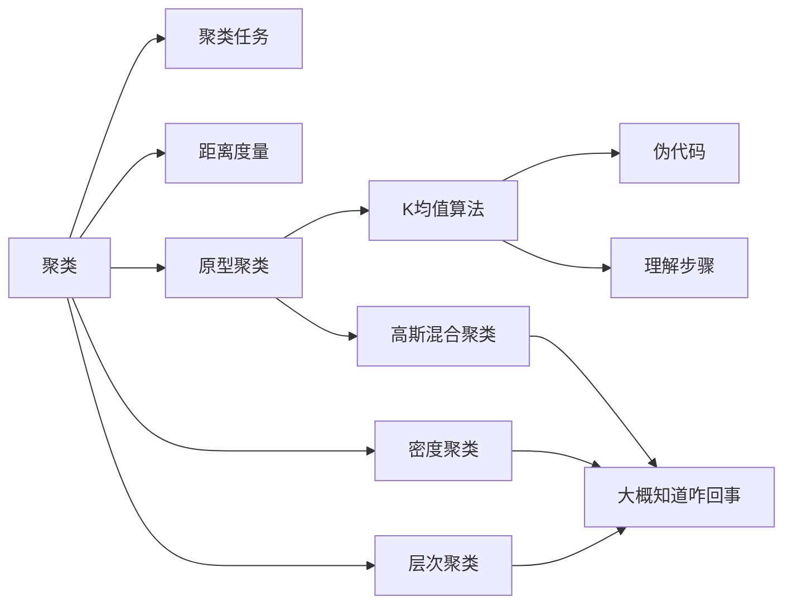

# [机器学习]12 聚类

> 首先要明确：聚类是**无监督学习**。

## 12.1 聚类任务

* 目标：通过对无标记训练样本的学习来展示其内在规律。其实现的形式是将样本划分为若干个不相交的子集(簇,$cluster$)
* 描述：给定一个训练集$D=\{x_1,x_2,...,x_m\}$，其中$x_i\in R^n$，聚类将训练集划分为$k$个不相交的簇$C=\{C_1,C_2,...,C_k\}$，其中$C_i\cap C_j=\emptyset$，$C_i\neq\emptyset$，$D=\cup^k_{l=1}C_l$，$i=1,2,...,k$

## 12.2 性能度量

> 似乎没啥好考的，因为后面的算法完全没有用到

## 12.3 距离度量

* 距离度量的性质：
  * 非负性：$d(x_i,x_j)\geq 0$
  * 同一性：$d(x_i,x_j)=0\Leftrightarrow x_i=x_j$
  * 对称性：$d(x_i,x_j)=d(x_j,x_i)$
  * 直递性：$d(x_i,x_j)\leq d(x_i,x_k)+d(x_k,x_j)$
* 常用距离：
  * 欧氏距离：$dist(x_i,x_j)=\sqrt{\sum\limits^n_{u=1}(x_{iu}-x_{ju})^2}$
  * 曼哈顿距离/街区距离：$dist(x_i,x_j)=\sum\limits^n_{u=1}(x_{iu}-x_{ju})$

## 12.4 原型聚类

### 12.4.1 K均值算法

> 这是本章最重要的算法，要求完全掌握，即思想、伪代码、优缺点、应用场景

* 给定数据集$D=\{x_1,x_2,\cdots,x_m\}$，K均值针对$k$个簇，最小化平方误差：

$$E=\sum^k_{i=1}\sum_{x\in C_j}\vert\vert x-\mu_i\vert\vert _2^2$$

#### (1) 伪代码

* **输入**：样本集$D=\{x_1,x_2,\cdots,x_m\}$，聚类簇数$k$;
* **过程**：

1. 从$D$中随机选择$k$个样本作为初始均值向量$\{\mu_1,\mu_2,\cdots,\mu_k\}$;
2. `repeat`
3. * 令$C_i=\emptyset(i=1,2,\cdots,k)$;
4. * `for` $j=1,2,\cdots,m$ `do` (遍历每个样本，更新每个样本所属的簇)
5. * * 计算样本$x_j$与各均值向量$\mu_i(i=1,2,\cdots,k)$的距离：$dist(x_j,\mu_i)=\vert \vert x_j-\mu_i\vert \vert_2$;
6. * * 根据距离最近的均值向量确定$x_j$的簇标记：$\lambda_j=arg\min\limits_{i\in\{1,2,\cdots,k\}}dist(x_j,\mu_i)$;
7. * * 将样本$x_j$划入相应的簇：$C_{\lambda_j}=C_{\lambda_j}\cup\{x_j\}$;
8. * `end for`
9. * `for` $i=1,2,\cdots,k$ `do`
10. * * 计算新均值向量：$\mu_i'=\frac{1}{\vert C_i\vert}\sum\limits_{x\in C_i}x$;
11. * * `if` $\mu_i'\not =\mu_i$ `then`
12. * * * 将当前均值向量$\mu_i$更新为$\mu_i'$;
13. * * `else`
14. * * * 保持当前均值向量不变;
15. * * `end if`
16. * `end for`
17. `until` 当前均值向量均未更新;
18. `return` 簇划分$C=\{C_1,C_2,\cdots,C_k\}$;

### 12.4.2 高斯混合聚类

> 应该不会详细考

* $p_M(x)=\sum\limits^k_{i=1}\alpha_ip(x\vert\mu_i,\sum_i)$
* 高斯混合分布是若干个参数不同的高斯分布的线性组合，来估计数据总体分布

* 过程：
  * E：(先估计高斯混合分布参数)
  * M：(最大化对数似然)

## 12.5 密度聚类

* 通常情况下，密度聚类算法从样本密度角来考察样本之间可连接性，并基于可连接性样本不断扩展聚类簇，以获得最终结果

## 12.6 层次聚类

* 在不同层次对数据集进行划分，从而形成属性的聚类结构，数据集划分可“自底向上”，也可“自顶向下”。

## Extra12-总结

* 本章的知识脉络如下

* 本章大概只有一个核心重点：K均值聚类，要完全明白其思想、伪代码，要达到能够手写的水平
* 然后两个距离度量稍微看一眼就行；其他的，大概知道咋回事就行
