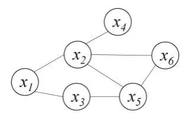
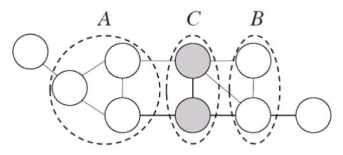
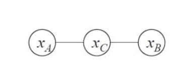

# [机器学习]14 概率图模型

> QAQ反正这一章挺难的

## 14.1 隐马尔可夫模型(HMM)

> 一种有向图模型(属于贝叶斯网)，是结构最简单的动态贝叶斯网，主要用于时序数据建模

* 马尔可夫链：在任一时刻，观测变量的取值仅依赖于状态变量，即$x_t$由$y_t$确定；同时，状态变量的取值仅依赖于前一时刻的状态变量，即$y_t$由$y_{t-1}$确定

## 14.2 马尔可夫随机场

> 一种无向图模型(属于马尔可夫网)，用于描述变量之间的依赖关系

* 团：一个子图，其中任意两个结点之间都有边连接
* 极大团：若一个团中加入其他任意结点都不再是团，则称该团为极大团

### 14.2.1 连续分布的分解

* 多个变量之间的连续分布可基于团分解为多个因子的乘积。
* 对于$n$个变量$\text{x}=\{x_1,x_2,\cdots,x_n\}$，所有团构成的集合为 $\mathcal{C}$ ，与团 $\mathcal{C}_i$ 相关联的变量集合为
  $\text{x}_{\mathcal{C}_i}$ ，则有

  $$p(\text{x})=\frac{1}{Z}\prod_{\mathcal{C}_i\in\mathcal{C}}\psi(\text{x}_{\mathcal{C}_i})$$

  > 可见这其实是一个全概率

    * 其中，$\psi(\text{x}_{\mathcal{C}_i})$为团$\mathcal{C}_i$的势函数，$Z$为归一化因子。
    * 若变量问题较多，则团的数目过多，上式累乘项过多，造成计算困难。所以为了简化，需要考虑极大团。
* 假设所有极大团构成的集合为$\mathcal{C}^\ast $，则有

  $$p(\text{x})=\frac{1}{Z^\ast }\prod_{\mathcal{C}_i\in \mathcal{C}^\ast }\psi_{\mathcal{C}_i}(\text{x}_{\mathcal{C}_
  i})$$

    * 其中，$\psi(\text{x}_{\mathcal{C}_i})$为极大团$\mathcal{C}_i$的势函数，$Z^\ast $为归一化因子。
    * 由于极大团的数目远小于团的数目，所以计算简化了很多。

> 接下来看看这个[例题](#概念理解基于极大团的分解)，应该就知道怎么回事了

### 14.2.2 全局马尔可夫性

> 若结点集A的任意结点到结点集B的任意结点都必须要经过结点集C中的结点，则称结点集C为结点集A和结点集B的**分离集**
> 。此时A中任意结点$a_i$都不与B中任意结点$b_i$相邻，即结点集层面的独立性。
>

* **全局马尔可夫性：在给定分离集的条件下，两个变量子集独立**。
* 若结点集$C$为结点集$A$和结点集$B$的分离集，则表示为：

$$\text{x}_A \perp\text{x}_B\vert\text{x}_C$$

* 但我们为什么要研究这个呢？因为可以简化模型：此时可以把结点集A、B、C分别只视为一个结点(变量)。
  
* 对于这个图，图模型的联合概率也简化为：

$$p(x_A,x_B,x_C)=\frac{1}{Z}\psi_{AC}(x_A,x_C)\psi_{BC}(x_B,x_C)$$

### 14.2.3 全局马尔可夫性的验证

> 全局马尔可夫性总结一下就是：即使推广到结点集，只要马尔科夫随机场中两个结点集之间不直接相连，则这两个结点集独立。
>
> 证明的话就是证明这一点，也就是$x_A$与$x_B$独立，即$p(x_A,x_B\vert x_C)=p(x_A\vert x_C)p(x_B\vert x_C)$

* 如何证明请详见[例题](#概念理解证明全局马尔可夫性)

## 14.3 话题模型/LDA

> 但要注意，我看了一下LDA的算法流程，似乎它只能从文档中提取话题分布(即不同话题的比例、每个话题的词频等)
> ，相当于总结或者说降维，它不能直接生成回答(自然语言)。要想获得自然语言，还需要进一步的处理(文本生成模型，比如diffusion、GAN)。

* 隐狄里克雷分配模型(LDA)是话题模型的典型代表。

### 14.3.1 LDA的基本单元

* 词(Word)：待处理数据的基本单元
* 文档(Document)：待处理数据，由词组成，在文档中词是不计顺序的
* 话题(Topic)：一个概念，表示为一系列相关的词及其在该概念中出现的概率。

### 14.3.2 LDA的构成与生成过程

* 符号约束：
    * 数据集$W=\{w_1,w_2,\cdots,w_T\}$：T篇文档，每个文档$w_i$都是一个N维向量，表示这篇文档中$N$个词的词频。
    * 话题集$\text{B}=\{\beta_1,\beta_2,\cdots,\beta_K\}$：K个话题，每个话题$\beta_i$都是一个N维向量，表示这个话题下第$N$个词的词频。
    * 话题分布$\Theta_t$：第$t$篇文档中各个话题的分布情况。

* 生成过程：
    1. 从以$\alpha$为参数的狄利克雷分布中采样得到话题分布$\Theta_t$。
        2.
        1. 根据$\Theta_t$中各个话题的分布情况进行指派，得到第$t$篇文档中词$n$的话题$z_{t,n}$。(
           这里体现出每个词都应属于某个话题，不同话题之间不会有相同的词)
        2. 根据指派的话题所对应的词频分布$\beta_k$随机采样生成词

### 14.3.3 关于如何构建一个对话机器人

1. 数据收集：收集用于训练和评估LDA模型的对话数据集。这可以是真实对话数据、聊天记录、社交媒体对话等。

2. 数据预处理：对对话数据进行预处理，包括文本清洗、分词、去除停用词、词干化等。可以根据对话的特点，设计适合的预处理方法。

3. 构建词袋模型：将预处理后的对话文本转换成词袋模型，将每个对话表示为一个向量，其中每个元素表示词汇表中一个词的频率或出现次数。

4. 训练LDA模型：使用预处理后的对话数据和构建的词袋模型来训练LDA模型。LDA模型将对话集合视为主题和词汇的混合，并试图找到最合适的主题分布。

5. 主题分析：通过LDA模型，可以获取每个对话的主题分布和每个主题的关键词。可以根据这些信息来分析对话之间的主题相似性、主题变化等。

6. 对话生成：基于LDA模型的结果，**设计对话生成算法**来回应用户的输入。可以根据用户输入的主题、关键词或上下文来生成回复，并保持对话的连贯性和相关性。
   > 暗示LDA无法生成对话，只能生成话题分布，需要生成算法结合LDA的结果才能生成对话。

7. 对话管理：设计一个对话管理系统来处理用户输入和生成回复。可以使用规则引擎、状态机或强化学习等方法来管理对话流程，使对话机器人能够适应不同的对话场景和用户需求。

需要注意的是，LDA模型是一种无监督学习方法，它无法直接处理语义理解和生成的问题。在实际对话机器人的设计中，可能需要结合其他技术和方法，如自然语言处理（NLP）技术、对话管理算法、实体识别、情感分析等，来提升对话机器人的交互能力和智能性。

此外，对话机器人的设计还需要考虑到用户体验和系统性能等因素，例如响应时间、错误处理、用户反馈机制等，以提供良好的交互体验。

## Ques14-例题整理

### [概念理解·基于极大团的分解]

> 题目内容

* 对于上图所示的马尔科夫随机场，请基于极大团的分解，写出其联合概率分布的表达式。

> 分析与解答

* 极大团分解，其实主要就2步：
    1. 找出$\mathcal{C^\ast }$，也就是全部的极大团
    2. 列公式：

$$p(\text{x})=\frac{1}{Z^\ast}\prod_{\mathcal{C}_i\in \mathcal{C}^\ast}\psi_{\mathcal{C}_i}(\text{x}_{\mathcal{C}_i})$$

> 其中$Z^\ast$通常会直接给，或者直接用符号表示

1. 找出全部的极大团：

$$\mathcal{C^\ast}=\left\{\{x_1,x_2\},\{x_1,x_3\},\{x_2,x_4\},\{x_3,x_5\},\{x_2,x_5,x_6\}\right\}$$

2. 写出表达式：

$$P(\text{x})=\frac{1}{Z^\ast }\psi_{12}(x_1,x_2)\psi_{13}(x_1,x_3)\psi_{24}(x_2,x_4)\psi_{35}(x_3,x_5)\psi_{256}(
x_2,x_5,x_6)$$

### [概念理解·证明全局马尔可夫性]

> 题目内容

* 对于该图模型，请证明全局马尔可夫性

> 分析与解答

* 证明全局马尔可夫性，即证明$x_A$与$x_B$独立，即$p(x_A,x_B\vert x_C)=p(x_A\vert x_C)p(x_B\vert x_C)$
* 首先梳理一下我们能用什么：朴素贝叶斯的$P(a)=\sum_{b_i\in b}P(a,b_i)$(我一般叫它加法公式)
  ，以及在马尔可夫随机场中必定成立的公式：$p(x_A,x_B,x_C)=\frac{1}{Z}\psi_{AC}(x_A,x_C)\psi_{BC}(x_B,x_C)
  $。那么我们能做的也只有这些了。开始化简吧。
* 首先化简$p(x_A,x_B\vert x_C)$：

$$p(x_A,x_B\vert x_C)$$

$$=\frac{P(x_A,x_B,x_C)}{P(x_C)}$$

> 条件概率

$$=\frac{\frac{1}{Z}\psi_{AC}(x_A,x_C)\psi_{BC}(x_B,x_C)}{\sum_{x_A',x_B'}P(x_A',x_B',x_C)}$$

> 分子是代入马尔可夫随机场定律，分母是加法公式

$$=\frac{\frac{1}{Z}\psi_{AC}(x_A,x_C)\psi_{BC}(x_B,x_C)}{\sum_{x_A',x_B'}\frac{1}{Z}\psi_{A'C}(x_A',x_C)\psi_{B'C}(
x_B',x_C)}$$

> 分母再将马尔可夫随机场定律代入

$$=\frac{\psi_{AC}(x_A,x_C)\psi_{BC}(x_B,x_C)}{\sum_{x_A',x_B'}\psi_{A'C}(x_A',x_C)\psi_{B'C}(x_B',x_C)}$$

> 消去$\frac{1}{Z}$

* 然后化简$p(x_A\vert x_C)$：

$$p(x_A\vert x_C)$$

$$=\frac{P(x_A,x_C)}{P(x_C)},\text{(条件概率)}$$

$$=\frac{\sum_{x_B'}P(x_A,x_B',x_C)}{\sum_{x_A',x_B'}P(x_A',x_B',x_C)}$$

> 分子分母都是加法公式

$$=\frac{\frac{1}{Z}\sum_{x_B'}\psi_{AC}(x_A,x_C)\psi_{B'C}(x_B',x_C)}{\frac{1}{Z}\sum_{x_A',x_B'}\psi_{A'C}(x_A',x_C)
\psi_{B'C}(x_B',x_C)}$$

> 分子分母都将马尔可夫随机场定律代入

$$=\frac{\psi_{AC}(x_A,x_C)}{\sum_{x_A'}\psi_{A'C}(x_A',x_C)}$$

> 消去$\frac{1}{Z}$和$\psi_{B'C}(x_B',x_C)$

* 与上一个类似，$p(x_B\vert x_C)$=

$$\frac{\psi_{BC}(x_B,x_C)}{\sum_{x_B'}\psi_{B'C}(x_B',x_C)}$$

* 此时可以发现，化简后的$p(x_A\vert x_C)$和$p(x_B\vert x_C)$相乘恰好就是$p(x_A,x_B\vert x_C)$，所以$x_A$与$x_B$独立，证毕。
