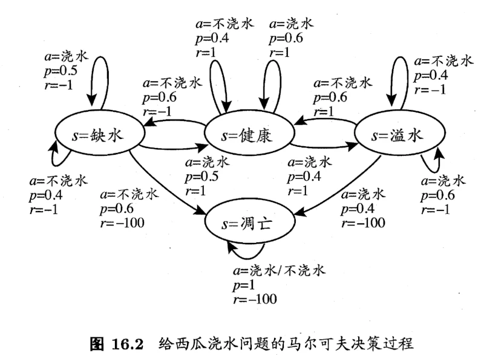

# [机器学习]15 强化学习

> 本章的考查偏概念，就考试来讲不算什么重点，但这一块发展很快，以DQN为代表的深度强化学习已经在很多领域取得了很好的效果，发展很快，所以还是要了解一下。

## 15.1 任务和奖励

> 任务和奖励是强化学习步骤中的两个重要概念

* 强化学习的任务是在一个环境中，找到一个最优的策略，使得在这个策略下，能够获得最大的奖励。
  > 而先前的梯度+迭代类的算法实质上只是在找局部最优(只不过如果是凸优化问题的话，不停找局部最优是能找到全局最优的)

* 在强化学习的过程中，智能体(模型)会尝试不同的动作，环境会产生相应的反馈和奖赏；智能体根据反馈来调整自己的策略，使得自己能够获得更多的奖励。
    * 也正是因为这种性质，使得它很适合作为游戏中的AI。

## 15.2 马尔可夫决策过程

> 强化学习通常用马尔可夫决策过程来描述。

* 马尔可夫决策过程是一个四元组：$E=<X,A,P,R>$
    * $E$：环境
    * $X$：状态空间，即环境中所有可能的状态的集合
    * $A$：动作空间，即智能体可以采取的所有动作的集合
    * $P$：状态转移概率，即在某个状态下，执行某个动作，转移到下一个状态的概率
    * $R$：奖励函数，即在某个状态下，执行某个动作，获得的奖励

* 以书中给瓜浇水为例，其马尔可夫决策过程如下图：

### 15.2.1 马尔可夫条件

* 通常公式表示为：$P(x_{t+1}\vert x_t,a_t)=P(x_{t+1}\vert x_1,...,x_t,a_1,...,a_t)$
    * 即**下一个状态$x_{t+1}$只与当前状态$x_t$和动作$a_t$有关**。
    * 这个条件是强化学习的基础，也是强化学习和监督学习的区别之一

### 15.2.2 强化学习目标

* 强化学习的目标是找到**长期累积奖励最大化的策略**。关于这一点有多种计算方式，但最常用的有2种：

1. $T$步累积奖励：$\mathbb{E}[\frac{1}{T}\sum^T_{t=1}r_t]$，其实就是平均奖赏的期望。
2. $\gamma$折扣累积奖赏：$\mathbb{E}[\sum^{\infty}_{t=1}\gamma^{t-1}r_t]$

## 15.3 K-摇臂赌博机

> 这是一个很经典的案例：一个赌博机有$K$个摇臂，赌徒投入一个硬币之后可随机按下其中一个摇臂，每个摇臂以一定的概率(未知)
> 吐出硬币，赌徒需要通过一定的策略最大化累积奖赏。

* 这个案例直观地反映了强化学习的主要困难：**探索-利用窘境**
    * 利用：根据已摇过的摇臂之反馈，选择最优的摇臂，以使得累积奖赏最大化
    * 探索：探索的足够多，才能较为准确的估计每个摇臂的概率，从而选择最优的摇臂
    * 两个极端的策略：仅利用和仅探索其实都无法使得累积奖励最大化，因此我们需要在探索和利用之间折中。比较常见的两个策略是$\epsilon$-贪心策略和Softmax。

### 15.3.1 $\epsilon$-贪心

* $\epsilon$-贪心策略的思想是：每次都以$\epsilon$的概率进行探索，以$1-\epsilon$的概率进行利用(选择当前最优的)。
* 此外，用$Q(k)=\frac{1}{n}\sum\limits^n_{i=1}v_i$记录第$k$个摇臂的平均奖赏。但如果直接按照定义计算的话需要记录每次$k$摇臂的结果，所以更高效的做法是用递推公式：$Q_{n}=\frac{1}{n}\left((n-1)\times Q_{n-1}(k)+v_n\right)$，也就是前$n-1$次的总奖赏加上第$n$次的奖赏$v_n$再除以$n$。

### 15.3.2 Softmax

> 众所周知，Softmax函数可以将实数值分布映射到$(0,1)$区间，且和为1，因此常用来表示概率分布。

* Softmax函数的公式通常表示为：$Softmax(x)=\frac{e^{x_i}}{\sum_i e^{x_i}}$，我们自然的想到，应当让平均奖励高的摇臂具有较高的被选择概率。
* 因此Softmax在此处的公式为：$P(a)=\frac{e^{Q(a)/\tau}}{\sum\limits^K_{i=1}e^{Q(i)/\tau}}$
    * $Q(a)$：第$a$个摇臂的奖赏
    * $\tau$：温度参数，$\tau$越小则平均奖励高的摇臂被选取的概率越高。因此：
        * $\tau\rightarrow0$：趋于“仅利用”
        * $\tau\rightarrow\infty$：趋于“仅探索”

## Extra15 总结

* 由于时间关系，(并且非考察重点)，根据局部性原理，我倾向于将时间更多花到其他更重要的部分。
* 本章的重点多在概念方面：
    * 搞清楚**状态**、**动作**、**奖励**，即强化学习“三要素”是什么
    * 了解两种强化学习的策略，最好从公式角度出发，简单介绍他们是如何平衡探索和利用的
