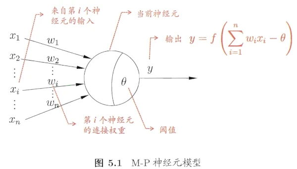
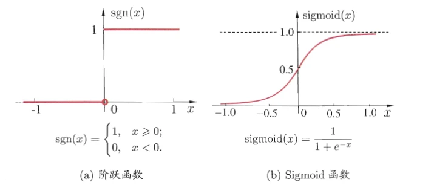
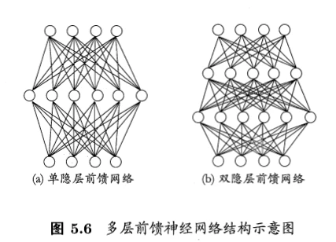
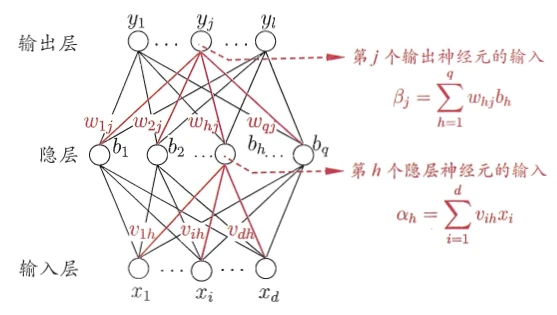
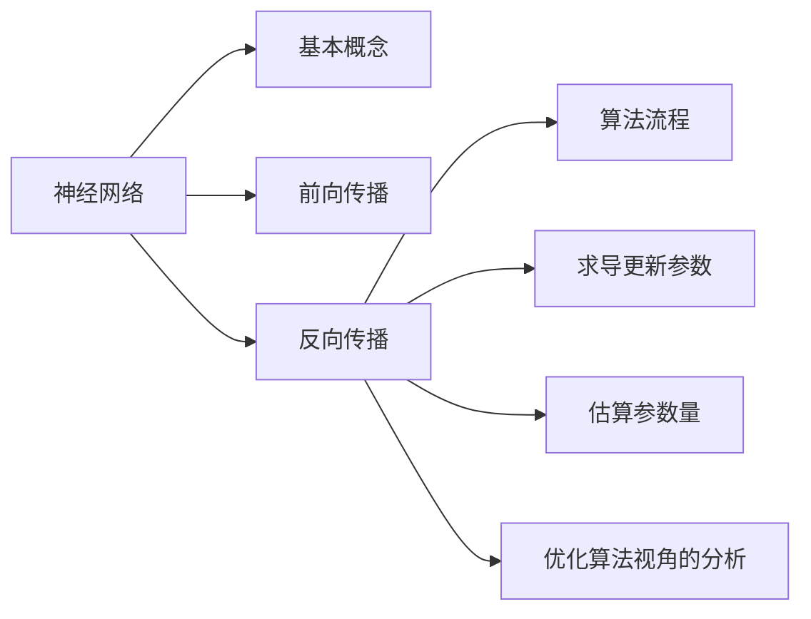

# [神经网络]01 神经网络

> 神经网络(neural network)大概已经是人工智能领域最典型的成就了，这节要是还不甚了解可就比较闹笑话了

## 7.1 神经网络中的基本概念

### 7.1.1 人工神经元

> 下图是人工神经元最为代表的**M-P神经元**模型的大致结构，它的结构其实很好地反映了在计算机中，我们关注的部分

* 图中，一个神经元接受 其他神经元的输出 作为输入$x_i$，其中每个输入都有个权重$w_i$，此外，这个神经元自身有一个参数$\theta$
* 当前这个神经元计算所有输出的加权和，然后减去阈值$\theta$，最后通过一个激活函数$f$，得到输出$y$
    * 也就是图中的$y=f\left(\sum\limits^n_{i=1}w_ix_i-\theta\right)$

### 7.1.2 激活函数

* 理想的激活函数如下图(a)所示，应当对于负值输出0，对于正值输出1
    * 但是这样的函数不可导，不利于计算和优化，所以出现了(b)所示的最常用的激活函数之一：sigmoid函数

## 7.2 感知机和多层网络

> 下图给出两个典型的神经网络的结构，其基本结构如下图

* 神经网络可分为3部分：输入层、隐藏层、输出层；其中隐藏层可以有多层。常说的神经网络主要是指前馈网络。
* 前馈网络：神经元之间不存在同层连接和跨层连接，也就是网络中无环或回路。
* 感知机：**没有隐藏层，只有输入层和输出层的**神经网络。
    * 感知机是一种线性分类器，其输出是输入的线性组合，经过阶跃函数后得到的
    * 感知机的局限性在于，它只能解决线性可分的问题

## 7.3 前向传播

> 此处介绍的是神经网络在一次迭代中做的事情的一部分。

* 以$b_h$为例，它将接受上一层(输入层)
  $d$个结点的输出$x_1,x_2,\cdots,x_k$，并将其进行加权求和，得到图中的$\alpha_h$，然后再减去阈值$\gamma_h$，经过激活，得到该神经元的输出(
  记作$b_h$)。
* 与这类似，输出层的神经元也是如此，$y_j$接受上一层的$q$个神经元的输出，加权求和得到总的输入$\beta_j$。然后再经过减阈值$\theta_j$，激活函数，得到输出$y_j$。
* 假设神经网络的输出为$\hat{y_k}=(\hat{y_1^k},\hat{y_2^k},\cdots,\hat{y_l^k})$。
* 则网络的预测输出在样本$(x_k,y_k)$上的均方误差(MSE)为

  $$E_k=\frac{1}{2}\sum^l_{j=1}(\hat{y_j^k}-y_j^k)^2$$

    * 也就是预测输出和实际标记的差的平方和，再除以2。

## 7.4 误差逆传播(BP)算法

> **本章重点**。BP全称为“error BackPropagation”。为便于演示，给出了下图所示的一个神经网络结构。
>
> * 输出层第$j$个神经元的阈值用$\theta_j$表示
> * 隐藏第$h$个神经元的阈值用$\gamma_h$表示
> * 测试用例记作$(x_i,y_i)$，但这里的$x_i$和$y_i$都是向量，分别有$d$维和$l$维，正好对应图中输入层/输出层的神经元节点数。也就是每个节点输入/输出一个维度的信息。

### (1) 反向传播/BP算法

> 简单来说，BP算法是用于优化神经网络中的参数的算法，其核心思想是**梯度下降法**——十分经典的优化算法。

* 接下来直接看例题：[神经网络参数更新例题](#计算神经网络参数更新)
* 此外，$\eta\in(0,1)$为学习率，控制着算法每一轮迭代的更新步长

### (2) 拓展：估算神经网络参数量

> 这就考验对整个网络结构的理解了

* 首先，三层的结点分别有$d,q,l$个，除了输入层，每个结点都有一个阈值，所以阈值个数为$q+l$个。
* 然后，**输入层-隐藏层**是一个完全二部图，即$d$个输入层结点和$q$个隐藏层结点之间都有连接，而每个连接都有权重，所以，此处共$d\times
  q$个权重。
* 一样的，**隐藏层-输出层**之间也都有连接，此处共$q\times l$个权重。
* 汇总一下，共$q+l+dq+ql=q(d+l+1)+l$个参数。

* **所以对于这种问题只需要考虑以下3步：**
    * 首先搞清各层的结点数，以及各层间的连接情况(不过考试的时候为了方便，一般都是全连接)
    * 除了输入层之外，每一层都有用于激活的阈值，计算阈值总数
    * 计算各层之间的连接数之和，也就是权重总数
    * 参数量就是**权重总数+阈值总数**
  > 所以其实不难

### (3) 标准BP和累积BP

* 说白了就是：
    * 标准BP每次针对单个训练样例更新权重和阈值
    * 累积BP优化目标是最小化整个训练集上的累积误差

### (4) 过拟合与缓解策略

> BP算法常常导致过拟合

* 什么是过拟合？
    * 过拟合($Overfitting$)是指模型**过度适应训练数据集，导致泛化性能不佳**的现象。
    * 过拟合通常发生在**模型复杂度较高**且**训练数据相对较少**的情况下。当模型复杂度过高时，它可能会**记住训练数据中的每个细节和噪声
      **，而**无法捕捉到普遍的模式**。这种情况下，模型可能会在训练数据上表现得非常好，但在新的数据上却无法正确地进行预测或分类。

* 主要策略
    * 早停：监控模型在验证集上的性能，当性能不再提高时提前停止训练
    * 正则化：通过添加惩罚项来约束模型参数的大小

## 7.4 全局最小与局部最小

> 分析BP算法可以看出其算法核心是梯度下降法，但如果损失函数不是凸函数，那么梯度下降法就不能保证找到全局最小值(
> 就是有可能会卡在“鞍点”，即局部极小值点)，所以需要一些其他策略来缓解这个问题。

* 模拟退火
* 随机梯度下降法
* 遗传算法

## Extra07-总结

* 本章的知识脉络如下：

* BP算法是本章的重点，因为此处可以出计算题，需要能够手算。
* 除此之外，为考量对于神经网络整体的理解，还会出一些简单计算题，比如估计神经网络的参数量。当然这里的神经网络不特意说明，指的都是全连接的前馈神经网络。

## Ques07-例题整理

### [概念理解·神经网络参数量估计]

> 题目内容

* 对于如图所示的神经网络，假定这三层的神经元分别有$d,q,l$个，请估算一次BP算法过程中更新的参数量

> 分析与解答

* 首先，三层的结点分别有$d,q,l$个，除了输入层，每个结点都有一个阈值，所以阈值个数为$q+l$个。
* 然后，**输入层-隐藏层**是一个完全二部图，即$d$个输入层结点和$q$个隐藏层结点之间都有连接，而每个连接都有权重，所以，此处共$d\times
  q$个权重。
* 一样的，**隐藏层-输出层**之间也都有连接，此处共$q\times l$个权重。
* 汇总一下，共$q+l+dq+ql=q(d+l+1)+l$个参数。

### [计算·神经网络参数更新]

> 题目内容

* 还是这个题，请给出完整的$w_{hj}$的更新流程

> 分析与解答

* 对于任意一个参数，其每一轮迭代的更新公式为$v\leftarrow v+\Delta v$，$v$表示任意一个可学习的参数

* 接下来以权重$w_{hj}$为例。假如我们想更新$w_{hj}$，那么可见，最重要的是计算出$\Delta w_{hj}=-\eta\frac{\partial
  E_k}{\partial w_{hj}}$，其中$\eta$是学习率。
* 根据求导的链式法则：

$$\frac{\partial E_k}{\partial w_{hj}}=\frac{\partial E_k}{\partial \hat{y_j^k}}\cdot\frac{\partial
\hat{y_j^k}}{\partial \beta_j}\cdot\frac{\partial\beta_j}{\partial w_{hj}}$$

* 这个公式中有2个部分很好算，因为这两个部分都是累加式求导：

$$\frac{\partial E_k}{\partial \hat{y_j^k}}=\hat{y^k_j}-y^k_j$$

$$\frac{\partial\beta_j}{\partial w_{hj}}=b_h$$

* 而对于$\partial \hat{y_j^k}/\partial \beta_j$，由于$\hat{y^k_j}=f(\beta_j-\theta_j)
  $，$f$是Sigmoid函数，所以这里实际上是$f'(\beta_j-\theta_j)\cdot\frac{\partial (\beta_j-\theta_j)}{\partial\beta_j}=f'(
  \beta_j-\theta_j)$
* 此时利用Sigmoid函数的特点:$f'(x)=f(x)(1-f(x))$，代换为：

$$f(\beta_j-\theta_j)\left(1-f(\beta_j-\theta_j)\right)=\hat{y_j^k}(1-\hat{y_j^k})$$

* 至此，已大体上推导完毕，将上述各部分回代，得到

$$\Delta w_{hj}=\eta g_jb_h$$

$$g_j=-\frac{\partial E_k}{\partial \hat{y^k_j}}\cdot\frac{\partial \hat{y^k_j}}{\partial\beta_j}$$

$$=-(\hat{y^k_j}-y^k_j)\cdot \left(\hat{y_j^k}(1-\hat{y_j^k})\right)$$

$$=\hat{y^k_j}(1-\hat{y_j^k})(y^k_j-\hat{y^k_j})$$

* 这就是BP算法中，梯度下降法的核心公式

### [概念理解·BP算法的流程]

> 题目内容

* 什么是神经网络的反向传播算法(back propagation)？它是如何用于训练多层感知机的？

> 分析与解答

* BP算法是一个迭代算法，它的核心思想是根据每次迭代结果计算损失，并结合一些优化算法(以梯度下降为例)
  计算每个权重的梯度以更新权重。反复迭代直到达到迭代结束条件。
* 在训练多层感知机时，反向传播算法计算每个神经元的误差，并将误差反向传播到前一层，以计算前一层的误差(
  其实现形式实际上是求导的链式法则)。然后，它使用这些误差来计算每个权重的偏导数，并使用这些偏导数来更新权重。
