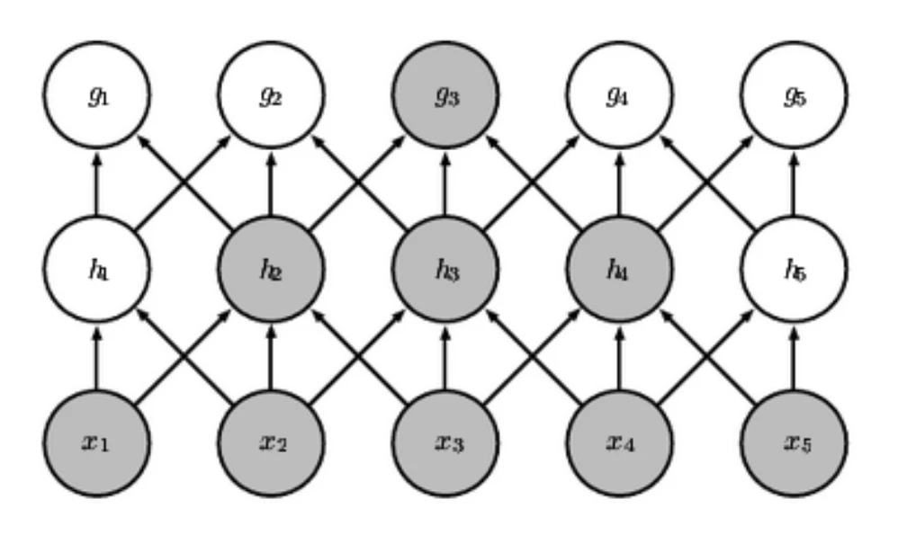
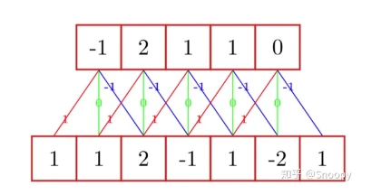

# [神经网络]02 卷积神经网络

> 这一章是扩展内容，课本上没有对应内容
>
> 卷积神经网络的目的是从低层特征开始，逐层抽象，逐渐得到高层特征，并根据高层特征完成各种任务(主要是分类任务)。
>
> 注意，CNN的任务主要是对于图像的分类，所以本章绝大多数数据都是二维的。

## 引子：计算机如何表示图像？

> 这部分大概可以不用看

* 我估计你肯定知道：矩阵嘛，彩图一般就是3维矩阵。
* 对于一张只有$64\times 64\times 3$的图片，简单计算一下，共需要12288个数据，如果按照常用的8bit色深来算，就是12288KB即12MB(当然照片的存储有压缩算法不会这么大，但如果是用于代码处理可就是实打实的12MB了)。
* 这个数据量其实对于电脑的压力已经很大了，为了降低图片处理的性能需求，人们开始寻找一种降低图片数据量，但又能尽量保持图片中有用信息的处理方法，卷积应运而生。

## 8.1 什么是卷积

* 卷积是一种对向量或张量的运算。简单来说就是：一边滑动窗口，一边矩阵点积。

* 卷积过程需要原始数据和卷积核两部分，两部分都是矩阵，卷积核中各元素的值就是权重。

### 8.1.1 一维卷积

* 对于一维数据，其卷积核也是一维的，即两者都是向量。

* 其运算过程就是将卷积核按照步长(默认为1)逐步遍历原始数据。遍历过程中卷积核会覆盖原始数据的一部分，卷积核与该部分做点积，计算结果就是卷积核在该位置的输出。

* 因此，卷积结果一定比原数据小，因为卷积核最多只能遍历$(n-m+1)$次，(其中n为原始数据的长度，m为卷积核的长度)。

* 下面我们看个[例题](#计算一维卷积)：

### 8.1.2 二维卷积

* 对于二维数据，其步骤与一维类似，只不过原始数据和卷积核都是2维的。(通常来说，卷积核默认为$3\times 3$)

1. 首先，将卷积核放在原始数据的边上(也就是一个角上，习惯上我们从左上角开始)
2. 然后，让卷积核滑动整个原始数据。由于原始数据是2维的，所以遍历时要先横向遍历，然后纵向遍历，就和使用双层for循环遍历2维数组一样。
3. 在每次滑动的过程中同样是计算一次内积，得到卷积结果。

* 这有张图表示的就不错：
  
* 这里我们同样有个[例题](#计算二维卷积)

### 8.1.3 三维及高维卷积

* 经过上面两种卷积过程，你应该已经对卷积运算有一定理解了。
* 卷积的实质是从原始数据中获取一个维度相同但规模稍低的映射，也就是原始数据的特征。而卷积核反映了特征提取时对于特征的偏好性。
* 高维卷积也是让卷积核按照顺序，滑动过原始数据的每个维度，并计算内积，拼成卷积结果。

### 8.1.3 填充：应对图像无法整除卷积步长的情况

> 填充(Padding)是处理该问题最主要的方式
>
> 需要说明的是，步长为1的时候是不需要填充的，因为卷积核每次移动一个单位不会出现无法整除的情况。

* 当原始数据为$w\times h$，卷积核边长为$k$，步长为$s$时，脑补一下卷积过程：卷积核从原始数据的左上角开始，横向移动范围$w-k$，纵向移动范围$h-k$，每次移动$s$个单位，如果这两个值不能被$s$整除，则需要填充到可整除。

> 一般来说，padding既可以在各维度的最后补足，也可以在各维度的首尾都补充，非要说的话，大概默认是最后补足。

### 8.1.4 估算卷积结果尺寸

> 以二维卷积为例

* 第一反应肯定是：$\frac{w-k}{s}$和$\frac{h-k}{s}$嘛，大体是这个思路，但还不太严谨。
* 首先考虑一下极端情况：当$w=h=k$时，卷积结果还是个$1\times1$嘛，这和上面那个公式不同。所以说：至少有个保底的1。
* 然后就像上面说的，如果$\frac{w-k}{s}$不是整数的话，一般会padding使其上取整。
* 因此总结出：卷积结果宽度为：$\left[\frac{w-k}{s}\right]+1$，中括号表示上取整；高度的话将$w$换成$h$即可。

## 8.2 卷积神经网络的特点

### 8.2.1 稀疏连接(局部连接)

> 稀疏连接是与全连接相比而言的。全连接指的是神经网络中，每个神经元都与前一层所有神经元相连，而稀疏连接则是每个神经元只与前一层的部分神经元相连。
>
> 在简单的多层感知机中，假设第$i$层有$m$个神经元，第$i+1$层有$n$个神经元，那么单单这两层，就有$mn$个权值(这还没算每个神经元的阈值/偏置)，参数量非常大。
>
> 但是在卷积神经网络中，每个神经元只与前一层的部分神经元相连，因此参数量大大减少了。

* 感受野：这个词可以类比“视野”，指的是某个神经元的输入的来源范围。
* 直观感觉似乎感受野并不大，毕竟某个结点的输入只来自前一层结点，更别说CNN还是稀疏连接。但其实这是个递归的过程，从输入到某层结点感受野是逐层扩大的。

### 8.2.2 权值共享

> 权值共享同样是针对于全连接来说的。在全连接中，任意$x_i$到$y_j$都存在一个权重$w_{ij}$。
>
> 但是我们脑补一下卷积过程：卷积核在前一层遍历求一遍内积，后一层的结果就出来了。中间所有结点间都依赖的是一个公共权值：卷积核，这就是权值共享。
>
> 权值共享机制相比于直接全连接，非常省参数量和计算过程，以下是一个证明[例题](#证明权值共享)

* 权值共享：任何神经元的卷积过程，其权值都是一样的，即卷积核。

#### (2) 等变性

* 先卷积再平移，和先平移再卷积的结果是一样的。

> 别小看这个特点，它的存在使得CNN可以学习到更多的特征，而且这些特征是平移不变的。

### 8.2.3 池化(Pooling)

* 池化：直接将原始数据分块，然后对每一块各自采取某种操作(如最大池化就是每一块取出最大值)，最后将各块的结果拼起来。

* 池化的实质是下采样，通过这种“分块选取表征”的方式减小表征大小，从而减少参数量和计算量。

* 不变性：对平移、旋转等变换操作具有近似不变性。

## 8.3 CNN分析

* 应用：图像处理(最常用)
* 缺点：感受野有限，不善于处理长距离依赖

## Ques-08 例题整理

### [计算·一维卷积]

> 题目内容

* 对于如图所示的一维数据(下面一行)，其卷积核为$[1,0,-1]$，若步长为1，请计算其卷积后的结果(其实就是上面一行)

> 分析与解答

* 其实知道卷积的原理后就是个送分题：先把卷积核贴住某一边，然后让卷积核逐渐在原始数据上滑动。
* 一开始，卷积核$[1,0,-1]$覆盖了$[1,1,2]$，则卷积核与该部分做点积，结果为$1\times1+0\times1+(-1)\times2=-1$，因此卷积后的结果的第一个元素为$-1$。
* 然后让卷积核向右移动1，此时是卷积核$[1,0,-1]$覆盖了$[1,2,-1]$，此时再点积，为$1\times 1+0\times2+(-1)\times(-1)=2$
* 以此类推，按照上述过程滑动，可得上面一行的整个卷积结果。

### [计算·二维卷积]

> 题目内容

* 假设原图像如下：

* 卷积核如下：

* 分别计算步长为1和步长为2的卷积结果

> 分析与解答

* 这题就是个简单的卷积计算，知道定义就能算，所以不分析了直接给答案

* 步长为1：

### [证明·权值共享]

> 题目内容

* 若输入层大小为$320\times280$，输出层大小为$319\times280$，卷积核大小$2\times1$，比较卷积和全连接的**参数量**和**加法/乘法次数**

>分析与解答

|         |          卷积           |                     全连接                     |
|:-------:|:---------------------:|:-------------------------------------------:|
|  参数数量   |      $2\times1$       |    $(320\times280)\times(319\times280)$     |
| 加法&乘法次数 | $320\times280\times3$ | $(320\times280)\times(319\times280)\times3$ |

* 这个表格来自PPT，但我觉得似乎有些地方不够严谨....将在之后分析

#### (1) 参数量

* 这部分整体都好理解。卷积参数量就是卷积核，2个；全连接由于输入层$320\times 280$个神经元和输出层$319\times280$个神经元之间都有连接，每个连接上都有权值，所以总共是$(320\times280)\times(319\times 280)$个权重。

#### (2) 加法&乘法次数

* 卷积：
  * 卷积核要与覆盖部分算内积，卷积核2个元素分别乘法，然后把乘积结果加起来，2次乘法1次加法共3次没问题。
  * 但问题是卷积核共遍历了多少次呢？实际上是$319\times280$次，但这里却写的$320\times280$，所以我认为他此处写的不严谨，只是表示个数量级罢了。

* 全连接：
   > 全连接时就完全不用看卷积核了。
  * 任意一个输出层神经元$y_j$，其输入的公式为$\sum_{i=1}^{320\times280}w_{ij}x_i$，此时就有$320\times280$次乘法，$320\times280$次加法了。这种运算要多少次呢？共有$319\times 280$个输出层神经元，所以共需要$(320\times280)\times(319\times 280)\times2$次运算。
  * 我认为到这里就结束了，但不知道为什么是$\times3$......

### [概念理解·CNN各结构的作用]

> 题目内容

* 请解释CNN的基本结构，包括卷积层、激活函数、池化层和全连接层。每种类型的层在CNN中的作用是什么？

> 分析与解答

* 通常来说，一个CNN包括卷积层、激活函数、池化层和全连接层。各部分的作用如下：

1. 卷积层：**特征提取**。在卷积层使用一个或多个卷积核对输入的矩阵进行卷积运算，可以得到特征图（feature map），该过程即特征提取。
2. 激活函数：**增加非线性**。激活函数对卷积层的输出进行非线性变换，使得CNN可以拟合复杂的函数。常用的激活函数有ReLU、sigmoid、tanh等。
3. 池化层：**减少参数量，防止过拟合**。池化层对特征图进行下采样以减少参数的数量，提高计算效率和泛化能力。常用的池化方法有最大池化、平均池化等。
4. 全连接层：**输出结果，完成分类或回归任务**。全连接层将池化层的输出降维，然后将其通过Softmax函数或线性函数映射得到分类结果或回归预测值。
