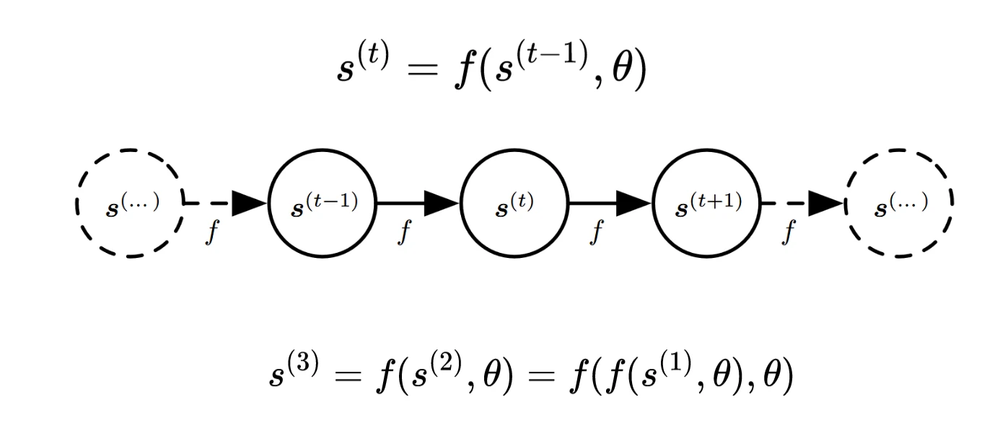
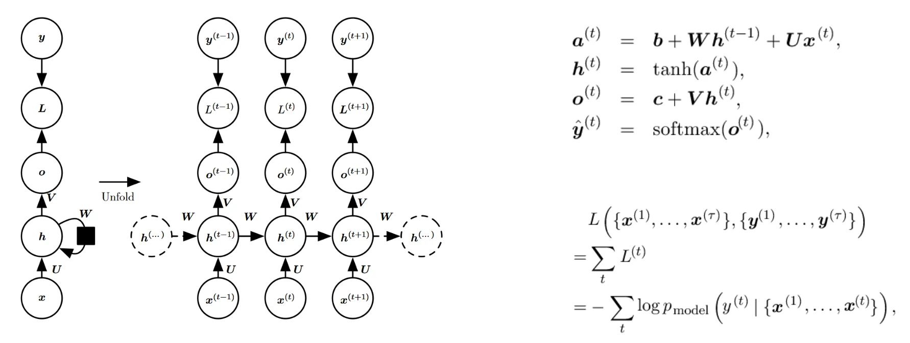

# [神经网络]03 循环神经网络

> 这一章是扩展内容，课本上没有对应内容
>
> 其实这么看来，循环神经网络这棵树也可称枝繁叶茂，只不过一来传统RNN的缺陷过于明显，另一方面这领域的后起之秀Transformer又太过耀眼，所以RNN遭到冷落了。

## 引子：什么是序列数据

* 音频
* 文本
* 时间序列
* 代码

> 序列数据将数据视为一串符号(`symbol`)的序列，重点突出的是符号之间的次序关系，(作为比较，CNN重点突出的是各元素之间的空间关系)

### 9.0.3 引子2：动力系统(Dynamical System)

> 动力系统是用于描述RNN的一种描述结构，但此时我在复习的时候，觉得这个图有点像后面将要学的贝叶斯网。

* 符号约束

|    符号     |     含义     |
|:---------:|:----------:|
| $s^{(t)}$ | 第$t$次迭代的状态 |

* 状态转移公式：$s^{(t)}=f(x^{(t-1)},\theta)$
* 目的：学到状态转移公式$f\text{和}\theta$

## 9.1 循环神经网络

### 9.1.1 循环神经网络计算流程

> 这张图详细展示了RNN迭代计算的过程

* 符号约束

  * $L^{(t)}$：第$t$次迭代的损失($Loss$)
  * $x^{(t)}$：第$t$次迭代的输入
  * $U, V, W$：要学习的参数
  * $\alpha^{(t)}=b+Wh^{(t-1)}+Ux^{(t)}$
  * $h^{(t)}=\tanh(\alpha^{(t)})=\tanh(b+Wh^{(t-1)}+Ux^{(t)})$：隐层迭代公式
  * $o^{(t)}=c+Vh^{(t)}$：输出层计算公式
  * $\hat{y}=\text{Softmax}(o^{(t)})$

### 9.1.2 RNN的分析

* 缺陷：
  * 难以并行实现，时间开销大
  * 梯度爆炸与梯度消失
  > 公式推导证明略。只要记住：在更新参数时，梯度实际上是递归累乘的结果，所以如果梯度太大或太小，就会导致参数更新时的不稳定。

## 9.2 LSTM与GRU

### 9.2.1 LSTM

> LSTM在原有RNN的基础上，引入**遗忘门**、**输入门**、**输出门**来控制信息的流向。

* 遗忘门：接受一个长期记忆并决定哪些信息保留，哪些信息遗忘。
* 输入门：确定什么样的新信息被存放在细胞状态。
* 输出门：根据输入和细胞状态，决定输出。

### 9.2.2 GRU

> GRU在原有RNN的基础上引入了重置门、更新门来控制信息的流向。

* 更新门：决定有多少信息需要继续传递
* 重置门：决定了哪些信息需要遗忘
* 二者都缓解了原本容易梯度消失梯度爆炸的问题；并且由于引入了记忆单元，能够更好地捕捉、记忆长距离依赖，对长序列任务效果更好。

## 9.3 双向RNN

> 匆匆提了一句，不记了

## Ques09-例题整理

### [概念理解·GRU和LSTM]

> 题目内容

* 请详细解释GRU和LSTM之间的主要差异，包括他们如何处理“长期依赖”问题的不同方式

> 分析与解答

* LSTM有三个门控结构，分别是输入门、遗忘门和输出门，它们可以控制信息在单元状态(长期记忆)和隐藏状态(短期记忆)之间的流动。
* GRU只有两个门控结构，分别是更新门和重置门，它们可以控制信息在隐藏状态中的流动。GRU的隐藏状态既充当长期记忆，又充当短期记忆。

### [计算·根据LSTM模型结构计算参数量]

> 题目内容

* 若一个LSTM的隐层单元数量和输入维度均为128，求该LSTM的参数数量，并给出求解过程。

> 分析与解答

* 单个LSTM cell的结构如上图所示。其内部包括4个非线性变换，实现形式是一个2层的全连接网络。
* 对于这4个全连接网络，输入层是$x_t$和$h_t$的结合，设这两个参数的维度数分别为$e$和$h$，则结合后的维度数为$e+h$；输出层维度为$h$。
* 则上述的单个二层全连接的参数量为$\left(e+h\right)\times e+e$。
* 又由于单个LSTM cell包括4个这种非线性变换，故单个cell的参数量为$4[\left(e+h\right)\times e+e]$。
* 代入得参数量为131584。

## Reference

* [M&DL \| LSTM：遗忘门、记忆门、输出门 - 知乎](https://zhuanlan.zhihu.com/p/100948638)
* [GRU：什么是GRU？为什么要学习GRU？\_Taizhuang\_的博客-CSDN博客](https://blog.csdn.net/Taizhuang_/article/details/121990358)
