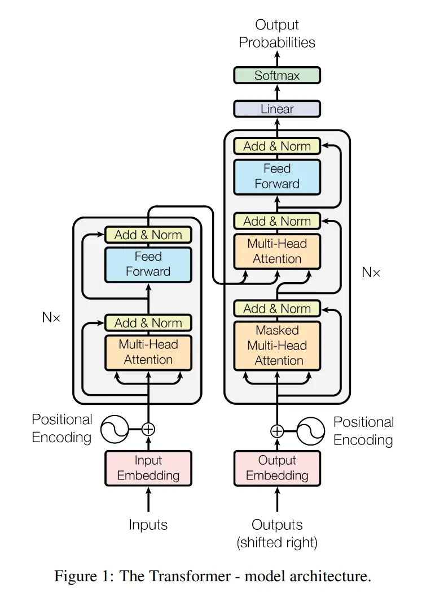
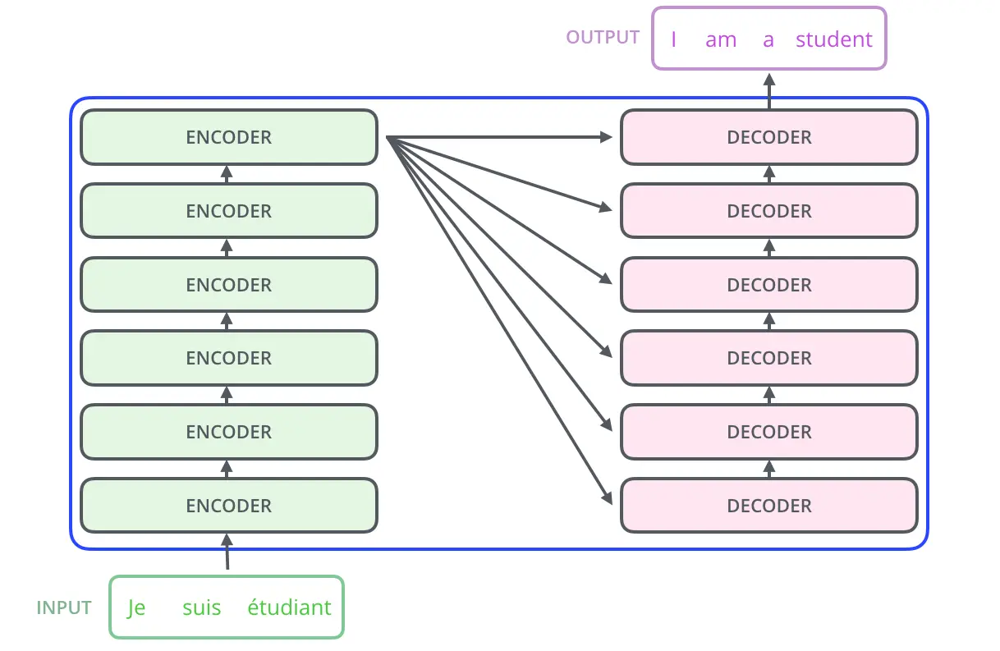
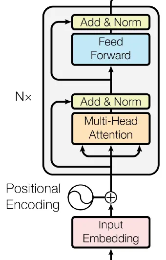
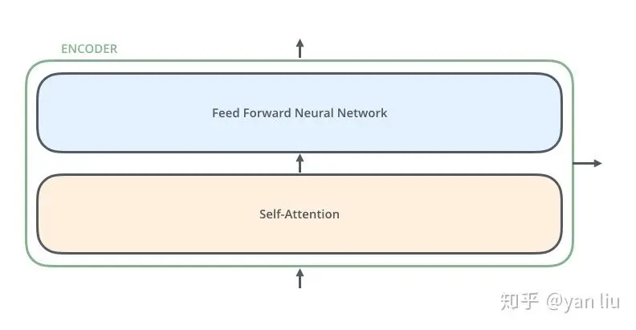
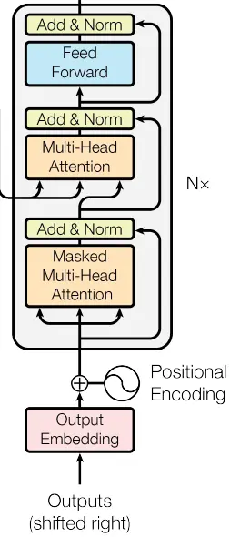
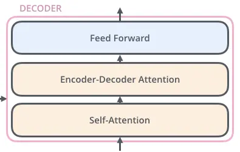
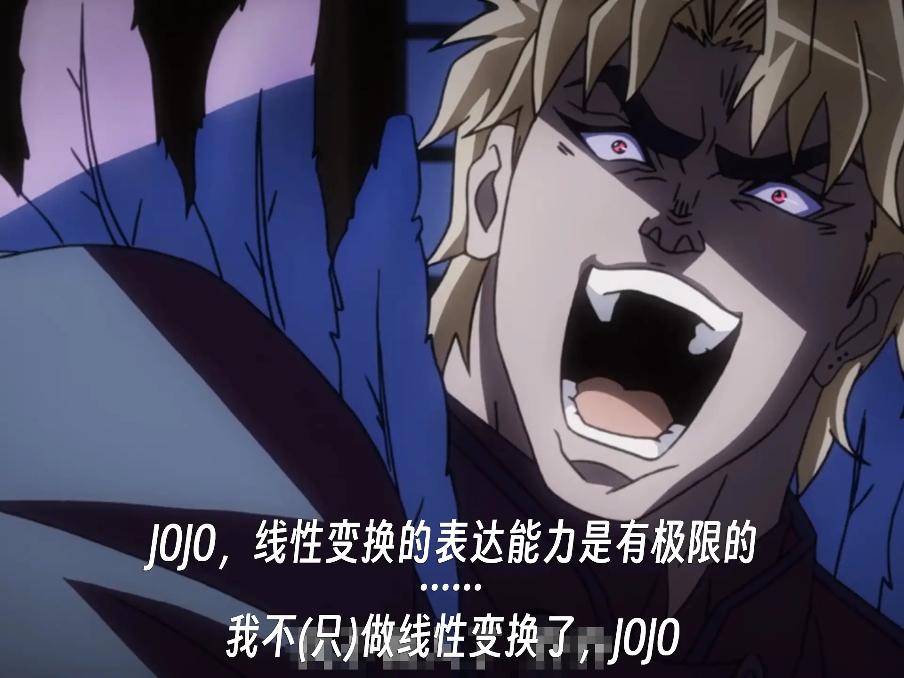

# [神经网络]04 Transformer

> 目前认为，Transformer是处理序列数据上限最高的模型，并且迁移到非序列数据(比如Vision Transformer之于图像)时仍有不错的效果，因其优秀的性能、高效的计算过程和广阔的应用场景受到了广泛关注。当下大火大语言模型(如ChatGPT、BERT)都是基于Transformer的。
>
> 这一章将结合汤老师的课程、原论文以及李沐大神的网课视频，记录下Transformer的相关知识。

## 引子：为什么需要Transformer？

> 因为RNN系列模型存在缺陷(此时又是批判前辈时间，并且这些缺点自然也是Transformer的优点)

* 难以获取长距离的依赖关系：RNN的隐层状态$h_t$只能通过$h_{t-1}$传递信息，如果距离过远，信息传递会出现衰减
* 难以并行：由于严格限制了信息传递的方式，其信息均来自上一时刻的隐层状态，因此无法并行计算。这在工程上是一个十分致命的问题。

## 符号约束与术语解释

|          符号          |                      含义                      |
|:--------------------:|:--------------------------------------------:|
| $X(x_1,x_2,...,x_n)$ |             输入序列，我们通常喜欢把输入记作$X$              |
| $Y(y_1,y_2,...,y_m)$ |         Decoder的输出序列，我们通常喜欢把输出记作$Y$          |
| $Z(z_1,z_2,...,z_n)$ |   Self-Attention的输出序列，这个序列是一个中间向量，用于后续的处理    |
| $R(r_1,r_2,...,r_n)$ | FFN的输出序列，这个序列是Self-Attention的输出序列经过FFN处理后的结果 |

|              术语              |                                  含义                                  |
|:----------------------------:|:--------------------------------------------------------------------:|
|          Attention           |                注意力机制，指模型在生成输出时，对输入序列中不同位置的信息赋予不同的权重。                 |
|       Auto-Regressive        |             自回归，指模型的输出依赖于之前的输出，这一特点在Decoder生成输出的过程中有所体现。             |
|           Decoder            |                解码器，在Transformer中的一种结构，用于将向量表示转换为输出序列。                |
|           Encoder            |                编码器，在Transformer中的一种结构，用于将输入序列转换为向量表示。                |
|     FC/Fully-Connection      |    全连接层，神经网络中一种常见的结构，每个神经元与上一层的所有神经元相连，这种结构的优点是参数多，表达能力强，缺点是计算量大。    |
|   FFN/Feed-Forward Network   | 前馈神经网络，在Transformer原始论文中就是一个2层的MLP，也就是两个全连接层，作用是进行非线性运算，让模型学到更抽象的特征。 |
|     Multi-Head Attention     |               多头注意力机制，是Transformer中的一种结构，用于增加模型的表达能力。                |
|  MLP/Multi-Layer Perceptron  |                  多层感知机，神经网络中一种常见的结构，由多个全连接层(FC)组成。                   |
|        Self-Attention        |               自注意力机制，是Transformer的核心，用于捕捉序列中的长距离依赖关系。                |
| Sequence Transduction Models |          序列转换模型，指的是输入是序列，输出也是序列的一类模型，看得出来这是单纯从输入和输出的角度来定义的。          |
|            Stack             |    堆叠/堆积，不要翻译成“堆栈”，那是计算机组成原理的东西。在这里指一种结构：某种“块”连续地串行排列，按照这种结构进行运算。    |

## 10.1 模型介绍

> * 在原始论文《Attention Is All You Need》中，Transformer模型被提出，并且用来完成机器翻译任务。因此下面的内容将以机器翻译任务为例，用以详细介绍Transformer模型。
> * 现在Transformer模型已经被广泛运用在各种序列数据(如时序数据、文本数据等)，甚至非序列数据中了(例如**Vision Transformer**)
> * 顺便说一句，在这篇文章出现之前，你去搜“Transformer”基本上只能搜出来变压器广告和变形金刚剧照，但现在，它的风头已经完全盖过了这两者。但其实这个名字取得也很合适——Transformer能用在多种任务中，“变形金刚”一词很贴切，而Transformer的“Encoder-Decoder”结构，与变压器的结构(原绕组-副绕组)也有异曲同工之妙。

### 10.1.1 模型整体结构

  > "The Transformer follows this overall architecture using stacked self-attention and point-wise, fully connected layers for both the encoder and decoder, shown in the left and right halves of Figure 1, respectively."
  >
  > “Transformer遵循这一整体架构，编码器和解码器都使用堆叠自注意力、逐点(姑且这么翻译)、全连接层，分别如图1的左半部分和右半部分所示。”

* 以上是Transformer原论文中的配图，其中左侧为Encoder，右侧为Decoder，我比较喜欢先整体后细节的方式，所以这一小节咱们只看整体结构和输入输出。

1. **Encoder**：对于左侧的Encoder，其输入均来自上一层Encoder的输出(第一层Encoder的输入为原始输入序列)，也就是图中**$\text{Input Embedding+Positional Encoding}$**的结果。
2. **Decoder**：而对于右侧的Decoder，我们能注意到一个不同的地方：它的输入不仅来自左边Encoder，同时还包括了一个**$\text{Output Embedding+Positional Encoding}$**。这其实就是**$\text{Auto-regressive}$**(自回归)的体现。它表示的意思是，Decoder每生成一个$y_i$，都会将其加入到下一时刻的输入中，也就是说，对于Decoder生成的第$t$个输出$y_t$，其“$\text{Outputs (Shifted right)}$”实际上是$(y_1,y_2,...,y_{t-1})$的向量表示。
    > 这里沐神总结的非常好：“在过去时刻的输出，也会作为当前时刻的输入”。
    * 此外，李沐老师提到，在解码器做**预测任务**时是没有输入的，此时的“$\text{Outputs (Shifted right)}$”是解码器在之前的时刻生成的输出，而“$\text{Shifted right}$”表示的是先前的输出作为此时的输入，是“一个一个往右移”地输入。
    > 这里没听懂没关系，在后面[Decoder结构](#1013-decoder结构)部分举了个例子来讲这里的“Shifted right”。
3. **输出**：因为Transformer仍然是一种**$\text{sequence transduction models}$**模型，因此通常来说Decoder输出的仍然是一个序列。比如在机器翻译任务中，Transformer的输入是一句德语，输出是一句英语，二者都是文本(序列数据)，如下图简化结构所示。但是上图我们能看到，在Decoder的输出后面，又套了一个$\text{Linear}$层，然后再套一个$\text{Softmax}$，得到$\text{Output Probabilities}$。这是因为在机器翻译任务中，Decoder每次实际输出的是一个向量(logits)，该向量中每个数表示一个单词的分数，随后通过Softmax将其转换为概率，并选择概率最高的单词作为本次的输出。
4. **补充**：最后，我们还能注意到在Decoder和Encoder旁边都有一个$N\times$，这表示实际的Transformer中，编解码器实际上是“Encoders”和“Decoders”，是若干个Encoder和Decoder堆叠在一起的。在原始论文里，作者使用了6个Encoder和6个Decoder。

    > 但是这个"6"不用奉为圭臬，实际上这个数字是很随意的，可以根据任务的复杂度、数据集的大小等因素来调整。

* 所以总结一下就是：
  * Encoders：若干个Encoder层，将输入序列生成隐层空间的表示。
  * Decoders：若干个Decoder层，将隐层空间的表示转换为输出序列。
  * 特点：Encoder和Decoder经过多层编码/解码，feature map的大小不变。

### 10.1.2 Encoder结构

> 这节咱们分析一下Encoder的结构啊，原论文的图细节非常清晰，但是相对应的，有些复杂。所以咱就把原论文中的图和简化的图一块摆出来，对比着看。
>
> 如下所示的这么一个框，咱们把它叫做一个block，一个块，咱们主要是以上图为主。

* 在看Encoder结构之前，我们可以先看看它的输入：一个$\text{Input Embedding}$和$\text{Positional Encoding}$相加。$\text{Input Embedding}$好理解，用`Word2Vec`或者其他词嵌入算法将原始自然语言转换为向量表示，但$\text{Positional Encoding}$是什么？
  * 因为除了$\text{Positional Encoding}$之外，Transformer就没有其他捕捉序列信息的方法了。Encoder的功能就是将输入的一堆向量$x_i$转换为另一种向量$r_i$，你问Encoder$x_i$和$x_j$谁在前谁在后？它不知道，所以需要额外的信息来告诉它。$\text{Positional Encoding}$就是这个信息，它是一个和$x_i$同维度的向量，表示$x_i$在序列中的位置。
* 然后我们看看Encoder啊，首先一眼能看到的是里面包括了一个**$\text{Multi-Head Attention}$**(多头注意力模块)和一个**$\text{Feed Forward}$**。那么至于什么是注意力机制、为什么要用多头注意力，以及为什么要来个全连接层，咱们后面会详细讲解的。
* 简单来说，Encoder是将输入$x_i$转换为向量表示$r_i$。
  * 接触过NLP的同学可能会奇怪：将自然语言转换成向量表示，这不是embedding吗，哪里是Encoder应该做的？说的没错，实际上输入$x_i$已经是词向量序列了，是经过预处理过程中`Word2Vec`或者其他词嵌入算法得到的。
  * 但是从意义上来讲，`Word2Vec`以及其他算法只是将文字(Plain text)转换为向量表示，而$Encoder$则是利用$\text{Self-Attention}$，将每个词向量转换成了另一种向量，后文在Self-Attention中会讲这个向量$Z$的含义，当你理解了该向量的含义后，很多问题就迎刃而解了。

$$Z=\text{Attention}(Q,K,V)=\text{Softmax}(\frac{QK^\top}{\sqrt{d_k}})V$$

> 似乎暂时还用不着，但感觉在这里放一个公式会显得很专业，就先随手放一个。

* 随后Z将会被送到$\text{Feed Forward}$中进行处理，从$z_i$转换为$r_i$。
* 所以严格来说，是$\text{Multi-Head Attention}$把$x_i$转换成了$z_i$，而$\text{Feed Forward}$则将$z_i$映射到了$r_i$。
* 最后再说点简化结构图中的东西：
  1. 简化图中的Encoder第一步是**$\text{Self-Attention}$**，其实不用在意，因为$\text{Multi-Head Attention}$就是$\text{Self-Attention}$的改进形式，思想和基本原理是相同的。只不过原论文中为了尽量准确，特意指明了用的是$\text{Multi-Head Attention}$，在初学时二者不用泾渭分明地区分。
  2. 简化图中省去了"Add & Norm"这一步
  3. 右图中的Encoder外部出现了两个箭头，但是按照原论文来说，应当只有1个，要么是向上的，表示该Encoder的输出继续流向下个Encoder；要么是向右的，表示该Encoder已经是N个Encoders中的最后一个了，结果将流向Decoder，但是这里出现了两个箭头，**可能是为了简化图的表达？不确定**。

### 10.1.3 Decoder结构

> 同样，也是两张图对比着看

* 在上面的两幅图中，尽管很多模块的名称看起来并不相同，但实际上这两幅图表示的过程是一样的，确实只是名称不同。咱们还是以上图(原论文)中的叫法来。

* 首先，输入是$\text{Output Embedding+Positional Encoding}$的结果，而且$\text{Output Embedding}$还有一个**Shifted right**，这一串设计让人有点眼花缭乱，没事，慢慢掰扯。
  1. 先来聊个简单的：**Shifted right**。
     * 它表示“让输入整体右移一位”，比如说我们的任务是“我爱中国” → “I love China”，那么$\text{Output Embedding}$就是“I love China”，经**Shifted right**后就变成了"\<start\> I love China"，其中"\<start\>"表示一个开始标记，这样Decoder就知道开始翻译了。
       > But, Why?
     * 因为咱们要做的本质上是个**预测任务**，Decoder翻译时是循环着逐词“蹦”出来的，那么当进行第$t$次循环时，它应当预测第$t$个词，而为了不让它直接通过$\text{Output Embedding}$提前知道第$t$个词的内容，所以整个$\text{Output Embedding}$都右移一位，这样Decoder就不会“提前看到答案”了。
      > 突然脑洞一下，这篇论文的阿拉伯语版译文会不会是**Shifted left**的意思？
  2. 然后$\text{Output Embedding}$和$\text{Positional Encoding}$进行相加没什么好说的，和前面Encoder的原因一样。
  3. 那么这个$\text{Output Embedding}$到底是什么呢？其实就是这一堆Decoder迭代过程中的输出。比如第一轮迭代，$\text{Output Embedding}$就是"\<start\>"，而这轮迭代的输出结果应当是"I"，那么第二轮迭代时，$\text{Output Embedding}$就是"\<start\> I"，而这轮迭代的输出结果应当是"love"，以此类推。
  4. 还有一个问题：
* OK，输入看完了我们开始看第一个模块：$\text{Masked Multi-Head Attention}$，咱们现在只说说$\text{Masked}$（掩盖/遮盖/掩码），其实都差不多，指的其实就是刚刚的Shifted right，让每个时间步的预测只能依赖于该时间步之前的输出和Encoder的输出，Attention相关的部分留到下节讲。
* 然后我们再看第二个模块：$\text{Multi-Head Attention}$，它不光接收了Encoder的输出，还接收了$\text{Masked Multi-Head Attention}$的输出，然后....就没什么特殊的了，和Encoder的$\text{Multi-Head Attention}$一样。
* $\text{Feed Forward}$的作用和Encoder中的一样，也是为了让模型学到更复杂的特征。

### 10.1.4 其他部分

* 好，咱们把这个图再贴过来，讲讲整个流程中，刚刚没提到的东西。

1. 首先就是：Encoder和Decoder都有的这个**$\text{Feed Forward}$**是干嘛的
   * 从结构上来讲，它是一个前馈神经网络模块是个2层MLP，第一层用ReLU激活，第二层使用线性激活函数。
   * 从功能上来讲，它的作用是让模型学到更复杂的特征，因为$\text{Multi-Head Attention}$中只是只有**线性变换**(矩阵乘法)，而$\text{Feed Forward}$中有非线性激活函数，能让模型学到更复杂的特征。
    
2. **$\text{Add & Norm}$**又是干嘛的呢？
   * 这一步是残差连接和Layer Normalization，层归一化，是为了稳定梯度，防止过拟合，属于常见的工程技巧，不是核心内容，可能是出于这个原因，在简化图中省略了。
3. 可以看到在整个模型最后，Decoder的输出最后过了一个$\text{Linear}$和一个$\text{Softmax}$，然后得到了$\text{Output Probabilities}$，这可能会让人有些疑问：明明是翻译任务，应该属于预测任务而非分类任务，为什么要用$\text{Softmax}$呢？
   * 这是因为在机器翻译任务中，Decoder每次实际输出的是一个向量(logits)，该向量中每个数表示一个单词的分数，随后通过Softmax将其转换为概率，并选择概率最高的单词作为本次的输出。
   * 比如在“我爱中国 → I love China”的任务中，在生成“I”的过程中，Decoder的输出是一个向量，比如它可能形如`[0.05, 0.05, 0.80, 0.05, 0.05]`，其中每个数表示一个单词的分数，随后通过Softmax将其转换为概率，而“I”正是根据这个概率选择出来的。
   * 至于为什么要这么设计：当然是因为这样，每个结果都是一个概率分布，可以知道每个单词的置信度，同时也便于计算交叉熵损失。

> 其他的....未完待续

## 10.2 自注意力机制(Self-Attention)

> Self-Attention是Transformer的核心，也是其最大的创新之一。它的提出解决了RNN系列模型的长距离依赖问题，同时也使得Transformer能够并行计算。

* 每个单词有3个不同的向量
  * Q: Query(查询)
  * K: Key(键)
  * V: Value(值)

### 10.2.1 自注意力计算方法

1. 每个单词都转化为$Embedding$(嵌入，或者说词向量)。
2. 根据$Embedding$得到第$i$个词的向量$q_i,k_i,v_i$，每个词的向量构成了$W^Q,W^K,W^V$三个权值矩阵(有时候也直接记作$Q,K,V$)
3. 然后计算$\text{score}_i$，$\text{score}_i=q_i . k_j$(j遍历其他所有的词向量)，得到若干个score值，这些值构成$score_i$向量
4. 然后是个工程技巧(trick)，将$score_i$除以$\sqrt{d_k}$，其中$d_k$是$K$的维度，实质上是个归一化，避免尺度不同造成的影响，同时稳定梯度
5. 对于上述$score_i$套个Softmax，转换为概率分布，然后再乘以$v_i$，得到最终的$z_i$
6. 在self-attention需要强调的最后一点是其采用了残差网络中的short-cut，以及Layer Normalization，目的都是稳定梯度，防止过拟合。

## 10.3 其他设计

### 10.3.1 Multi-Head Attention

* 实质即多个Self-Attention并行，允许不同的头关注不同的位置

### 10.3.2处理序列信息：Positional Encoding

* 先前的设计中没有利用序列信息，为了解决这个问题，Transformer引入了Positional Encoding

### 10.3.3 其他Trick

* 残差连接
* Layer Normalization

## Ques10-例题整理

### [原理理解·自注意力机制]

> 题目内容

* 请详细解释Transformer模型的自注意力(Self-Attention)机制如何帮助模型捕捉序列中的长距离依赖关系。

> 分析与解答

* Self-Attention的运算过程如下：
  * Transformer为每个词向量都分配三个权重矩阵：$W^Q,W^K,W^V$，将每个词向量分别与这三个权重矩阵相乘，得到$q_i,k_i,v_i$；然后对于序列中的每一个词$x_i$计算其权重：$\text{attention}_i=\text{Softmax}\left(\frac{Q\cdot K^\top}{\sqrt{d_k}}\right)$。实际得到$attention$系数矩阵，最后按照$Z=attention\cdot V$得到输出。
* 在Transformer中，其Encoder和Decoder都使用了Self-Attention机制。
  * 在编码阶段，每个词向量经过编码后都包含了其对于整个序列的相关性信息。
  * 在预测阶段，Decoder会接收来自Encoder传入的Q、K矩阵，使得进行每一次预测时，模型拥有了对于之前序列的全局信息，从而避免了像RNN一样对于长序列编码过程中信息丢失的问题。

### [模型理解·网络结构比较]

> 题目内容

* 请比较并对比CNN、RNN、GRU、LSTM和Transformer这五种神经网络结构。请考虑他们的主要特性、优点、缺点和适用场景。

> 分析与解答

|     模型      |         网络结构          |           特性           |               优点                |            缺点             |          适用场景          |
|:-----------:|:---------------------:|:----------------------:|:-------------------------------:|:-------------------------:|:----------------------:|
|     CNN     |     卷积层、池化层、全连接层。     | 通过卷积层和池化层来提取特征并减少参数量。  |        权值共享、局部感受野、平移不变性。        | 池化层可能会丢失信息、容易出现梯度消失或梯度爆炸。 |    计算机视觉中，分类、识别等任务。    |
|     RNN     |      多个神经元线性排列。       |       适合处理序列数据。        |      可以捕捉长期依赖关系，能有效利用时序信息。      |   难以解决“长期依赖”问题，难以并行化计算。   | 自然语言处理中，如机器翻译、情感分析等任务。 |
|     GRU     |      引入了更新门和重置门。      |   通过更新门和重置门控制信息的流动。    |   计算相较于LSTM更快，某些问题下能达到不错的效果。    |   在某些情况下仍然无法很好处理长期依赖问题。   |          同上。           |
|    LSTM     |    引入了遗忘门、输入门和输出门。    | 通过遗忘门、输入门和输出门控制信息的流动。  | 适用于处理长期依赖关系，能够有效地缓解梯度消失和梯度爆炸问题。 |        计算较为复杂，开销大。        |          同上。           |
| Transformer | 包括Decoder-Encoder两部分。 | 基于自注意力机制，能有效应对长距离依赖问题。 |      允许并行计算，对于序列数据的处理效果更好。      |    局部信息的获取不如RNN和CNN强。     |    序列数据的处理，如自然语言处理。    |

## References

* [从零开始了解transformer的机制\|第四章：FFN层的作用-CSDN博客](https://blog.csdn.net/weixin_73179708/article/details/132516512)
* [详解Transformer （Attention Is All You Need） - 知乎](https://zhuanlan.zhihu.com/p/48508221)
* [Self-Attention和Transformer \| machine-learning-notes](https://luweikxy.gitbook.io/machine-learning-notes/self-attention-and-transformer)
* [Transformer论文逐段精读【论文精读】 _哔哩哔哩 _bilibili](https://www.bilibili.com/video/BV1pu411o7BE)
* [细节拉满，全网最详细的Transformer介绍（含大量插图）！ - 知乎](https://zhuanlan.zhihu.com/p/681532180)
* [超详细图解Self-Attention - 知乎](https://zhuanlan.zhihu.com/p/410776234)
* [The Illustrated Transformer – Jay Alammar – Visualizing machine learning one concept at a time.](https://jalammar.github.io/illustrated-transformer/)
