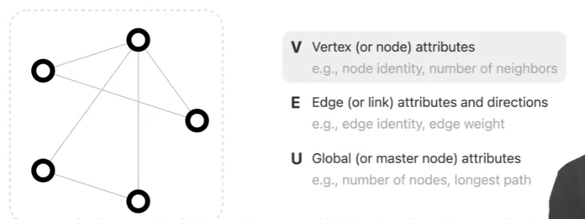
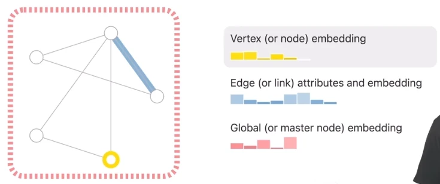
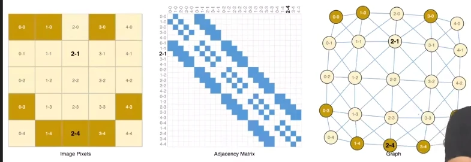
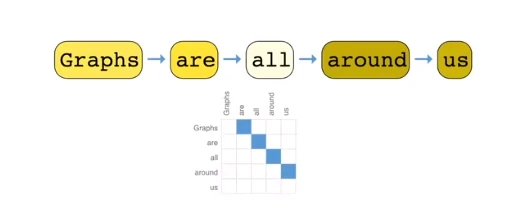
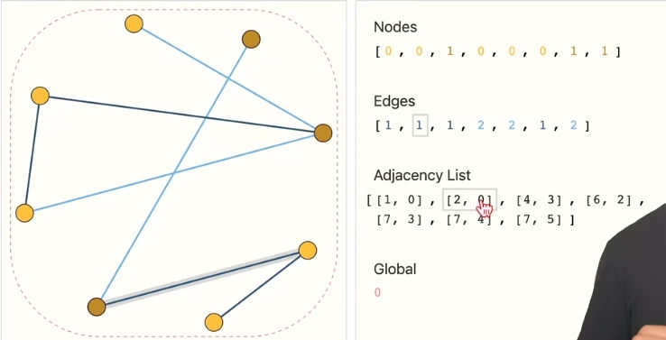
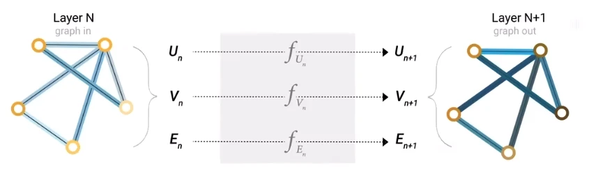
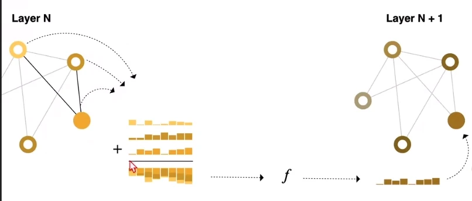

# [神经网络]Extra 01 GNN与GCN

> 拓展内容，由于期末实验选了一个推荐类算法，需要额外学习图神经网络和图卷积神经网络。

## 一、看博客

> **A Gentle Introduction to Graph Neural Networks**，《图神经网络简明介绍》，但其实并不简单，这是行业大牛谦虚的说法，这篇博客的几个作者都来自**Google Research**。
>
> [零基础多图详解图神经网络（GNN/GCN）【论文精读】](https://www.bilibili.com/video/BV1iT4y1d7zP)

### 1. 前言

#### 1.1 这篇文章的由来

* 十几年前，研究者提出了针对于图($Graph$)的神经网络。
* 最近图神经网络有一些进展，开始出现了一些实际的应用：药物的发现、物理的模拟、虚假新闻的检测、车流量的预测和推荐等
  > 推荐系统正是我目前所需要的
* 因此，图神经网络近年来开始受青睐和关注。

#### 1.2 这篇文章的结构

* 什么样的数据可以表示为图
* 图和别的数据有什么不一样的地方(它的优势)
* 构建一个GNN，分析一下结构
* 提供一个GNN的$playground$
  > $playground$指的是什么呢？

### 2. 什么是图

#### 2.1 传统的图($Graph$)结构

* 图是一种用于表示实体($entitiy$)之间关系的数据结构，点表示各个实体，边表示各个实体之间的关系。
  * 点($V(Vertex/Node)$):
  * 边($E(Edge/Link)$):
  * 全局($U(Global/Master\ node)$):是一个虚拟的点，它与所有点均相连，也因此能够表示整个图(全局)的信息。
* 此外，我们不仅关心图的结构，更重要的是每个顶点、每条边、整个图的信息($attribute$)

#### 2.2 GNN中的图

* 每个点、边和整张图都可以由一个$embedding$，也就是一个向量来表示。
* 注意到，图中黄点的$embedding$有5维，而蓝边的$emveddubf$有8维，也就是说边和点的$embedding$的维度允许不一样。

#### 2.3 如何把图像表示为图

> 假设图片大小为$244\times 244\times 3$(3通道)

* 假定每个像素点都是一个点，那么图片矩阵中的邻接像素才相邻，每个点的$embedding$就是一个3维的$tensor$，用以表示一个点的特征。
* 上图是图像的三种表示：位图矩阵($Bitmap\ matrix$)、邻接矩阵($Nearby\ matrix$)、图($Graph$)
  * 邻接矩阵通常来说是一个规模很大的稀疏矩阵(实现时可以考虑用稀疏化矩阵运算来优化)

#### 2.4 如何把文本表示为图

> 文本其实就是词的序列

* 可以将每个词视为图中的一个顶点，按照文本中词语顺序，相邻的词语之间有一条有向边，这样就构成了一个有向图。
* 文本的图比较特别，它其实是一个有向的路(并不是典型的图)

> 此外，知识图谱、分子结构、社交网络、论文引用关系等都可以表示为图，但由于这些内容和我目前的研究内容没什么关系，就不再细说了。

### 3. 在图上可以定义一些什么问题

* 图层面上的任务：考虑实体和关系
* 顶点层面的任务：考虑实体
* 边层面的任务：考虑关系

### 4 神经网络用到图上面所面临的问题

#### 4.1 怎样表示图，使得能够与神经网络的方法兼容？

* 最主要的问题是，如何处理/存储？
  * 当然可以借助邻接矩阵，但邻接矩阵是个极稀疏的矩阵，所以存储、计算时就不能用常规矩阵了
  * 很多库虽然提供了稀疏矩阵的支持，但客观来讲，稀疏矩阵的计算还是非常难的。
* 此外，还有一个问题：不同的实体存放进邻接矩阵其实就是个编码过程。
  * 但是对于同一个图，对不同实体编码顺序的不同，会导致其对应邻接矩阵也完全不同。

#### 4.2 上述问题的解决方式

> 用邻接矩阵，而是用邻接列表

* 每个结点按顺序存放在Nodes列表中，其顺序就是对应的编码，其值就是对应的$embedding$。
* 每条边也按顺序存放在Edges列表中，其顺序就是对应的编码，其值就是对应的$embedding$。
* 接下来是重点：表示邻接关系
  * 有一个Adjacency List列表，其长度和Edges相同，即每个Adjacency List元素都对应一个Edges里相同序列的元素。
  * 每个Adjacency List元素都是一个二元组，分别代表这条边的两个顶点的编码(也就是在Nodes中的序列)。

### 5. 图神经网络(GNN)

* GNN：对图上所有属性进行的一个可以优化的变换，这个变换是可以保持图的对称信息的(编码不变性)。
* 采用信息传递($message\ passing$)的方式来构建GNN(当然也有别的框架)。
* 输入是图、输出也是图($Graph-in, graph-out$)，并且只改变属性，不改变图的结构。

> 可以看出，GNN其实就是个更新属性的方法论。

#### 5.1 一个GNN例子

* 首先每个点、边、全局向量都有$embedding$。
* 然后分别对于这三者采用MLP(多层感知机，这里只是以此为例)更新这些$embedding$
  > 这个过程执行多次其实就是深度学习的过程了。
* 最后根据目的不同，在输出层做不同的处理，就可以得到不同的结果了。
  * 例如对二分类问题，就在输出层添加一个输出为2的全连接层，再加个softmax激活函数，就能得到预测结果了。
  * n分类就换成n个输出的全连接层，再加个softmax激活函数。
  * 回归问题就是直接输出预测值即可。

#### 5.2 稍复杂一些的GNN例子

> 假如某个点没有$embedding$该怎么办？

* 将与该点相邻的边，以及全局向量取出来，全部加起来，就可以获得一个新的、代表该点的$embedding$。
  * 当然如果出现$embedding$维度不同的问题，应该在这里做个投影，以进行运算。
  * 如果是缺边的$embedding$或全局的$embedding$，也可以用这种方式生成$embedding$。
  * 当然如果是不关心的数据，可以不生成。
* 上面的这些工作在“汇聚层($pooling$)”完成，然后就是[5.1 一个GNN例子](#51-一个gnn例子)的步骤了

* 问题：在顶点、边、全局的属性做变换的时候，没有利用结构信息

> 看来我需要的是对点做预测，而且根据之前对数据的分析，边的$embedding$其实并不明显，所以也许需要汇聚层。

#### 5.3 优化的GNN(信息传递)

* 可以看到，在更新某个节点之前，我们多做了一步工作：将该节点及其邻居节点的$embedding$求和，得到汇聚的$embedding$。
* 然后将汇聚的$embedding$输入MLP，得到更新后的，该点的$embedding$。
* 可以想象，如果层数足够深，输出层某个节点的$embedding$，其实已经受诸多邻居节点的影响了，而且邻居关系越远，影响越小。这个过程其实就是信息传递。
  > (这十分符合常理)
* 此外，信息传递还可以交叉进行：顶点的$embedding$综合边的$embedding$，边的$embedding$综合顶点的$embedding$，然后再送入MLP，更新所需的$embedding$。
  * 其实这就是一种汇聚，不过注意，上述两种方式产生的结果会不一样的（即先汇聚边和先汇聚顶点产生的结果并不同）

#### 5.4 为什么需要Global信息

> 这里没怎么听懂

### 6. GNN playground

> 其实就是一个$demo$，但比较可惜的是没有展示代码，只是给了可视化和一些超参数的调节框，并且实时显示Model的AUC。而且也没能明显感觉到调参的效果。
>
> 整体感觉....似乎GNN很难调参，层数、$embedding$的维度、汇聚操作、信息传递的方式都可以调，自由度很高，但缺少指导该如何调的方法论。

### 7. GNN相关技术

#### 7.3 GNN的假设

> 任何方法都有一些基本假设，正是基于某些假设，才让求解问题有迹可循。

* GNN的假设就是之前说过的两大问题之一：图的对称性。也就是不管如何编码，图的实质不变。
* GNN的汇聚操作，通常有$sum,avg,max/min$可选，但实际哪个更好，没有定论，应该结合实际问题。

#### 7.4 GCN

* 图卷积神经网络，其实就是GNN的一种
* 只不过GCN强调，汇聚的过程中，只看距离当前节点步数在$k$内的节点的信息，并汇聚。
* 这里汇聚就相当于卷积，k对应$k\times k$的卷积核
