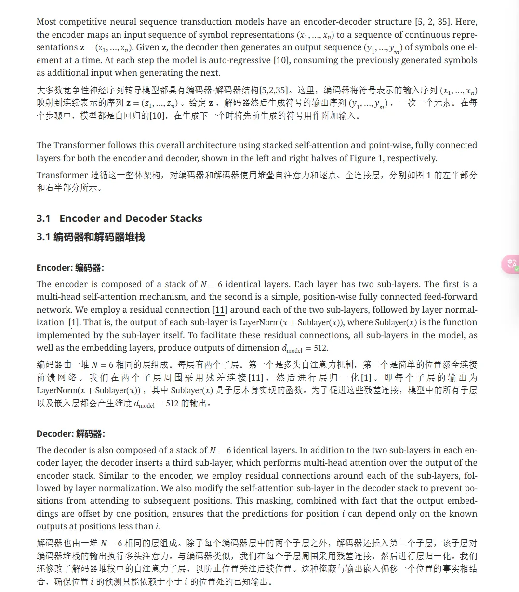
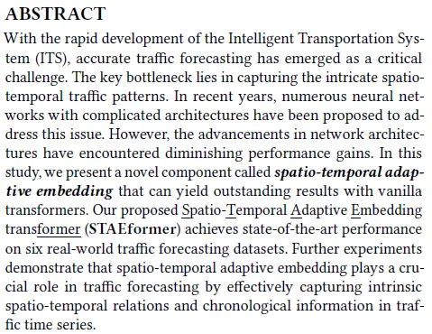
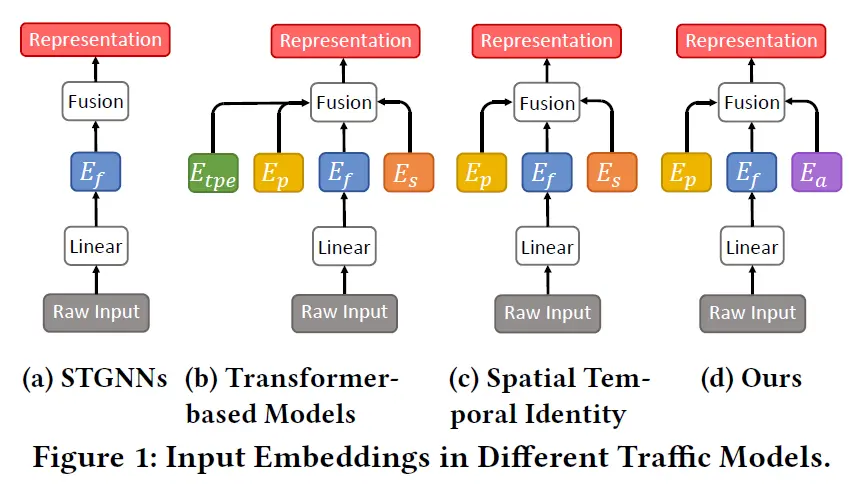
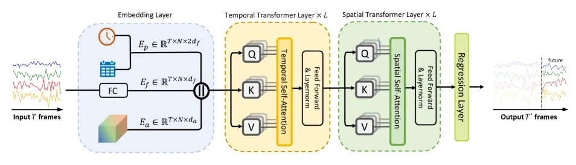
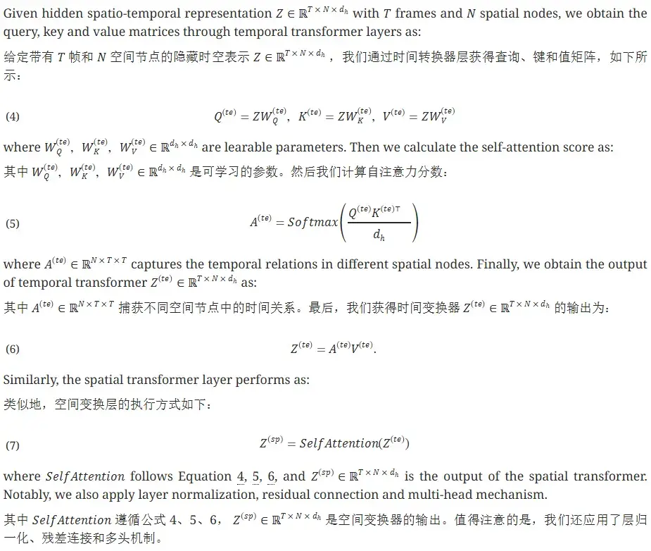
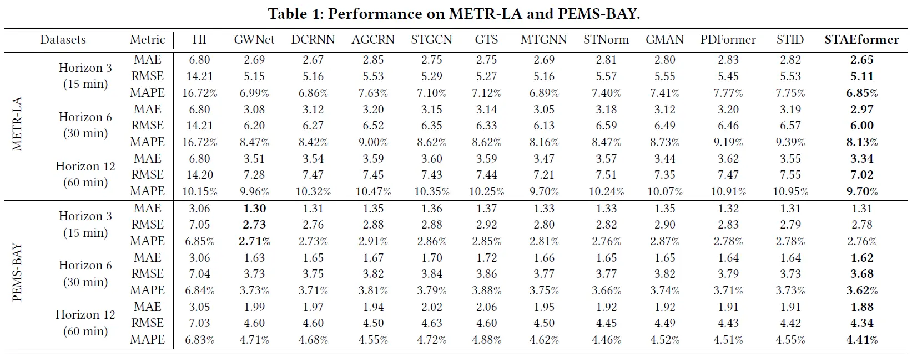
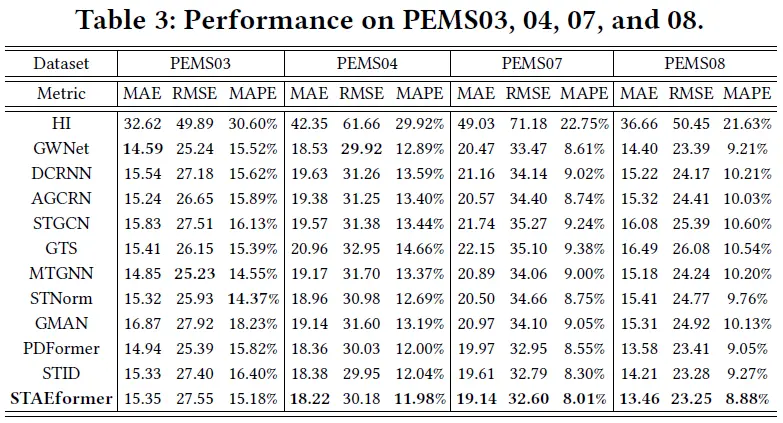
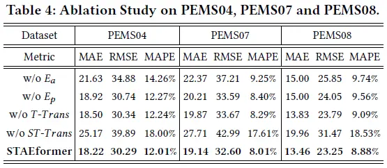
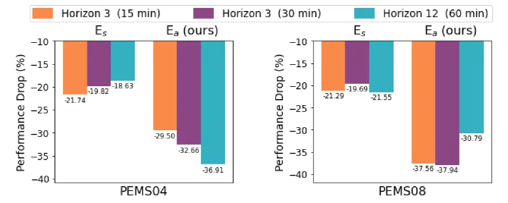
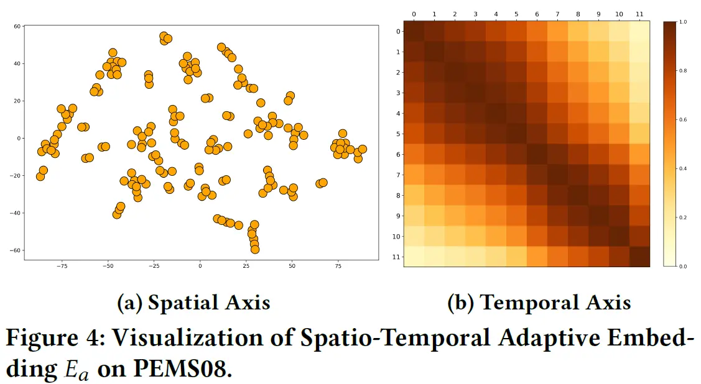

# [神经网络]Extra 02 STAEformer学习笔记

> 上网搜了搜，似乎关于这篇论文的资料比较少，于是自己啃了啃论文，看了看源代码，并斗胆分享一下自己的理解。

## 1. 在正文之前

### 1.0 关于如何看论文

> 直接开门见山地说吧，我就是来推荐一个插件的：[沉浸式翻译](https://immersivetranslate.com/)，如果你已经在用了或者不感兴趣，那么请直接跳过这一小节。

<details>
<summary>具体内容</summary>
<ul>
  <li>之前看论文的时候都是先下载英文版的pdf，然后用DeepL或者其他翻译软件翻译成中文，但直接翻译pdf极易造成排版混乱，而且还要翻译版和原文档来回切换，实在是不太方便。</li>
  <li>后来我发现，包括<a href="https://arxiv.org/">arXiv</a>、<a href="https://ieeexplore.ieee.org/Xplore/home.jsp">IEEE Xplore</a>、<a href="https://www.cnki.net/">中国知网</a>等很多常用的学术网站都提供了网页版的论文阅读，随后试了一下，沉浸式翻译在这些网页上均能提供很不错的翻译体验：</li>
  
  <li>以这篇《Attention is All You Need》在arXiv上的效果为例，可以看到不仅专有名词翻译的很准(堆栈、前馈网络、残差连接、层归一化等等)，而且公式也很好地保留了下来，几乎没有排版混乱的情况。</li>
</ul>
</details>

### 1.1 评价指标

> 先聊一些简单的东西：如果你对监督学习有些了解的话，应当知道我们需要一些东西来评估模型好不好。对于判别模型的话，通常有一些评价指标，比如准确率、精确率、召回率等等，而对于回归模型，我们通常会将模型的预测值与真实值进行比较，从而得出模型的好坏。在这篇论文中，模型用于预测交通流量，属于回归类问题，所以我们需要一些回归类的评价指标，下面介绍的几种就是常用的回归类评价指标。

* 对于预测类问题，由于模型最后是能够得出预测值的，所以评价指标通常就是计算预测值与真实值之间的差距，以下这3种是常用的几个指标：
  * MAE
  * MAPE
  * RMSE
  
* 然后我们简单介绍一下，下面原始值以$Y_i$表示，预测值以$\hat{Y_i}$表示，共有$n$个样本。

#### 1.1.1 MAE

> MAE (Mean Absolute Error) - 平均绝对误差

* MAE就是**误差的绝对值的均值**，公式表示为：

$$\text{MAE}=\frac{1}{n}\sum^n_{i=1} \vert Y_i-\hat{Y_i}\vert$$

* 若$Y_i$和$\hat{Y_i}$均为向量，则$\vert Y_i-\hat{Y_i}\vert$表示向量之差的模长。
* MAE对异常值不敏感，但它不能反映预测误差的分布情况<sup>[[1]](#reference)</sup>。
* 在Python中，计算MAE可以使用`mean_absolute_error`函数，函数原型为：

```python
def mean_absolute_error(y_true, y_pred, *, sample_weight=None, multioutput="uniform_average")
```

#### 1.1.2 MAPE

> MAPE (Mean Absolute Percentage Error) - 平均绝对百分比误差

* 嗯，名字和MAE很像啊，其实二者也确实差不多，只不过MAPE多了个Percentage，所以要将其按百分比缩放，公式表示为：

$$\text{MAPE}=\frac{100\%}{n}\sum^n_{i=1}\vert \frac{Y_i-\hat{Y_i}}{Y_i}\vert$$

* 可以看到，缩放这一步是在绝对值内部实现的，此时值域为$[0, +\infty)$。我们称$\text{MAPE}=0$的为完美模型，$\text{MAPE}>100\%$为劣质模型<sup>[[2]](#reference)</sup>。
* 注意：当真实值有数据等于0时，存在分母为0的问题，该公式不可用！
* 同样，`sklearn`提供了计算MAPE的函数`mean_absolute_percentage_error`，函数原型为：

```python
def mean_absolute_percentage_error(y_true, y_pred, *, sample_weight=None, multioutput="uniform_average")
```

#### 1.1.3 RMSE

> RMSE (Root Mean Square Error) - 均方根误差

* emmm，我觉得不用介绍吧，看看英文名全称就知道怎么写公式了：

$$\text{RMSE}=\sqrt{\frac{1}{n}\sum^n_{i=1}(Y_i-\hat{Y_i})^2}$$

* MSE对异常值敏感（因为当异常值与正常值差距较大时，误差会大于1，取平方值以后会进一步增大数值），但它们能够反映预测误差的分布情况<sup>[[1]](#reference)</sup>。
* 还是老朋友`sklearn`，提供了计算RMSE的函数`mean_squared_error`，函数原型为：

```python
def root_mean_squared_error(y_true, y_pred, *, sample_weight=None, multioutput="uniform_average")
```

### 1.2 数据集介绍

> 该论文采用了诸多数据集进行验证，但这些数据集的采集间隔、特征维度等信息都基本一样，仅在传感器数和时间戳数上有所不同。下面仅介绍一下PeMS08，其他数据集与该数据集类似。

* PeMS08数据集的**数据维度**为$17856 \times 170 \times 3$，文件格式为`npz`，采用`float32`存储。
* 根据学习笔记<sup>[[3]](#reference)</sup>上对于该数据集的介绍，PeMS08为170个探测器每隔5分钟采集一次，共采集62天的数据，每个样本包含3个特征，分别为**流量**、**平均速度**和**平均占用率**
* 我们可以简单计算一下：一天采集的次数为$24 \times ( 60\div 5 )= 288$，那么总共就采集$288 \times 62=17856$个样本，嗯，数据集也确实是这样。
* 所以....数据集长这个样子：
  

|   数据集    | 传感器数 | 时间戳数  |      时间范围       |
|:--------:|:----:|:-----:|:---------------:|
| METR-LA  | 207  | 34272 | 2012/03-2012/06 |
| PeMS-BAY | 325  | 52116 | 2017/01-2017/05 |
|  PeMS03  | 358  | 26209 | 2012/05-2012/07 |
|  PeMS04  | 307  | 16992 | 2018/01-2018/02 |
|  PeMS07  | 883  | 28224 | 2017/05-2017/08 |
|  PeMS08  | 170  | 17856 | 2016/07-2016/08 |

### 1.3 Transformer

* 在看这一篇论文之前，你应当了解过Transformer，知道一些该类模型的基本原理。不熟的话，可以看看之前我的另一篇[Transformer笔记](/机器学习/神经网络/04_Transformer.html)

> 原始论文可以在arXiv<sup>[[4]](#reference)</sup>上找到。
>
> 为了保持简洁~~因为我懒~~，这里只简单介绍一下论文的主要内容，原文中**CCS CONCEPTS**、**KEYWORDS**等与内容关系不太大的部分就不介绍了，之后按照论文的行文顺序，逐一介绍各部分内容。

## Abstract

> 摘要部分作者写的很短，主要是介绍了该研究领域的困境，并简单介绍了他们提出的新组件的效果。

<details>
<summary>查看截图</summary>

</details>

* 作者在这一段指出了一个现状：在近年来的有关**交通流量预测**的研究中，神经网络的结构越来越复杂，但是性能提升却越来越小。
  > 结合下文作者提出的新组件和他们的创新点，颇有种“众人皆醉我独醒”的感觉。
* 随后，作者引出了他们提出的一种新型组件：**spatio-temporal adaptive embedding**(称之为**时空自适应嵌入**吧)，在使用~~香草变压器~~(哈哈，其实是**vanilla transformers**，即普通的Transformer模型，这是翻译问题)的情况下，在6个实际的数据集上取得了SOTA的性能。

## 1. Introduction

> 在本节，作者介绍了先前的一些工作，以及他们的工作的创新点。



* **STGNNs**(Spatio-Temporal Graph Neural Networks，时空图神经网络)和**Transformer-based Models**(基于Transformer的模型)都曾因其出色的性能而大受欢迎，这也是在交通流量预测领域的两个主要方向。
* 随后研究者在此基础上投入了大量的精力，构建出了更“花哨”和复杂的模型，如**novel graph convolutions**(新颖的图卷积)、**learning graph structures**(学习图结构)、**efficient attention mechanism**(有效的注意力机制)等，但可惜的是这些改进带来的性能提升却越来越有限。
* 这促使研究者将注意力从**复杂的模型设计**转移到**更有效的数据表示**上，本文的主要创新点就在这方面。
  > 我觉得这是非常正确的，模型的结构决定了模型表达能力的上限，但是模型的实际表现和数据(特征)的表示同样有着密切的关系。在模型结构如何改进都无法带来性能提升的情况下，说明限制模型效果的瓶颈可能已经不在于模型的表达能力上了。
* 作者将改进重点集中在**input embedding**(输入嵌入)上，提出了一种全新的嵌入$E_a$，时空自适应嵌入(关于$E_a$是如何起作用的，详见下一节)
* 随后作者比较了前述的几种模型所采用的嵌入方式：
  * **STGNNs**:
    * $E_f$：Feature embedding，特征嵌入，将原始输入直接映射到隐层。
  * **Transformer-based Models**:
    * $E_{tpe}$：Temporal positional encoding，时间空间编码(还记得原始Transformer结构中的“Positional Encoding”吗？)
    * $E_p$：**Periodicity embedding**，周期性编码(这点很符合直觉，交通流量是有一定周期性的，比如早晚高峰、周末等，结合周期方面的特征应该能提高模型性能)
    * $E_f$：Feature embedding，特征嵌入
    * $E_s$：Spatial embedding，空间嵌入(将空间信息嵌入到模型中，这点也很重要，交通流量间的空间相关性仍然很突出)
  * **Spatial Temporial Identity**: 最近比较新出的模型，如**PDFormer**, **GMAN**, **STID**等
    * $E_p$：Periodicity embedding，特征嵌入
    * $E_f$：Feature embedding，特征嵌入
    * $E_s$：Spatial embedding，空间嵌入

> “Notably, STID is among the few studies that explore these embeddings. It employs spatial embedding and temporal periodicity embedding with a simple Multi-layer Perceptron (MLP) and achieves remarkable performance.”
>
> “值得一提的是，STID是少数探索**嵌入**的研究之一，它在一个简单的多层感知机上采用了空间嵌入和时间周期嵌入，并取得了显著的性能。”

* 在本节最后，作者简述了包含**时空自适应嵌入$E_a$**(和$E_p,E_f$)的(普普通通的)Transformer模型的流程：
  1. 将原始输入经过**嵌入层**(Embedding layer)以获取特征表示。
  2. 将该嵌入送到**时间和空间Transformer层**(Temporal and Spatial Transformer layers)中。
  3. 最后送到回归层(Regression layer)中并进行预测。
  > 然而就是似乎这么简单的结构却取得了SOTA的性能，也算说明了笔者的观点：在嵌入表示方面还有很大的提升空间。

## 2. Problem Definition

* 交通流量预测问题的表述很简单，就是已知前$T$个时间段的流量序列$X_{t-T+1:t}$，根据这些训练出模型$\mathbb{F}(\cdot)$(以及模型中的参数$\theta$)，预测出未来$T'$个时间段的流量序列$X_{t+1:t+T'}$。这一过程可表示为：

$$[X_{t-T+1},\dots,X_{t}] \xrightarrow[\theta]{\mathbb{F(\cdot)}} [X_{t+1},\dots,X_{t+T'}]$$

* 其中，$X_i\in \mathbb{R}^{N\times d}$，$N$代表空间节点数量(也就是探测器个数，在PeMS08中为$170$)，$d$表示输入特征的维度，在本研究中由于只关注交通流量(一个标量)，所以$d=1$。



## 3. Methodology

* 正如上图描述的，STAEformer的结构非常简单，由**嵌入层**(Embedding layer)、**时间Transformer层**(Temporal Transformer Layer)、**空间Transformer层**(Spatial Transformer Layer)和**回归层**(Regression layer)组成。嵌入层抽取特征，然后依次经过时间和空间Transformer层，最后回归层则就是一个全连接层。

### 3.1 Embedding Layer

> 这一节直接介绍嵌入层，也包含本文主要的创新点：**时空自适应嵌入**。

1. 特征嵌入$E_f$：
   * 特征嵌入的提取方式和其他模型一样，直接将原始输入映射到隐层，得到特征嵌入$E_f \in \mathbb{R}^{T \times N \times d_f}$，$N$是空间节点数(传感器数量)，$d_f$是特征嵌入的维度。

    $$E_f=FC(X_{t-T+1:t})$$

2. 周期嵌入$E_p$：
   * 周期嵌入的提取方式相对来说就麻烦一些，但也不难理解。作者考虑了两种周期：“时间戳级别”(timestamp-of-day)的周期和“星期级别”(day-of-week)的周期。显而易见的，不同天的同一时刻(比如5月24号和5月25号的16:50)，交通流量应该有相似之处，而不同星期的同一天(比如不同周次的星期六)亦然。
    > 为什么偏偏是这个时间和这个星期呢？因为我在写这一部分时就是5月24日的16:50，星期六....
   * 对于某个特定的时间戳或星期，其嵌入表示应该是固定的。设星期的`index`范围为$\[0,6\]$，时间戳的`index`范围为$\[0,287\]$（[上文](#12-数据集介绍)已对该类数据集做过介绍，每天会产生$288$个时间戳）。随后，作者构建了星期嵌入字典$T_w \in \mathbb{R}^{N_w \times d_f}$和时间戳嵌入字典$T_d \in \mathbb{R}^{N_t \times d_f}$，其中$N_w=7$，$N_t=288$。而$d_f$在此处表示周期嵌入的维度（没错，星期和时间戳嵌入的维度也是$d_f$）。
   * 现在，我们可以通过查字典的方式，为$T$个历史时刻的数据构建星期嵌入$E_{w}^t \in \mathbb{R}^{T \times d_f}$和时间戳嵌入$E_{d}^t \in \mathbb{R}^{T \times d_f}$。
     * 比如对于$t$时刻，假设它的星期的`index`为**2**，时间戳的`index`为**142**，（此时可认为$t$时刻为星期三的11:00），该时刻的星期嵌入为$T_w[2]$，时间戳嵌入为$T_d[142]$。
   * 最后，通过拼接并广播$E^t_w$和$E^t_d$，得到周期嵌入$E_p \in \mathbb{R}^{T \times N \times 2d_f}$。
3. 时空自适应嵌入$E_a$：
   * 出乎意料，这部分反而没什么理论上的解释，只是介绍了这个嵌入的...由来？鉴于原文也没什么理解门槛，这里就不细究了，直接放原文和翻译了。

   > On one hand, it’s intuitive that the temporal relation is not only decided by periodicity but also affected by the chronological order in the traffic time series. For example, a time frame in traffic time series should be more similar to the time frames nearby. On the other hand, the time series from different sensors tend to have different temporal patterns. Thus, instead of adopting a pre-defined or dynamic adjacency matrix for spatial relation modeling, we designed a spatio-temporal adaptive embedding $E_a \in \mathbb{R}^{T \times N \times d_a}$ to capture intricate spatio-temporal relation in a uniform way. In particular, $E_a$ is shared across different traffic time series.
   >
   > 一方面，直观地说，时间关系不仅由周期性决定，而且还受到交通时间序列中时间顺序的影响。例如，交通时间序列中的时间范围应该与附近的时间范围更相似。另一方面，来自不同传感器的时间序列往往具有不同的时间模式。因此，我们没有采用预定义或动态邻接矩阵进行空间关系建模，而是设计了时空自适应嵌入$E_a \in \mathbb{R}^{T \times N \times d_a}$来以统一的方式捕获复杂的时空关系。特别是，$E_a$在不同的流量时间序列之间共享。
4. 拼接上述三种嵌入，得到隐藏的时空表示$Z \in \mathbb{R}^{T \times N \times d_h}$，$d_h=3d_f+d_a$

  $$Z=E_f \vert\vert E_p \vert\vert E_a$$

### 3.2 Transformer and Regression Layer

> 可能是考虑到这部分内容并不重点，作者将模型的其他部分全都放在了这一节，包括Transformer层和回归层。

1. Transformer Layer
   * 如果留心看那个模型结构图了就不难发现，Temporal Transformer和Spatial Transformer的结构就是完全一样的(这一点在代码中也有体现)，所以这里就只介绍一下Temporal Transformer的结构。
   * 而Temporal Transformer Layer的结构也非常...经典，和[《Attention Is All You Need》](https://arxiv.org/abs/1706.03762)中的结构基本一样，也是**多头自注意力层**(Multi-head Self-Attention Layer)、**前馈网络**(Feed-Forward Layer)、**残差连接**(Residual Connection)和**层归一化**(Layer Normalization)。
   * 唯一较大的不同就是整体架构了。传统Transformer的架构为**Encoder-Decoder**架构，而Temporal Transformer的架构看起来属于**Decoder-Only**架构(抱歉，学术不精，不是很确定)。不过根据目前LLM领域较为主流的观点，Decode-Only架构更适合生成式任务，采用Decoder-Only架构也是合理的。
   * 原文中有一些公式描述，但基本上和原始Transformer的公式没有什么区别，这里就不再赘述了，仅仅把原文截图贴出来：
     <details><summary>查看截图</summary></details>
2. 至于回归层嘛，没什么好解释的，就是一个全连接层，将Transformer的输出映射到最终的预测值$\hat{Y} \in \mathbb{R}^{T' \times N \times d}$，$T'$是预测范围，$d=1$是输出特征的维度。

  $$\hat{Y}=FC(Z')$$

## 4. Experiments

### 4.1 Experimental Setup

* 这部分也没什么好讲的，直接把原文和翻译贴过来算了：

> **Datasets.** Our method is verified on six traffic forecasting benchmarks, i.e., METR-LA, PEMS-BAY, PEMS03, PEMS04, PEMS07, and PEMS08. The first two datasets were proposed by [DCRNN (Li et al., 2018)](https://arxiv.org/abs/1707.01926). The last four datasets were proposed by [STSGCN (Song et al., 2020)](https://aaai.org/papers/00914-spatial-temporal-synchronous-graph-convolutional-networks-a-new-framework-for-spatial-temporal-network-data-forecasting/). The time interval in the six datasets is 5 minutes, so there are 12 frames in each hour. More details are shown in Table 2.
>
> **数据集** 我们的方法在六个流量预测基准上进行了验证，即 METR-LA、PEMS-BAY、PEMS03、PEMS04、PEMS07 和 PEMS08。前两个数据集由 [DCRNN（Li et al., 2018）](https://arxiv.org/abs/1707.01926)提出。最后四个数据集由 [STSGCN（Song et al., 2020）](https://aaai.org/papers/00914-spatial-temporal-synchronous-graph-convolutional-networks-a-new-framework-for-spatial-temporal-network-data-forecasting/)提出。六个数据集的时间间隔为 5 分钟，因此每小时有 12 帧。更多详细信息如表 2 所示。
>
> **Implementation.** We implement the model with the PyTorch toolkit on a Linux server with a GeForce RTX 3090 GPU. METR-LA and PEMS-BAY are divided into the training, validation, and test sets in a fraction of 7:1:2. PEMS03, PEMS04, PEMS07 and PEMS08 are divided in a fraction of 6:2:2. In fact, the performance of our model is not sensitive to the hyper-parameters. For more details, the embedding dimension $d_f$ is 24 and the $d_a$ is 80. The number of layers $L$ is 3 for both spatial and temporal transformers. The number of heads is 4. We set the input and prediction length to be 1 hour, namely, $T=T'$ =12. Adam is chosen as the optimizer with the learning rate decaying from 0.001, and the batch size is 16. We apply an early-stop mechanism if the validation error converges within 30 continuous steps. The code is available at <https://github.com/XDZhelheim/STAEformer>.
>
> **执行** 我们使用 PyTorch 工具包在配备 GeForce RTX 3090 GPU 的 Linux 服务器上实现该模型。 METR-LA 和 PEMS-BAY 按 7:1:2 的比例分为训练集、验证集和测试集。 PEMS03、PEMS04、PEMS07 和 PEMS08 被分成 6:2:2 的分数。事实上，我们模型的性能对超参数并不敏感。有关更多详细信息，嵌入维度 $d_f$ 为 24， $d_a$ 为 80。空间和时间Transformer的层数 $L$ 均为 3。头数为4。我们设置输入和预测长度为1小时，即 $T=T'$ =12。 Adam 被选为优化器，学习率从 0.001 开始衰减，批量大小为 16。如果验证误差在 30 个连续步骤内收敛，我们将应用提前停止机制。代码可在 <https://github.com/XDZhelheim/STAEformer> 获取。
>
> **Metrics.** We use three widely used metrics for traffic forecasting task, i.e, $MAE$, $RMSE$ and $MAPE$. Following previous work, we select the average performance of all predicted 12 horizons on the PEMS03, PEMS04, PEMS07 and PEMS08 datasets. To evaluate the METR-LA and PEMS-BAY datasets, we compare the performance on horizon 3, 6 and 12 (15, 30, and 60 min).
>
> **指标** 我们使用三个广泛使用的指标来进行流量预测任务，即 $MAE$、$RMSE$ 和 $MAPE$。继之前的工作之后，我们选择了 PEMS03、PEMS04、PEMS07 和 PEMS08 数据集上所有预测的 12 个 horizons 的平均性能。为了评估 METR-LA 和 PEMS-BAY 数据集，我们比较了 3、6 和 12 个 horizon （15、30 和 60 分钟）的性能。
>
> **Baselines**. In this study, we compare our proposed method against several widely used baselines in the field. [HI (Cui et al., 2021)](https://dl.acm.org/doi/abs/10.1145/3459637.3482120) is a typical traditional model. We also consider STGNNs such as [GWNet (Wu et al., 2019)](https://arxiv.org/abs/1906.00121), [DCRNN (Li et al., 2018)](https://arxiv.org/abs/1707.01926), [AGCRN (Bai et al., 2020)](https://proceedings.neurips.cc/paper_files/paper/2020/file/ce1aad92b939420fc17005e5461e6f48-Paper.pdf), [STGCN (Yu et al., 2018)](https://arxiv.org/abs/1709.04875), [GTS (Shang et al., 2021)](https://arxiv.org/abs/2101.06861), and [MTGNN (Wu et al., 2020)](https://dl.acm.org/doi/abs/10.1145/3394486.3403118), which employ the embeddings shown in Figure 1(a). Additionally, we examine [STNorm (Deng et al., 2021)](https://dl.acm.org/doi/abs/10.1145/3447548.3467330), which focuses on factorizing traffic time series. While there exist Transformer-based methods for time series forecasting, such as [Informer (Zhou et al., 2021)](https://ojs.aaai.org/index.php/AAAI/article/view/17325), [Pyraformer (Liu et al., 2021)](https://openreview.net/forum?id=0EXmFzUn5I), [FEDformer (Zhou et al., 2022)](https://proceedings.mlr.press/v162/zhou22g.html), and [Autoformer (Wu et al., 2021)](https://proceedings.neurips.cc/paper/2021/hash/bcc0d400288793e8bdcd7c19a8ac0c2b-Abstract.html), they are not specially tailored for short-term traffic forecasting. Hence, we select [GMAN (Zheng et al., 2020)](https://aaai.org/ojs/index.php/AAAI/article/view/5477) and [PDFormer (Jiang et al., 2023a)](https://ojs.aaai.org/index.php/AAAI/article/view/25556), which are transformer models targeting the same task as ours. The input embeddings in [GMAN (Zheng et al., 2020)](https://aaai.org/ojs/index.php/AAAI/article/view/5477) and [PDFormer (Jiang et al., 2023a)](https://ojs.aaai.org/index.php/AAAI/article/view/25556) follow the configuration in Figure 1(b). Furthermore, we consider [STID (Shao et al., 2022b)](https://dl.acm.org/doi/abs/10.1145/3511808.3557702), which enhances the spaito-temporal distinction in traffic time series by utilizing the input embedding depicted in Figure 1(c).
>
> **基线** 在这项研究中，我们将我们提出的方法与该领域广泛使用的几种基线进行比较。 [HI (Cui et al., 2021)](https://dl.acm.org/doi/abs/10.1145/3459637.3482120)是典型的传统模型。我们还考虑了 STGNNs，例如 [GWNet (Wu et al., 2019)](https://arxiv.org/abs/1906.00121)、[DCRNN (Li et al., 2018)](https://arxiv.org/abs/1707.01926)、[AGCRN (Bai et al., 2020)](https://proceedings.neurips.cc/paper_files/paper/2020/file/ce1aad92b939420fc17005e5461e6f48-Paper.pdf)、[STGCN (Yu et al., 2018)](https://arxiv.org/abs/1709.04875)、[GTS (Shang et al., 2021)](https://arxiv.org/abs/2101.06861) 和 [MTGNN (Wu et al., 2020)](https://dl.acm.org/doi/abs/10.1145/3394486.3403118)，它们采用图 1(a) 所示的嵌入。此外，我们还研究了 [STNorm (Deng 等人，2021)](https://dl.acm.org/doi/abs/10.1145/3447548.3467330)，它专注于分解流量时间序列。虽然存在基于 Transformer 的时间序列预测方法，例如 [Informer (Zhou et al., 2021)](https://ojs.aaai.org/index.php/AAAI/article/view/17325)、[Pyraformer (Liu et al., 2021)](https://openreview.net/forum?id=0EXmFzUn5I)、[FEDformer (Zhou et al., 2022)](https://proceedings.mlr.press/v162/zhou22g.html) 和 [Autoformer (Wu et al., 2021)](https://proceedings.neurips.cc/paper/2021/hash/bcc0d400288793e8bdcd7c19a8ac0c2b-Abstract.html) ，它们并不是专门为短期流量预测量身定制的。因此，我们选择 [GMAN (Zheng et al., 2020)](https://aaai.org/ojs/index.php/AAAI/article/view/5477) 和 [PDFormer (Jiang et al., 2023a)](https://ojs.aaai.org/index.php/AAAI/article/view/25556) ，它们是与我们的任务相同的 Transformer 模型。[GMAN (Zheng et al., 2020)](https://aaai.org/ojs/index.php/AAAI/article/view/5477) 和 [PDFormer (Jiang et al., 2023a)](https://ojs.aaai.org/index.php/AAAI/article/view/25556) 中的输入嵌入遵循图 1(b) 中的配置。此外，我们考虑 [STID (Shao et al., 2022b)](https://dl.acm.org/doi/abs/10.1145/3511808.3557702) ，它通过利用图 1(c) 中所示的输入嵌入来增强流量时间序列的时空区别。

### 4.2 Performance Evaluation





* 上述两张表展示了STAEformer在不同数据集上的性能表现，可以看到STAEformer在六个数据集上的大多数指标中都取得了SOTA的性能，并且值得一提的是，STAEformer并未进行任何图结构的学习，并且结构也相对简单，训练速度也较快。

### 4.3&4.4 Ablation Study

> 这篇论文的消融实验做的比较有意思，不仅有(常规的)移除组件后的效果对比，还进行了$E_a$的可视化。

* 作者提出了4种变体：
  * **w/o $E_a$**: 移除时空自适应嵌入$E_a$。
  * **w/o $E_p$**: 移除周期嵌入$E_p$(包括星期嵌入和时间戳嵌入)。
  * **w/o $T-Trans$**: 移除时间Transformer层。
  * **w/o $ST-Trans$**: 移除了时间Transformer层和空间Transformer层。
> 为什么没有单独移除空间Transformer层的变体呢？我在PeMS08上移除$S-Trans$后发现甚至性能会有一定的提升...哈哈，这有点尴尬



* 根据上表可以看出，$E_a$在STAEformer中起到了至关重要的作用，移除后会出现最大幅度的性能下降，其次是$E_p$。



* 上图是第二组消融实验的可视化结果，将$E_a$替换为了空间嵌入$E_s$。对于这两种模型，当沿时间轴$T$打乱原始输入后，$E_a$将会表现出更明显的性能下降，这说明$E_a$使得该模型对时间顺序更加敏感。



* 上图是对$E_a$进行了可视化，分别是空间和时间维度上的可视化结果。
  * 在空间维度上的可视化是利用了$\text{t-SNE}$算法，将高维的$E_a$映射到二维平面上，可以看到不同节点的嵌入自然形成集群(我的理解就是“簇状分布”)，这和交通数据的空间特征相匹配(嗯....大概是吧)。
  * 在时间维度上，作者绘制了12个输入帧之间的相关系数的热力图，图中每一帧都与附近的帧表现出较高的相关性，而距离越远相关性越低，这也说明了$E_a$对时间顺序的敏感性。

## 5. Conclusion

* 略

## Reference

> 是本文的主要参考资料

1. [评价指标 - MAE、MSE、RMSE、MRE - 知乎](https://zhuanlan.zhihu.com/p/652167878)
2. [预测评价指标RMSE、MSE、MAE、MAPE、SMAPE-CSDN博客](https://blog.csdn.net/guolindonggld/article/details/87856780)
3. [PEMs数据集 - emanlee - 博客园](https://www.cnblogs.com/emanlee/p/17923764.html)
4. [[2308.10425] STAEformer: Spatio-Temporal Adaptive Embedding Makes Vanilla Transformer SOTA for Traffic Forecasting](https://arxiv.org/abs/2308.10425)
5. [学习笔记：STAEformer - white514 - 博客园](https://www.cnblogs.com/white514/p/17776167.html)