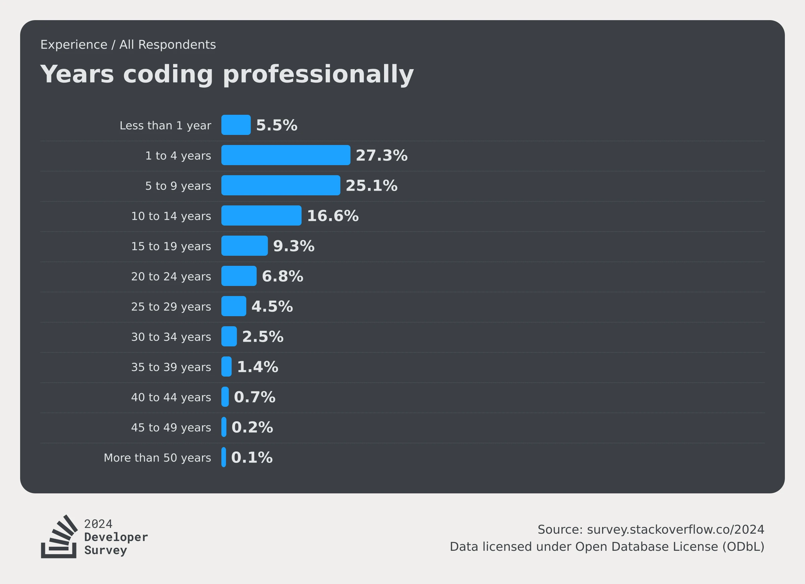
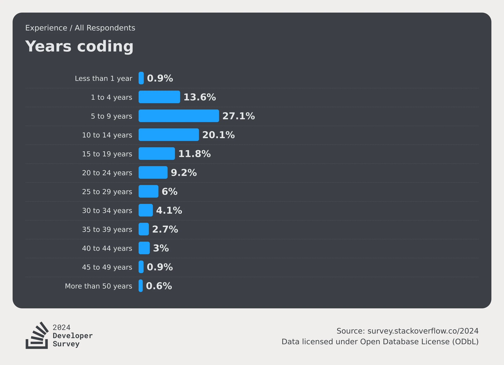
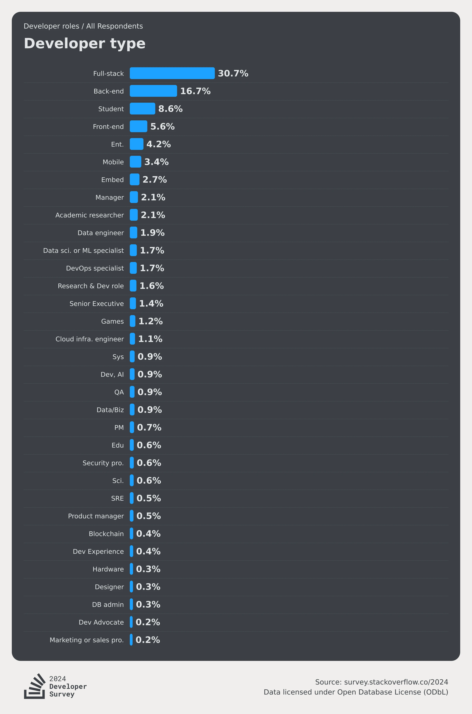

# [行业观察]2024各年度报告汇总

> 篇幅有限，没办法把完整的内容都放过来，本文章的内容仅仅是我感兴趣部分的汇总。其实各报告的正文阅读难度也不高，感兴趣的话非常推荐去阅读原文。
>
> 我比较感兴趣的部分是AI、编程语言和数据库的赛博斗蛐蛐

## 2024 Stack Overflow Developer Survey

> - 原文链接：[2024 Stack Overflow Developer Survey](https://survey.stackoverflow.co/2024/)
> - 来源：Stack Overflow

- Stack Overflow给整篇报告分了几个板块，我们就照着来好了。

### 1. Developer Profile

> 这部分我感兴趣的内容不多，就随便写写

- **Experience**: Years coding和Years coding professionally两张图完全可以结合起来看。在“所有人都是经过大概4年的学习后开始工作”的假设下，这两张图反映的结果几乎完全一致：**接近半数的人在2010~2019年间接触编程，并在大概4年后从事这方面的工作**。这个时间段恰好是互联网蓬勃发展的时期：
  - 2007年发布的iPhone和2008年发布的Android经过几年的发展，已成为事实上的标准制定者，技术选型趋于稳定，同时创造了大量移动互联网的需求
  - 其次是一系列新技术的发布，降低了开发门槛，加快了构建速度：Node.js(2009)、AngularJS(2010)、Kotlin(2011)、Electron(2013)、React(2013)、Swift(2014)、ES6(2016)，以及在这一时期逐渐开始普及的HTML5与CSS3，并且奠定了“大前端”的趋势，可谓影响深远。

  
  

- **Developer roles**: 这张图显示了受访者的身份占比，其中可以看到全栈工程师的占比最高，其次是后端、学生、前端。另外Stock Overflow还在这一部分附加了一句话：*然而，自去年以来，前端开发人员已从6.6%下降到5.6%*，已经比学生占比还低了。
  - 说实话，看到全栈工程师占比最高我还是挺意外的，一直在国内混，总觉得前端后端都是独立的，全栈工程师并不常见。但是仔细一想，随着各种前端框架的快速迭代和完善，开发一个前端项目的难度会越来越低，后端兼顾前端开发也会越来越容易，而且全栈工程师能够站在项目全流程的角度思考，同时无需沟通成本，效率会非常高。
  - 除此之外，前端开发近两年行情不好也是有目共睹的，单纯做前端开发已经很难立足了，更好的选择要么是**转向全栈**，要么是深耕前端技术的同时**拓宽知识面**，在浏览器、Node.js、移动端等方向上发力，成为多面手，不然生存环境只会被进一步压缩。

  

### 2. Technology

## Octoverse 2024

> - 原文链接：[Octoverse: AI leads Python to top language as the number of global developers surges - The GitHub Blog](https://github.blog/news-insights/octoverse/octoverse-2024/)
> - 来源：GitHub

## 2024 开发者生态系统现状

> - 原文链接：暂无
> - 来源：JetBrains

## 2024 中国开源年度报告

> - 原文链接：暂无
> - 来源：开源社

## The DBMS of the Year 2024

> - 原文链接：暂无
> - 来源：DB-Engines

## 关联阅读

- [2024 Stack Overflow Developer Survey](https://survey.stackoverflow.co/2024/)
- [Octoverse: AI leads Python to top language as the number of global developers surges - The GitHub Blog](https://github.blog/news-insights/octoverse/octoverse-2024/)
