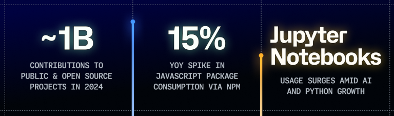

# [行业观察]2024各年度报告汇总

> 篇幅有限，没办法把完整的内容都放过来，本文章的内容仅仅是我感兴趣部分的汇总。其实各报告的正文阅读难度也不高，感兴趣的话非常推荐去阅读原文。
>
> 先说明，这篇文章会包含不少作者的主观看法，如果有不同意见，以你的观点为准。

## 2024 Stack Overflow Developer Survey

> - 原文链接：[2024 Stack Overflow Developer Survey](https://survey.stackoverflow.co/2024/)
> - 下文图片与数据转载自Stack Overflow，遵循[Open Database License (ODbL)](https://opendatacommons.org/licenses/odbl/)。

- Stack Overflow给整篇报告分了几个板块，我们就照着来好了。

### 1. Developer Profile

> 这部分我感兴趣的内容不多，就随便写写

- **Experience**: *Years coding*和*Years coding professionally*两张图完全可以结合起来看。在“所有人都是经过大概4年的学习后开始工作”的假设下，这两张图反映的结果几乎完全一致：**接近半数的人在2010~2019年间接触编程，并在大概4年后从事这方面的工作**。这个时间段恰好是互联网蓬勃发展的时期：
  - 2007年发布的iPhone和2008年发布的Android经过几年的发展，已成为事实上的标准制定者，技术选型趋于稳定，同时创造了大量移动互联网的需求
  - 其次是一系列新技术的发布，降低了开发门槛，加快了构建速度：Node.js(2009)、AngularJS(2010)、Kotlin(2011)、Electron(2013)、React(2013)、Swift(2014)、ES6(2016)，以及在这一时期逐渐开始普及的HTML5与CSS3，并且奠定了“大前端”的趋势，可谓影响深远。

  
  

- **Developer roles**: *Developer type*这张图显示了受访者的身份占比，其中可以看到全栈工程师的占比最高，其次是后端、学生、前端。另外Stock Overflow还在这一部分附加了一句话：*然而，自去年以来，前端开发人员已从6.6%下降到5.6%*，已经比学生占比还低了。
  - 说实话，看到全栈工程师占比最高我还是挺意外的，一直在国内混，总觉得前端后端都是独立的，全栈工程师并不常见。但是仔细一想，随着各种前端框架的快速迭代和完善，开发一个前端项目的难度会越来越低，后端兼顾前端开发也会越来越容易，而且全栈工程师能够站在项目全流程的角度思考，同时无需沟通成本，效率会非常高。
  - 除此之外，前端开发近两年行情不好也是有目共睹的，单纯做前端开发已经很难立足了，更好的选择要么是**转向全栈**，要么是深耕前端技术的同时**拓宽知识面**，在浏览器、Node.js、移动端等方向上发力，成为多面手，不然生存环境只会被进一步压缩。

  

### 2. Technology

> 这部分就是相当“赛博斗蛐蛐”的环节，讲述了各项技术的使用情况，篇幅也比较长，应该是大家都比较关心的部分。

- **Most popular technologies**
  - Programming, scripting, and markup languages: 如果你之前就关注类似的排名的话，这里的结果应该会很符合印象：反正靠前的几个无非就是`JS/TS`、`Python`、`SQL`，事实也确实如此。即使JS和TS已经分开计算了，`JS`仍然占据了头把交椅，随后是`HTML/CSS`这个不太像编程语言的选项，然后依次是`PY`、`SQL`、`TS`。
    - 动态语言凭借其低门槛和灵活性等优势，一直是入门的好选择，因此在这里占据了很大的比例。
    - 再往后看看呢？不出意外的，`Java`和`C#`仍然差不多，这一点和国内`Java`一家独大的现象截然不同....这应该可以归结为历史原因吧。
    - 然后，`PHP`和`Ruby`，这两个语言都曾在互联网早期风靡一时，但就我观察，现在的Web开发者已经几乎不会再用这两个语言及其框架了，在这里仍然有超过10%的使用率，挺意外的。
  
  - Databases: `PostgreSQL`和`MySQL`依然是最受欢迎的两个数据库，只不过从去年开始，PG成为了第一。`SQLite`作为几乎唯一的嵌入型数据库也有不错的使用率，随后是`SQL Server`，`MongoDB`，`Redis`，`MariaDB`，也都是熟面孔。
    - 可以发现排名前三的数据库都是开源的——这能让人放心一些，毕竟数据库里存放的东西非常重要，其隐私性和安全性要求都很高。
    - 单从功能上来讲，PostgreSQL几乎可以说完胜MySQL，二者我也都用过，PG的性能、数据类型、库函数等方面都比MySQL完善很多，而硬件需求却差不多(Oracle你给点力啊)。只是MySQL占据了先发优势，现在你随便翻一本数据库相关书籍，会发现书里面用的SQL几乎都能够直接放到MySQL中使用，而PG的语法则相差较大，我想这也是开发者从MySQL转向PG的一个阻力吧。
    - `SQLite`的生态位比较特殊，不是它需要抢市场，而是市场需要这么一个可嵌入的数据库，再加上它自己也比较争气，一直都没有什么竞品，所以它的使用率一直都很高。
    - `SQL Server`是这几个数据库中，我唯一一个没用过的，但听说它各方面都还可以——好一个中庸之道啊。
    - `Redis`和`MongoDB`可以视为2个NoSQL的发展方向：性能取向和易用取向(虽说本身NoSQL相比于SQL就有性能优势)，前者为了更极致的性能牺牲了易用性(用起来有种写C程序的美)，最终让它广泛用在缓存和消息队列等需要快速响应的场景；后者则是为了降低开发难度，变成了一个“更大更强”的JSON，几乎可以不再设计Schema，直接上来就是存，这种特性让它在一些中小型项目中非常受欢迎。
    
  - Web frameworks and technologies: 工作相关，当然也要仔细看看，这张图统计的框架类型比较杂，只要是“Web相关”的框架都在里面了。
    - 首先排名第一的是`Node.js`毫无争议，它在Web开发的历史中有着划时代的地位：它的出现让JS与浏览器解耦，成为了一门全栈语言。
    - 随后是`React`，以及基于此的静态网站框架`Next.js`。`React`的使用率接近`Node.js`是我没想到的，看来在前端框架中，国内和国外又是两个世界....
    - `jQuery`仍然老而弥坚是我没想到的，毕竟相较于三大前端框架，它似乎显得有些过时：写起来像脚本，不好维护，语法有点丑（个人观点）.....但是呢，它又有一个独特的优点：不依赖于任何框架，直接在浏览器中引入就可以使用。我代入那个前端工程化之前的时代想想，这也应该是最朴素而有效的方式了。
    - `Vue.js`和`Angular`在表格中差不多，但考虑到国内用户很少会参与这份问卷，而国内前端开发者中使用`Vue.js`的比例会远高于`Angular`，因此我认为`Vue.js`的实际使用率应该会更高一些。
    - 其实这里面还有几个我的熟面孔：`Flask`、`Django`和`FastAPI`，都是基于`Python`的Web服务框架。但我猜其中大多数服务的体量都不大，也就是所谓的“微服务”，毕竟作为曾经深深踩过`Flask`的坑的人，我深知即使用了`Python`的类型注解，在体量上来之后，维护压力仍然很大(亦或是我当时太菜了？)。
    
  - Integrated development environment
    - 在这方面被称为“宇宙第一IDE”的`VS Code`一骑绝尘，甩开第二名一倍还多(虽然第二名也是微软的)。丰富的插件让它不仅能处理各种代码任务，只要是文本编辑，几乎都能通过插件胜任。比如此刻，这篇博客就是在`VS Code`里写的，此外，csv、JSON、甚至是各种字幕、歌词文件也都有对应的插件，让它成为了我最常用的工具之一。
    - `Visual Studio`是一个“All in one”的IDE，它同样也能够安装各种“插件”来进行对应项目的开发——只不过这些“插件”都是微软官方开发的。虽然这一切看起来都很美好：**在Microsoft Windows上用Microsoft的IDE开发**，但我最终还是选择了JetBrains。不是微软不懂，而是JetBrains太懂了。
    - 之后的榜单中，JetBrains的产品占据了很大的比例，它的产品使用着同一套平台，但每个又针对不同场景做了优化，因此开箱即用就能得到非常不错的体验。其实这里就能看出来微软和JB的产品理念几乎是截然相反的：*All in one*和*One for all*。这两者没有好坏之分，而他们两个也都挺成功的。
    
  - AI Search and Developer Tools: 开发场景下，AI工具格局已经趋于稳定，大概可称为**一超多强**。
    - OpenAI虽然近期有些负面新闻，但至少目前，它仍然还是AI行业的领头羊，并且`GPT-4o`和`o1`两类新模型各自解决了前代模型中的主要问题：`GPT-4o`支持了多模态、`o1`让模型能够进行复杂推理，都对编程方面有着很大的帮助。
    - 排行第二的是`GitHub Copilot`，背靠`OpenAI`的模型和`GitHub`的数据，再加上直接在IDE中进行代码补全和提示的方式，它应该是“AI代码助手”里最好的那一档。收费应该是唯一阻碍它推广的原因了。
    - 之后的AI工具大多也来自大厂，比如`Google Gemini`、`Bing AI`、`Visual Studio Intellicode`、`Claude`，这些工具也都不错，但目前都还只是追赶者。
    

- **Worked with vs. want to work with**: 这一部分也很有意思，它展示了各领域的开发者在未来一年的发展方向。下面的图中，外层的圈表示的是“目前正在使用的技术”，而圈内各种线条的粗细则反映了“想要使用的技术”的人数。
  - Programming, scripting, and markup languages: 这张图稍显混乱，我就直接说几个比较明显的现象吧：
    - Bash有一条挺粗的线指向了Python，毫无疑问，Bash和Python在系统管理和自动化方面是毫无疑问的好兄弟。
    - HTML/CSS与JavaScript的最粗的线条指向了对方....嗯，不愧是前端三件套。除此之外，JavaScript第二粗的线指向了TypeScript....众所周知，前端三件套有四个成员。
    - Python向外指的线条很少，毕竟很多时候，凭借丰富的生态，Python不用搭配其他语言即可独立完成任务——当然完成的好不好就另说了。
    
  - Databases: 相比于一片“勃勃生机，万物竞发”的编程语言，数据库这边的核心玩家少得多，所以显得整齐一些。而且和编程语言不同的是，一个项目的数据库种类可能只有1~2种，因此这张表更大程度上意味着数据库的“**选择**”而非“**搭配**”。
    - `PostgreSQL`: PG大胜利，不仅使用人数最多，而且往往也是其他通用数据库最想换用的目标。`MySQL`、`SQLite`、`MongoDB`、`MariaDB`、`Microsoft SQL Server`向外最粗的线条都是指向PG的。而PG向外指的线条只有2个: `Redis`和`Elasticsearch`，一个用于缓存，一个用于搜索，和PG并非竞争关系。总的来说，在大多数人眼中，PG就是通用数据库的首选。
    - `Redis`和`Elasticsearch`: 二者由于其独特的定位，几乎没有竞品，因此没有向外指的线条，他们就是所在领域的唯一选择。
    - `MySQL`: Oracle你争点气啊....`MySQL`应该是用户流失最严重的数据库了，没办法，这两年`MySQL`表现实在不行，甚至出现了性能开倒车的情况，再加上更新缓慢，社区活跃度低，用户流失也就不足为奇了。我个人都在前段时间弃坑了`MySQL`，把一个个人项目换到了`SQLite`上。
      > “再见了，所有的旧世纪MySQL们”

    

### 3. AI

> AI这块其实大家都差不多，而且Stack Overflow的调查结果显得很肤浅（个人观点），所以就随便聊聊

- **Sentiment and usage**: 简单点说就是越来越多的人开始使用AI工具，但对于AI工具的认可度却没有去年高了（也许是随着深入使用，发现AI也不是万能的....）

- **Developer tools**: 这一部分的内容相对有用一些，列举如下
  - AI的主要优势在于**提高生产力**和**加快学习速度**
  - AI的主要缺陷在于**难以处理复杂问题，生成的准确性欠佳**
  - 目前AI主要用于生成代码，而多数人希望AI未来能够扩展到**文档编写**和**测试**方面
  

- **Efficacy and Ethics**: 实在没什么意思，不聊了

### 4. Work

- **Employment**: 大多数人当然是全职就职状态，不过比较令我惊讶的是，尽管*In-person*（线下）工作的人数连续3年增加，但仍然只占到20%，远程和混合模式的占据了大多数....还是和国内很不一样啊
  

- **Company info**: 公司规模以20-99人最多，100-199人次之，就一张图，没什么意思，不讲了。

- **Salary**: 薪酬水平永远是绕不开的话题，也这我比较想看的。
  - Salary by developer type和Salary and experience by developer type的结果比较类似。 如下图，平均薪资最高的依次是：
    1. Senior Executive(管理人员，如C-level和副总)
    2. Dev Advocate(开发者大使，公司及其内部开发者与外部生态开发者之间的代言人、调解员及翻译官)
    3. Manager(项目经理)
    4. Dev Experience(开发者体验，主要负责开发者的体验设计)、
    5. SRE(不太好翻译，国内好像也没有，但大致目的是为了提高网站的可靠性，也可以视为一种运维吧)
    6. Cloud infra. engineer(云基础设施工程师)
    
  - Salary and experience by language: 这个更有意思，按照编程语言和经验来衡量薪资。首先讲一下这张图：横轴是经验，纵轴是年薪中位数，而颜色代表人数。
    - 因此，颜色越鲜艳的点表示使用人数越多，机会和需求一般也越多；越靠近左边的点，要么表示语言比较新，要么就意味着即使是新入行也能有不错的薪资；
    - 但是，仍然要告诫诸位同学：语言只是工具，值钱的永远不是使用的语言，而是创造的作品。比如**学Python和懂AI是完完全全的两码事**(国内很多天煞的补习班在努力混淆这二者)。
    1. 首先可以看到咱们大多数流行语言都聚集在65000左右，包括HTML/CSS，Java，Python，TS，JS，SQL，C，C++，C#等，这些语言基本构建了现代网络和软件的基础，因此在薪资方面也是大多数，能反映整体水平。
    2. 除此之外，Swift、Go和Rust较高，达到了75000左右，应当表明在国外，这三种语言通常被用于比较重要的项目，比如Go用于网络服务，Swift用于iOS开发，Rust用于系统编程和底层开发。
    
- 在此之外，本节的内容就没什么意思了，就不看了吧。

### 5. Community

> 这部分的内容可以说没什么大用，因为这是Stack Overflow自己的数据，股东可能会感兴趣一些(如果有的话)。由于国内用户使用的比较少，而且也很少会专门注册账号，因此这部分对于国内用户的感知不强。

- 简单点说：
  - 大多数人都访问过 Stack Overflow，但对于其他Stack Overflow旗下的网站访问较少。
  - 大多数人都已经注册了账户(原来不注册是可以填这份问卷的吗)
  - 使用Stack Overflow的首要目的是快速找到答案(很现实)而非学习

### 6. Professional Developers

> 这部分专门列出几个专业开发者回答的问题，这部分内容没有多少技术含量，但问题颇有些意思。

- **Productivity Impacts**:
  - Years of professional work experience: 由于这部分的数据来源于专业开发者，因此工作经验普遍较为丰富，5~9年的人数最多，其次是1~4年。
  - Daily time spent searching for answers/solutions: *61%的受访者每天花费超过30分钟来寻找问题的答案或解决方案*。哈哈，原来我也不是那么菜嘛
  - Daily time spent answering questions: 61%的人每天花费超过30分钟来回答问题，并且对于People Manages(人事经理)来说，这一比例更高。

- **Developer Experience**:
  - Most common frustrations: 首当其冲的是技术债，2个字总结即“不熟”，随后是构建和部署时技术栈的复杂问题，随后还提到了工具/系统的可靠性和问题。
    > 我认为这也是当前普遍的问题。前端是大家吐槽造轮子最密集的领域，三大框架之外还有Svelte、Web Component、jQuery、Semantic UI等诸多框架，而且三大框架的抽象与封装都比较深，这就导致可能换个团队，写法和框架设计就要从头学习，虽然前端一般被认为比较简单，但总是在学习新东西会让人感到疲惫。

### 7. Methodology

> 这部分是关于调查的方法论，对于普通用户来说，没什么用，就不看了。

## Octoverse 2024

> - 原文链接：[Octoverse: AI leads Python to top language as the number of global developers surges - The GitHub Blog](https://github.blog/news-insights/octoverse/octoverse-2024/)
> - 来源：GitHub

*和Stack Overflow不同的是，GitHub的报告几乎全篇都在透露着“AI大赢特赢”的倾向，排名第一的编程语言也顺理成章的成为了Python。我个人就是Python入门的，因此也自认为也比较清楚Python的优势和不足，个人感觉这个排名有点太激进了....虽说AI是近两年的绝对热门话题，但哪有那么多人懂AI，并参与AI开发呢？*

- 首先，GitHub总结了这一年的三大趋势：
  1. **A surge in global generative AI activity**(全球生成式 AI 活动的激增)
  2. **A rapidly growing number of developers worldwide—especially in Africa, Latin America, and Asia**(全球开发人员数量迅速增长，尤其是在非洲、拉丁美洲和亚洲)
  3. **Python is now the most used language on GitHub as global open source activity continues to extend beyond traditional software development**(Python 现在是 GitHub 上最常用的语言，因为全球开源活动不断超越传统软件开发)

### 1. A global community of developers that' s growing fast

> 这一部分介绍了GitHub的情况

1. 2024年，1亿+开发者为开源项目做出了超过52亿次贡献
2. 印度是开发者人数增长最快的国家，并且在2022年超过中国，成为第2大开发者社区，中国则此后一直保持第3。
3. 在全球范围内，开发者社区增长显著，其中巴西、印度和尼日利亚的增长尤其迅速。

   - 看到下面这个图我还挺惊讶的，因为我感觉经常逛GitHub的都是~~老二刺猿~~比较年轻的开发者，和我年龄相仿，即使如此还能保持第3，应该说中国的开发者群体还是很庞大的。
   - 印象中印度开发者应该主要活跃于Web项目，并且格外喜欢PHP....
  

#### 1.1 Projecting the top 10 developer communities on GitHub through 2030

GitHub预测，到2028年，印度将取代美国成为GitHub上最大的开发者社区(去年的预测是2027年)，无可厚非。

#### 1.2 Fastest growing developer communities in Latin America

> 拉丁美洲我不太熟悉，也就不多说了

#### 1.3 The fastest growing developer communities in Asia Pacific

- 亚太地区社区的 GitHub 开发人员数量正在以全球最快的速度增长，并且预计这一趋势将持续下去。
- 其中，印度拥有快速增长的开发者社区，并有望在 2028 年之前成为世界上最大的开发者社区，GitHub上三哥确实多。
- 此外，这里还提到印度优先考虑开源软件，并要求学校将代码和AI纳入学生课程，并且GitHub在印度是最受追捧的技能之一。
- 突然想到自己在上学时，学校的教育基本上只限于写代码，开源、Git乃至Markdown都没提及，交作业好点的会打包项目发邮件，差一些的就直接塞到Word里....这就是基础素养的缺失啊。

**Asia Pacific spotlights**：随便点了一下新加坡、日本和韩国，不展开了。

#### 1.4 The fastest growing developer communities in Europe and the Middle East

- 欧洲与中东的开源发展....总体上不温不火吧，英德法西土的开源社区也在发展，但是看起来国家政策层面的支持并不如印度与亚太那么明显。
- 除此自外点了一下阿联酋，毕竟虽然背靠石油，有钱，但终归有一天会耗尽的，提前找些新的发展点不是坏事，而且至少现在可以大撒币式地发展。

#### 1.5 The fastest growing developer communities in Africa

> 非洲....也跳过吧，GitHub讲这些的篇幅有点多了，就像领导开会发言似的，要把每个地区都照顾到

### 2. The state of open source

> 2024年，总提交次数约1B(10亿次)，JS包的使用量增长了约15%(数据来自npm)，以及Jupyter Notebook的使用量激增(2024年使用量增加了92%)。
>
> (不过Jupyter确实比单独写代码更利于实验，它无需沉重的IDE、自带断点、上次记录和可视化，受到数据科学家和ML研究人员的青睐也无可厚非)

### 3. The state of generative AI in 2024

> To be continued

## 2024 开发者生态系统现状

> - 原文链接：[2024 软件开发者统计数据 - 开发者生态系统现状报告 | JetBrains: Developer Tools for Professionals and Teams](https://www.jetbrains.com/zh-cn/lp/devecosystem-2024/)
> - 来源：JetBrains
> - 在“代码相关”的公司或组织中，**JetBrains**是我比较喜欢的一个，因为我感觉它是比较懂广大程序员的。本来打算过年的时候就写一写，结果过年期间也在忙，就拖到现在了(2025/02/21)。但是好饭不怕晚，现在终于端上来了。

### 1. 重要发现

> 不知道为啥这一节叫这个名字....好像也不是什么很重要的东西啊，就只是赛博斗蛐蛐而已。

1. 过去12个月，您使用过以下哪种（哪些）编程语言？
  

2. 编程、脚本和标记语言的使用
  

- 单看上面两张图，结论基本上符合以往的印象，JS第一，Python第二，HTML/CSS、SQL等等依次向后。但是看发展趋势，从2020年开始，JavaScript的使用率逐年下降，而Python则逐年上升。
- 但是这也并不意味着前端药丸，JavaScript在近5年下降了约10%，而TypeScript则在近5年增长了约10%，说明大家逐渐意识到类型检查在大型项目中的重要性，新项目更多的选择了TypeScript。
- 就我自己而言也是如此。我们搭建的一个新的内部系统采用了Vue 3 组合式API+Element Plus+TailwindCSS+TypeScript。在编写时还没有什么感觉，但是当我需要查看一个旧项目时(Vue 2+Element UI+JavaScript)，才发现*没有类型检查+缺乏注释+异步执行*的情况下，追溯一个变量简直是不可能的事情，这时才意识到TypeScript是真香啊。
- 而当谈及当前项目在用以及未来将会用什么语言时，“在用”榜单和上面的大差不差，而“未来将用”最多的则是Rust和Go，好吧这哥俩确实是近年的大热门。除此之外，“未来将用”的最多的回答是“**否，我不打算采用或迁移到其他语言**”，足足有59%，这个回答挺欧亨利的。

### 2. 技术

> 这是比较有意思的部分了

1. 您是否开发应用程序？如果开发，最终用户应用程序在哪执行？
  
2. 您的代码在哪种（哪些）平台上执行？
  
这两张图问的问题好像差不多，就合起来看吧
   - 首先是大多数应用都是运行在浏览器上的，即Web应用，这个是符合印象的。
   - 其次是服务器端应用，或者说云服务，这也没问题。
   - 但接下来就有意思了，无论是哪个结果，桌面应用都是多于移动应用的，这和大家常说的“移动互联网”有些不符，但仔细想想也是有原因的。
     - 首先是桌面开发成熟且便捷：桌面开发可用的技术栈很多，基本上主流的语言都能找出一套框架，而且大多数都能跨平台，比如PyQt、Swing、WPF、Electron，Qt或GTK等，几乎无需为了开发桌面应用重新学一门新的语言、适应新的生态。而移动开发，无论是原生的Java、Kotlin、Swift，还是跨平台的Flutter、React Native，都难以做到“既主流又跨平台”。
     - 其次，就像摄影圈“底大一级压死人”一样，电脑的屏幕和性能就是比手机强，因此很多需求难以也没必要在手机上实现，比如一些专业软件、游戏、乃至Office三件套等（真的会有人在手机上搞PPT或者Excel吗）。
     - 最后，桌面应用的用户群体更加广泛，因此也更容易获得收益。比如一款游戏，即使是小众游戏，也能在Steam上找到一批忠实玩家，而手机游戏则很难做到这一点。

> **未完待续**

## 2024 中国开源年度报告

> - 原文链接：暂无
> - 来源：开源社

## 关联阅读

- [2024 Stack Overflow Developer Survey](https://survey.stackoverflow.co/2024/)
- [Octoverse: AI leads Python to top language as the number of global developers surges - The GitHub Blog](https://github.blog/news-insights/octoverse/octoverse-2024/)
- [2024 软件开发者统计数据 - 开发者生态系统现状报告 | JetBrains: Developer Tools for Professionals and Teams](https://www.jetbrains.com/zh-cn/lp/devecosystem-2024/)
