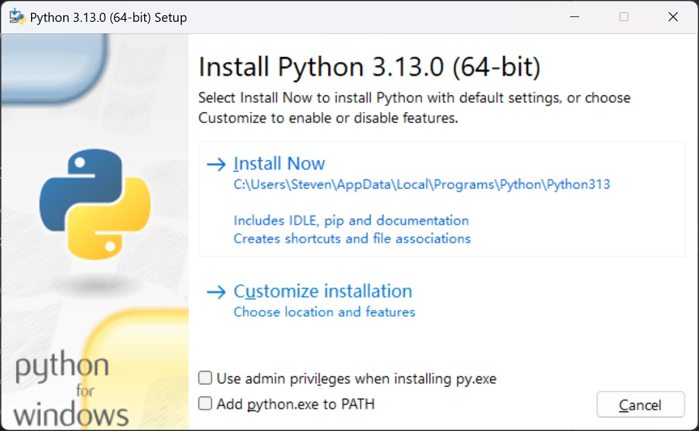
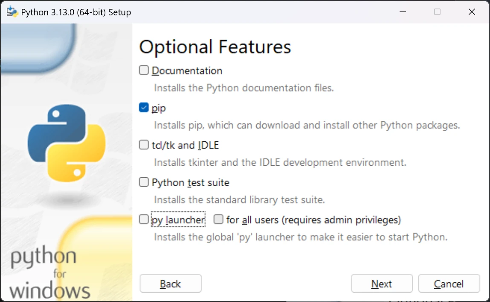
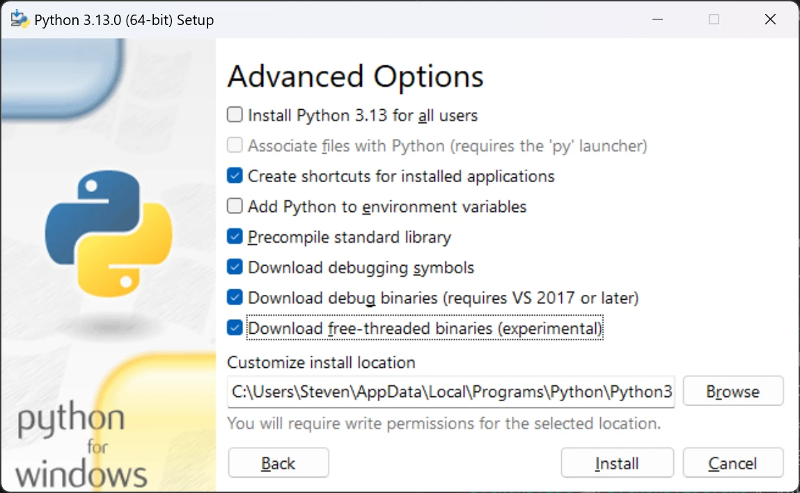
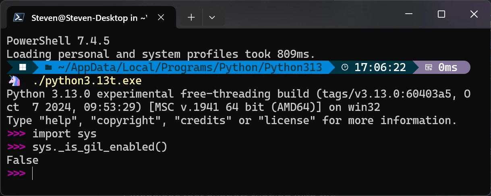
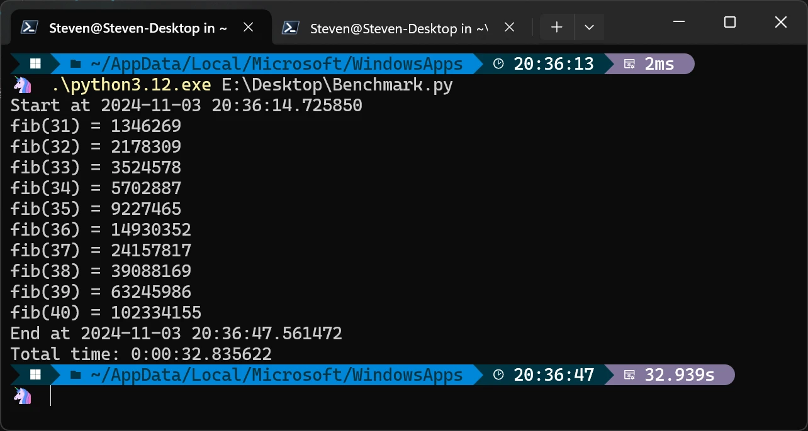
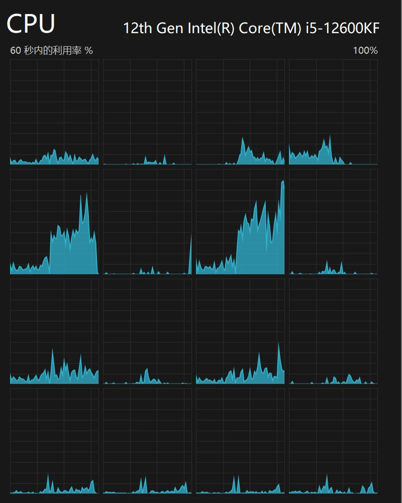
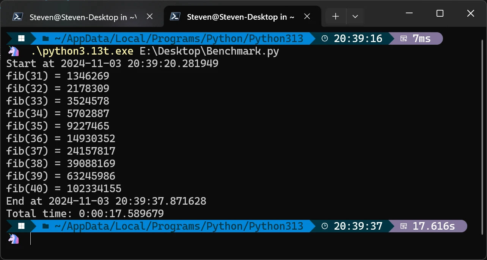
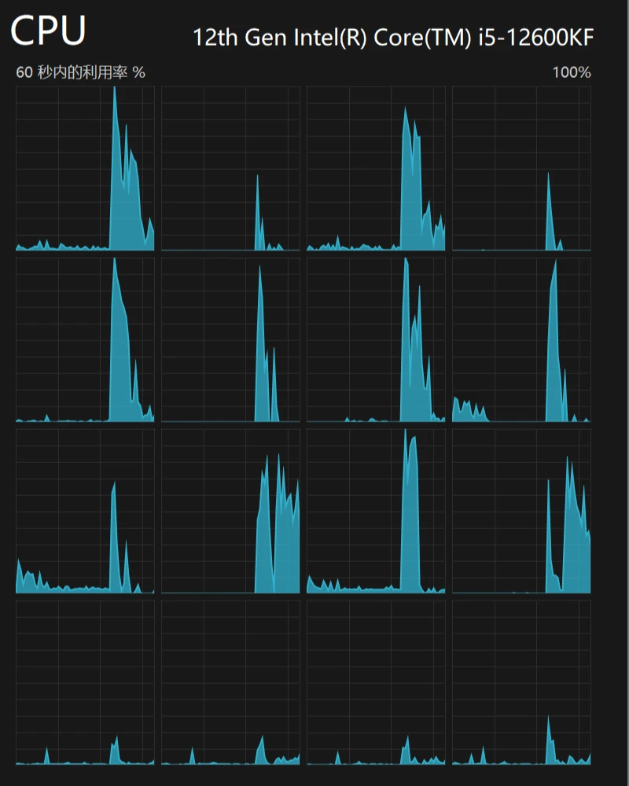

# [行业观察]Python Free-Threaded模式体验

> 就在前不久(10月7日)，Python团队发布了Python 3.13，可以说很多人对此期盼已久，或者说对“no-GIL模式”（官方称为"free-threaded mode"）期盼已久。那么我们可以上手试一下。

> 以下内容写于2024-10-13

## 关于该特性

- 这里我们先把官方公告和参考翻译贴一下，懒得看的可以跳过这部分：

> - CPython now has experimental support for running in a free-threaded mode, with the [global interpreter lock](https://docs.python.org/3.13/glossary.html#term-global-interpreter-lock) (GIL) disabled. This is an experimental feature and therefore is not enabled by default. The free-threaded mode requires a different executable, usually called `python3.13t` or `python3.13t.exe`. Pre-built binaries marked as free-threaded can be installed as part of the official [Windows](https://docs.python.org/3.13/using/windows.html#install-freethreaded-windows) and [macOS](https://docs.python.org/3.13/using/mac.html#install-freethreaded-macos) installers, or CPython can be built from source with the [--disable-gil](https://docs.python.org/3.13/using/configure.html#cmdoption-disable-gil) option.
> - CPython现在实验性地支持在自由线程模式下运行，禁用了[全局解释器锁](https://docs.python.org/3.13/glossary.html#term-global-interpreter-lock)（GIL）。这是一个实验性功能，因此默认情况下不启用。自由线程模式需要不同的可执行文件，通常称为`python3.13t`或`python3.13t.exe`。标记为自由线程的预构建二进制文件可以作为官方[Windows](https://docs.python.org/3.13/using/windows.html#install-freethreaded-windows)和[macOS](https://docs.python.org/3.13/using/mac.html#install-freethreaded-macos)安装程序的一部分安装，或者CPython可以使用[`--disable-gil`](https://docs.python.org/3.13/using/configure.html#cmdoption-disable-gil)选项从源代码构建。
> - Free-threaded execution allows for full utilization of the available processing power by running threads in parallel on available CPU cores. While not all software will benefit from this automatically, programs designed with threading in mind will run faster on multi-core hardware. The free-threaded mode is experimental and work is ongoing to improve it: expect some bugs and a substantial single-threaded performance hit. Free-threaded builds of CPython support optionally running with the GIL enabled at runtime using the environment variable [PYTHON_GIL](https://docs.python.org/3.13/using/cmdline.html#envvar-PYTHON_GIL) or the command-line option [-X gil=1](https://docs.python.org/3.13/using/cmdline.html#cmdoption-X).
> - 自由线程执行允许通过在可用的CPU内核上并行运行线程来充分利用可用的处理能力。虽然不是所有的软件都会自动受益于此，但基于线程设计的程序将在多核硬件上运行得更快。自由线程模式是实验性的，仍然在改进中：预计会有一些错误和单线程性能的大幅下降。CPython的自由线程构建支持在运行时使用环境变量[`PYTHON_GIL`](https://docs.python.org/3.13/using/cmdline.html#envvar-PYTHON_GIL)或命令行选项[`-X gil=1`](https://docs.python.org/3.13/using/cmdline.html#cmdoption-X)启用GIL。
> - To check if the current interpreter supports free-threading, [python -VV](https://docs.python.org/3.13/using/cmdline.html#cmdoption-V) and [sys.version](https://docs.python.org/3.13/library/sys.html#sys.version) contain “experimental free-threading build”. The new sys._is_gil_enabled() function can be used to check whether the GIL is actually disabled in the running process.
> - 为了检查当前的解释器是否支持自由线程，[`python -VV`](https://docs.python.org/3.13/using/cmdline.html#cmdoption-V)和[`sys.version`](https://docs.python.org/3.13/library/sys.html#sys.version)包含“实验性自由线程构建”。新的`sys._is_gil_enabled()`函数可以用来检查GIL是否在运行过程中被禁用。
> - C-API extension modules need to be built specifically for the free-threaded build. Extensions that support running with the [GIL](https://docs.python.org/3.13/glossary.html#term-GIL) disabled should use the [Py_mod_gil](https://docs.python.org/3.13/c-api/module.html#c.Py_mod_gil) slot. Extensions using single-phase init should use [PyUnstable_Module_SetGIL()](https://docs.python.org/3.13/c-api/module.html#c.PyUnstable_Module_SetGIL) to indicate whether they support running with the GIL disabled. Importing C extensions that don’t use these mechanisms will cause the GIL to be enabled, unless the GIL was explicitly disabled with the [PYTHON_GIL](https://docs.python.org/3.13/using/cmdline.html#envvar-PYTHON_GIL) environment variable or the [-X gil=0](https://docs.python.org/3.13/using/cmdline.html#cmdoption-X) option. pip 24.1 or newer is required to install packages with C extensions in the free-threaded build.
> - C-API扩展模块需要专门针对自由线程而重新构建。支持禁用[GIL](https://docs.python.org/3.13/glossary.html#term-GIL)的情况下运行的扩展应该使用[`Py_mod_gil`](https://docs.python.org/3.13/c-api/module.html#c.Py_mod_gil)插槽。使用单阶段init的扩展应该使用[`PyUnstable_Module_SetGIL()`](https://docs.python.org/3.13/c-api/module.html#c.PyUnstable_Module_SetGIL)来指示它们是否支持在禁用GIL的情况下运行。导入不使用这些机制的C扩展将导致启用GIL，除非GIL被[`PYTHON_GIL`](https://docs.python.org/3.13/using/cmdline.html#envvar-PYTHON_GIL)环境变量或[`-X gil=0`](https://docs.python.org/3.13/using/cmdline.html#cmdoption-X)选项显式禁用。pip 24.1或更高版本需要在自由线程构建中安装带有C扩展的软件包。
> - This work was made possible thanks to many individuals and organizations, including the large community of contributors to Python and third-party projects to test and enable free-threading support. Notable contributors include: Sam Gross, Ken Jin, Donghee Na, Itamar Oren, Matt Page, Brett Simmers, Dino Viehland, Carl Meyer, Nathan Goldbaum, Ralf Gommers, Lysandros Nikolaou, and many others. Many of these contributors are employed by Meta, which has provided significant engineering resources to support this project.
> - 这项工作之所以成为可能，要归功于许多个人和组织，包括Python的大型社区贡献者和第三方项目，以测试和启用自由线程支持。主要贡献者包括：Sam Gross、Ken Jin、Donghee Na、Itamar Oren、Matt Page、Brett Simmers、Dino Viehland、Carl Meyer、Nathan Goldbaum、Ralf Gommers、Lysandros Nikolaou和许多其他人。这些贡献者中的许多人受雇于Meta，该公司为支持该项目提供了大量的工程资源。

- 这段公告介绍了这一特性的情况，并且对参与这项工作的人表示了感谢。总结一下大家关心的内容：
  - `no-GIL`模式仍然是实验性的，需要在安装时使用特定的二进制文件(`python3.13t`或`python3.13t.exe`)，或者使用`--disable-gil`选项从源代码构建。
  - 不是所有的软件都会从自由线程模式中受益，并且当前版本可能会存在bug，以及单线程性能会有显著下降。因此不要将其应用到任何生产环境中。
  - 使用C-API的扩展模块需要特别构建，因此可能有些扩展在自由线程模式中无法正常使用。

## 安装

- OK，看完了官方说明后，感觉大致了解了(觉得我又行了)，就下载安装吧。我现在用的Windows，直接来到[下载页面](https://www.python.org/downloads/windows/)下载Windows installer (64-bit)，双击安装，又是熟悉的界面：
  
- 自由线程模式由于是实验特性，所以默认不启用，如果在这个界面直接一键安装是不含这个特性的，所以需要点击"Customize installation"，手动安装，会进入下面这个界面。由于只是试着玩，所以这里非必要选项我就不安装了，只留个pip方便安装库：
  
- 点击"Next"，进入真正重要的一屏，我是这么勾选的。由于我电脑上已经有3.12了，为了防止环境变量冲突就没勾选添加环境变量，然后最后一个选项就是我们要的"Free-threaded mode"，勾选上就好：
  
- 由于要额外下载python3.13t相关的文件，所以安装时间略长。安装后找到安装路径，就可以看到`python3.13t.exe`了。
- 直接在命令行执行可执行文件，第一行就显示出了版本信息:*experimental free-threading build*，试了一下`sys._is_gil_enabled()`，也是未启用的，说明安装的没有问题。
  

## 写段代码试一下

- 首先要知道，以往在Python中执行计算密集型任务时，由于本身是解释型语言，再加上GIL，无法利用多核提升性能，所以其实很多提高性能的方式是把计算任务扔给C语言，比如numpy、PyTorch等知名的高性能计算库。知乎上曾经就有人说过“Python是一个开销极低的C启动器”，其实很形象。
- 因此想要测试`no-GIL`模式的性能提升，就需要一个使用Python原生实现的计算密集型需求。

### 错误示例

- 好的，我们现在玩点好玩的东西。现在网上已经有一些针对3.13的性能测试了，但是测试用代码都是一些没什么意义的东西，比如搁那跑个空的循环之类的，没意思。
- 此时我本想拿图像转码试一下，将jpg转换为webp，但是当我看了Python库`webp`的源码后，发现它也只是`libwebp`的“Python绑定”，相当于还是调用了C语言的库，所以这个例子就不适合了。但代码都写出来了，就放在这里吧：

```python
import webp
import threading
from pathlib import Path
from datetime import datetime
from PIL import Image


fileList = Path("C:/Users/Steven/test/").rglob("*.jpg")


def convert(file: Path):
    with Image.open(file) as img:
        webp.save_image(img, file.with_suffix(".webp").as_posix(), quality=95)
        print(f"Finish: {file.name}")


if __name__ == "__main__":
    threads = [threading.Thread(target=convert, args=(file,)) for file in fileList]
    start = datetime.now()
    print(f"Start at {start}")
    for thread in threads:
        thread.start()

    for thread in threads:
        thread.join()
    end = datetime.now()
    print(f"End at {end}")
    print(f"Total time: {end-start}")
```

- 顺便还试了下3.13运行，可惜`webp`和`Pillow`都依赖于`numpy`，而目前`numpy`仍然不支持自由线程模式，所以这个例子是无法运行的。

> 以下内容写于2024-11-03

### 正确示例

- 正确的做法是，尽量规避掉使用以往的计算库，因为它们大多数都是依赖于numpy或C语言库实现高性能计算的，所以这里我们使用Python原生的方法计算一些东西，比如计算多个不同的斐波那契数列：

```python
import threading
from datetime import datetime

n_list = [31, 32, 33, 34, 35, 36, 37, 38, 39, 40]


def fib(n: int) -> None:
    def _fib(n: int) -> int:  # 递归函数
        if n <= 1:
            return n
        return fib_recur(n-1) + fib_recur(n-2)
    print(f"fib({n}) = {_fib(n)}")


if __name__ == "__main__":
    threads = [threading.Thread(target=fib, args=(n,)) for n in n_list]
    start = datetime.now()
    print(f"Start at {start}")
    for thread in threads:
        thread.start()

    for thread in threads:
        thread.join()
    end = datetime.now()
    print(f"End at {end}")
    print(f"Total time: {end-start}")
```

- 以下是**Python 3.12**的结果：
  
  
  - 需要注意的是，递归求解Fibonacci数列的时间开销很大，在实际计算过程中会有很多重复计算，时间复杂度为$O(2^n)$，在实际跑的过程中，$n<35$时基本上能做到结果秒出，而在此之后等待时间便会显著增加。
  - 观察占用结果，不难发现，似乎只有两个逻辑核心处于高负载，我猜这两个实际上属于同一颗物理核心，其中一个是超线程罢了，因此实际上这几个计算任务还是串行计算的，最终成绩32s左右。

- 而接下来，是**Python 3.13**自由线程模式的结果：
  
  
  - 毫不意外的，最终成绩有了大幅度提升，从32s一路降到了17s左右，近乎翻倍！观察CPU占用也不难看出，前三排的逻辑核心基本上都处于较高负载状态（第四排属于英特尔定义的E核，一般不参与复杂计算），由于时间较短，因此图像中只有一个窄窄的尖峰不太明显，但这正说明了Python终于可以利用多核心进行计算了。这一结果是非常令人振奋的。

## 结尾

- 结尾就谈谈我对Python的特殊感情吧。Python是我第一门真正热爱并且深耕的编程语言，它的简洁、生态以及新手友好一直是我所钟爱的特点。使用Python能快速实现一个demo或功能，让新手及时获得正向反馈，尽快度过枯燥的学习初期，适合科班或非科班的人在没有对编程有太多了解时培养兴趣。
- 但尽管如此，有段时间我却非常不愿意使用Python。因为在那之前，我还在基础学习阶段，沉浸于Python“啥都能干”的喜悦中。但当我真的用Python去实现各种任务时，却发现它似乎什么都干不好——做GUI，PyQt简直是个完全独立的领域；做服务，Flask的网页交互太过原始；做爬虫，Selenium多动症一样的API让人查教程查到崩溃，以及最重要的——Python有**GIL**，这一点对于曾经把Python奉若神明的我来说简直是一个污点……也是在那段时间，我尝试过很多其他的语言：C#、JavaScript、Dart，甚至还一度想要学PHP。那时我觉得Python的“全能”是一个谎言，在这上面投入大量精力简直是浪费时间，根据需求选择合适的工具才是正道。
- 再后来，我对各种编程语言都有了一些了解后，我有了一些关于程序设计的思考，其中最朴素的一条就是：盲目追求“最好”得不偿失，“合适”才是最重要的。静态语言性能是强，但没有人会用Java、C++写爬虫或系统脚本，因为这不合适。我的情况是对性能几乎没有要求，但我的时间有限，Python就是最合适的工具。自此，我重回了Python的怀抱，并且找到了一种更好的使用方式：“Python+”。对于GUI，客户端开发太复杂，我就换Web甚至是Gradio；对于服务，Flask交互差劲，我就换Vue构建页面，用FastAPI提供服务；对于爬虫，我直接分析请求模拟发包，绕开Selenium；即使真的需要性能，也有大把底层使用C或Rust的高性能库都可以随便用。自此，我对Python的态度发生了大转变，从“干啥都用Python实现”到“干啥都用Python简化”。现在想想，这其实就是“看山是山”——“看山不是山”——“看山还是山”的过程，也是我自己的一种成长吧。

## 关联阅读

- [聊聊3.13中你们感兴趣的特性，和我实现的功能 | 码农高天](https://www.bilibili.com/video/BV1dm2yYrEnn)
- [Python 3.13正式版发布:去除全局解释器锁(GIL)和新的交互式解释器(REPL) | 腾讯云开发者社区](https://cloud.tencent.com/developer/news/1762031)
